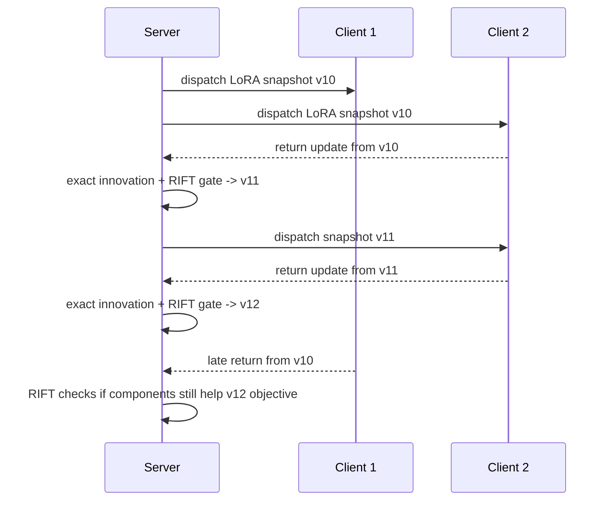
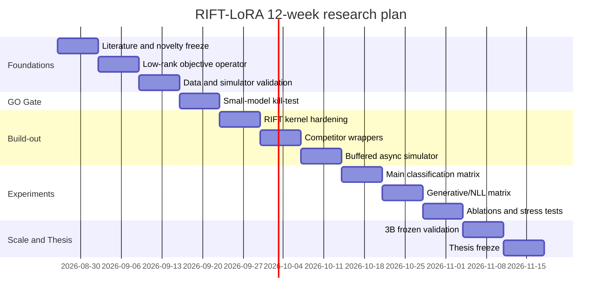

# RIFT-LoRA - Research Feasibility Review & 12-Week Senior Research Guide

Ngay tao: 2026-08-26

Tai lieu nay la ban guide rieng cho **RIFT-LoRA** sau khi VAST-LoRA ban dau
bi thu hep claim va RIFT tro thanh huong nghien cuu co tin hieu GO. No duoc viet
theo cung tinh than voi `VAST_LoRA_Research_Guide_12_Weeks.md`: co thesis,
novelty map, ly thuyet, simulator, dataset, baseline, metric, statistical
protocol, roadmap 12 tuan, GO/NO-GO gate, rui ro va deliverables.

## 0. Executive verdict

### Final assessment

**GO cho thesis prototype**, voi claim hep va do duoc:

> RIFT-LoRA la mot calibration-assisted, gauge-invariant, rank-wise safety layer
> cho delayed LoRA innovations trong heterogeneous-rank asynchronous FedLoRA.
> No loc tung intrinsic singular component theo first-order objective gain va
> chi chap nhan update neu mot paired held-out calibration-loss gate khong thay
> harmful effect.

Day **khong phai** claim RIFT co accuracy cao nhat trong moi setting. Day la
claim ve **late-update objective safety**: update tre co lam loss server hien tai
tang hay khong, va method co giam harmful late updates trong regime kho hay
khong.

### One-sentence thesis

> Can a calibration-assisted rank-wise filter reduce harmful late updates in
> asynchronous heterogeneous-rank federated LoRA while preserving optimization
> progress?

### Crucial scope decision

RIFT nen duoc dinh vi la **wrapper / safety layer** nam sau cac lop aggregation
dung ve hinh hoc:

```text
client LoRA factors
  -> exact intrinsic innovation
  -> optional alignment / projection baseline
  -> RIFT objective-safety filter
  -> scale / gate / accept / reject
  -> server update
```

No khong thay the FedEx, FedRot, FLoRG, GLoRA, FSLoRA, SDFLoRA hay AlignFed.
No tra loi mot cau hoi khac:

> Sau khi update LoRA da duoc represent dung, thanh phan nao cua update tre van
> con la descent direction doi voi objective hien tai?

## 0A. Coverage map against the original 12-week guide

Bang nay chung minh ban RIFT guide co du cac nhom noi dung chinh nhu guide VAST
12-week ban dau.

| Nhom trong guide VAST | Phan tuong ung trong guide RIFT |
|---|---|
| Executive verdict | Section 0 |
| Problem definition | Sections 1-2 |
| Core mathematical object | Sections 3-6 |
| Operator design | Sections 7-10 |
| Theoretical proposition | Section 11 |
| Lifecycle and async aggregation | Sections 12-14 |
| Novelty / related work | Sections 15-17 |
| Hypotheses | Section 18 |
| Kill-test / GO-NO-GO | Section 19 |
| Simulation strategy | Sections 20-24 |
| Datasets / partitions / staleness | Sections 25-27 |
| Baselines / competitors | Section 28 |
| Ablations | Section 29 |
| Metrics | Section 30 |
| Statistical protocol | Section 31 |
| Figures | Section 32 |
| Engineering layout | Sections 33-36 |
| Tests / complexity / stability | Sections 37-39 |
| 12-week roadmap | Sections 40-41 |
| Research gates / experiment matrix | Sections 42-43 |
| Success and failure criteria | Sections 44-45 |
| Reproducibility / thesis structure / pitch | Sections 46-49 |
| References | Section 50 |

# 1. What problem are we solving?

Asynchronous FedLoRA co 3 nguon loi chong len nhau:

1. **LoRA factor ambiguity**: cung mot intrinsic update `BA` co vo so cach factor
   hoa `B R` va `R^-1 A`. Neu aggregate factor truc tiep, hinh hoc co the sai.
2. **Staleness**: client train tu model version cu. Khi update ve server, server
   da di den mot diem objective khac.
3. **Non-IID + heterogeneous rank**: client co data bias va capacity khac nhau,
   nen update tre khong chi "cu", ma co the di theo objective cuc bo da lech.

Nhieu method hien tai xu ly diem 1 hoac diem 3. RIFT tap trung vao diem 2 trong
ngu canh LoRA:

> Trong mot delayed LoRA innovation, khong phai moi singular component deu con
> co ich cho server hien tai.

# 2. Why asynchronous FedLoRA is different from ordinary FedLoRA

Trong synchronous FedLoRA, nhieu client train tu cung global version va server
aggregate theo round. Staleness gan nhu bang 0 trong mot round.

Trong asynchronous FedLoRA:

```text
server v10 dispatch -> client A
server v11 update
server v12 update
client A returns update trained from v10
server must decide whether to apply it at v12
```

Neu chi dung scalar freshness:

```text
update_weight = f(tau)
```

ta gia dinh moi thanh phan trong update tre xau nhu nhau. RIFT phan doi gia dinh
do: mot update tre co the gom ca thanh phan tot va thanh phan harmful.

# 3. Correct object: transport the innovation, not the whole adapter

Client bat dau tu LoRA state tai dispatch version:

```text
G_0 = B_dispatch A_dispatch
```

Sau local training:

```text
G_E = B_final A_final
```

Update ma client that su hoc duoc la intrinsic innovation:

```text
D = G_E - G_0
  = B_final A_final - B_dispatch A_dispatch
```

RIFT khong aggregate lai toan bo adapter `G_E`, vi lam vay de double-count kien
thuc server da gui cho client luc dispatch. RIFT chi xu ly `D`.

# 4. Exact low-rank representation of stale innovation

Neu `B_final A_final` va `B_dispatch A_dispatch` deu rank `r`, thi:

```text
D = B_final A_final - B_dispatch A_dispatch
```

co rank toi da `2r`. Ta co the viet:

```text
D = [B_final, -B_dispatch] [A_final; A_dispatch]
```

Sau do compact lai bang SVD:

```text
D = U diag(sigma) V^T
  = sum_j sigma_j u_j v_j^T
```

Day la intrinsic representation, bat bien voi gauge rotation cua LoRA factors.

# 5. Why raw LoRA factors cannot be compared directly

LoRA co gauge ambiguity:

```text
B A = (B R)(R^-1 A)
```

Nen so sanh `A` voi `A'`, `B` voi `B'`, hoac average factor truc tiep co the sai.
RIFT dung `D = BA - B0A0`, roi SVD tren intrinsic update. Component
`sigma_j u_j v_j^T` la don vi objective scoring.

# 6. Gauge-invariant compact SVD

RIFT scoring dua tren:

```text
D = U diag(sigma) V^T
gain_j = -sigma_j u_j^T G v_j
```

Trong do `G` la gradient cua loss server hien tai tren calibration-gradient
split. Neu doi dau singular vector:

```text
u_j -> -u_j, v_j -> -v_j
```

thi `u_j^T G v_j` khong doi dau. Vi vay score la bat bien voi sign ambiguity.

# 7. Current objective signal

RIFT can mot tin hieu objective server hien tai. Ban hien tai dung labeled
calibration split nho:

```text
G_l = grad loss(theta_server; calibration_gradient_split)
```

voi moi LoRA module/layer `l`.

Calibration phai tach rieng:

- gradient split: de tinh `G`;
- gate split: de test candidate scale;
- client pool: de train local clients;
- final eval: de report held-out metric.

Khong duoc tune hyperparameter theo final eval.

# 8. Rank-wise predicted gain

Voi moi component:

```text
d_j = sigma_j u_j v_j^T
```

first-order Taylor approximation:

```text
L(theta + d_j) - L(theta) approx <G, d_j>
```

Nen predicted gain khi apply component la:

```text
gain_j = -<G, d_j>
       = -sigma_j u_j^T G v_j
```

Rule don gian:

```text
keep component j iff gain_j > 0
```

Interpretation:

- `gain_j > 0`: component du doan giam loss hien tai;
- `gain_j = 0`: neutral;
- `gain_j < 0`: component du doan tang loss, nen harmful.

# 9. RIFT core operator

Input:

- server LoRA state hien tai;
- client dispatch snapshot;
- client final LoRA factors;
- calibration gradient batch;
- calibration gate batch.

Steps:

1. Reconstruct exact stale innovation `D`.
2. Compact SVD `D = U diag(sigma) V^T`.
3. Score tung component bang `gain_j`.
4. Giu components co `gain_j > 0`.
5. Tao filtered update:

```text
D_filtered = sum_{j: gain_j > 0} sigma_j u_j v_j^T
```

6. Thu scale ladder:

```text
s in {1, 1/2, 1/4, 1/8}
candidate_s = theta + s * D_filtered
```

7. Tinh paired loss delta tren gate split:

```text
delta_i = loss(candidate_s, x_i) - loss(current, x_i)
```

8. Accept scale co mean delta nho nhat neu pass:

```text
mean(delta) + z * stderr(delta) <= 0
```

Ban hien tai dung `z=0` nhu empirical gate; future work co the dung one-sided
confidence gate.

# 10. Why RIFT is attractive

## Property 1 - exact/gauge-safe input

RIFT khong scoring raw factors. No scoring intrinsic innovation, nen tranh loi
factor gauge.

## Property 2 - component-level selectivity

Freshness decay scale toan update:

```text
D -> alpha(tau) D
```

RIFT lam min hon:

```text
D = D_good + D_bad
D -> scale * D_good
```

Day la diem chinh de giam harmful late updates.

## Property 3 - complementarity

RIFT co the boc ngoai:

- FedEx-style exact update;
- FedRot-aligned update;
- GLoRA-like consensus update;
- projection-only update;
- whole-update calibration candidate.

Neu input candidate da tot ve hinh hoc, RIFT van hoi: candidate co con tot cho
objective hien tai khong?

## Property 4 - safety/optimization trade-off

RIFT co the reject update. Neu reject qua nhieu, learning cham. Vi vay metric
khong chi la harmful rate, ma gom:

- harmful late rate;
- cumulative late harm;
- accepted update rate;
- utility per accepted update;
- final loss/accuracy non-inferiority.

# 11. Target theoretical proposition

Mot proposition co the viet trong thesis:

> Under a first-order local approximation around the current server state, the
> RIFT rank-wise filter removes every singular component whose individual
> contribution has positive calibration-gradient inner product, and therefore
> produces a filtered candidate with non-positive first-order loss change on the
> calibration-gradient objective whenever retained predicted gain is positive.

Sketch:

```text
L(theta + D_filtered) - L(theta)
  approx <G, D_filtered>
  = sum_{j in kept} sigma_j u_j^T G v_j
  = -sum_{j in kept} gain_j
  < 0
```

Limit:

- chi la local first-order approximation;
- calibration gradient co noise;
- nonlinearity sau update lon co the pha;
- gate split can de validate candidate.

# 12. Buffered asynchronous aggregation

Ban hien tai dung delayed-arrival simulator voi `buffer_size=1`:

```text
when client update arrives:
  evaluate current loss
  build candidate update
  apply method-specific rule
  update server immediately
```

Future simulator nen co:

- `buffer_size=K` de compare voi FedBuff/AlignFed;
- version groups cho AlignFed-style comparison;
- synchronous cohort mode cho GLoRA/FedRot/FLoRG faithful runs.

# 13. Complete RIFT lifecycle

```text
server initializes LoRA adapter
server samples client and dispatches snapshot v_i
client trains local LoRA for E steps
client returns final factors and dispatch metadata
server reconstructs exact innovation D_i
server computes current calibration gradient G
server filters D_i rank-wise
server tries scale ladder on disjoint gate split
server accepts, scales, or rejects update
server logs utility, harmful status, staleness, accepted loss
server schedules next client event
```

# 14. Asynchronous sequence diagram



# 15. Why this is not simply existing work

## FedEx-LoRA

FedEx solves exact aggregation. It addresses:

```text
avg(B) avg(A) != avg(BA)
```

RIFT assumes this lesson is correct and uses intrinsic innovation. But exact
aggregation alone does not tell whether a stale update still decreases current
loss.

## FedRot-LoRA / FLoRG / GLoRA

These methods address representation:

- rotational alignment;
- Gram/Procrustes aggregation;
- gauge-aware consensus server state;
- rank-compatible readout.

RIFT addresses objective utility of delayed components. A gauge-correct update
can still be harmful if it points away from the current server objective.

## FedSteer

FedSteer handles stale gradients via cached subspaces and inactive-client replay.
RIFT handles returned LoRA innovations, decomposes them into singular components,
and filters by current calibration objective.

## AlignFed / OrthoFL

AlignFed and OrthoFL are close in async calibration/alignment. RIFT differs by
not learning cross-version semantic transforms; it uses first-order loss signal
to accept/reject rank-one LoRA innovation components.

## Spectral Surgery

Spectral Surgery is the closest technical overlap. It uses SVD and calibration
gradients to reweight trained LoRA adapters. RIFT must not claim that this idea
alone is new.

RIFT's novelty is applying rank-wise objective filtering to **online delayed
federated LoRA innovations**, with disjoint paired gate and late-harm metrics.

# 16. Safe and unsafe novelty claims

## Unsafe claims

- "No one has used SVD for LoRA."
- "No one has used calibration gradients for LoRA singular components."
- "RIFT is a replacement for GLoRA/FedRot/FedEx."
- "RIFT beats all competitors."
- "RIFT guarantees zero harmful updates."

## Safer working claim

> RIFT is a complementary objective-safety layer for stale LoRA updates. It
> filters intrinsic singular components of delayed client innovations using a
> current-objective calibration gradient and accepts only candidates that pass a
> disjoint paired calibration-loss gate.

# 17. Current evidence summary

## SST-2, BERT-tiny, non-IID/high-staleness, 6 seeds

| Method | Final accuracy | Final loss | Harmful | Late harmful |
|---|---:|---:|---:|---:|
| AlignFed-calibration control | 73.815% | 0.543452 | 12.50% | 8.33% |
| RIFT | 73.777% | 0.543222 | 4.17% | 0.00% |
| Projection/MTIP-style | 73.433% | 0.546267 | 56.67% | 52.78% |
| FedRot | 73.051% | 0.547290 | 50.00% | 44.44% |
| GLoRA-cache | 72.649% | 0.551434 | 49.17% | 44.44% |
| Freshness | 72.611% | 0.552068 | 50.00% | 44.44% |
| VAST | 72.515% | 0.551310 | 50.83% | 44.44% |
| FedEx/exact | 72.496% | 0.553451 | 55.00% | 52.78% |

Interpretation:

- RIFT is effectively tied on accuracy with the strongest whole-update
  calibration control.
- RIFT wins final loss on 6/6 seeds against that control.
- RIFT has much lower accepted harmful rate and zero late harmful updates in
  this measured SST-2 setting.

## QNLI, BERT-tiny, non-IID/high-staleness, 3 seeds

| Method | Final accuracy | Final loss | Harmful | Late harmful |
|---|---:|---:|---:|---:|
| RIFT | 74.121% | 0.538466 | 1.67% | 5.56% |
| AlignFed-calibration control | 73.991% | 0.539336 | 1.67% | 5.56% |
| FedRot | 71.973% | 0.560158 | 48.33% | 55.56% |
| Projection/MTIP-style | 71.615% | 0.563886 | 45.00% | 38.89% |
| GLoRA-cache | 71.549% | 0.565447 | 45.00% | 38.89% |
| Freshness | 71.517% | 0.565783 | 48.33% | 44.44% |
| VAST | 71.419% | 0.565118 | 46.67% | 44.44% |
| FedSteer-cache | 71.354% | 0.566204 | 48.33% | 44.44% |
| FedEx/exact | 70.475% | 0.573961 | 46.67% | 44.44% |

Interpretation:

- RIFT leads accuracy and final loss in the matched simulator.
- QNLI has only 3 seeds, so this is supporting evidence, not final proof.

# 18. Decisive research hypotheses

## H1 - Whole-update freshness is insufficient

Staleness `tau` alone does not identify which parts of an update are harmful.
RIFT should reduce late harmful rate more than freshness-only weighting.

## H2 - Gauge-correct update is not enough

FedEx/FedRot/GLoRA-like updates can be algebraically or geometrically better,
but still harmful under current objective mismatch. RIFT should improve safety
when wrapped around or compared against these candidates.

## H3 - Rank-wise objective filtering beats whole-update calibration

Whole-update calibration gate can reject bad updates. RIFT should do better on
at least one safety metric because it can keep useful components while dropping
harmful components.

## H4 - Benefit increases in hard slices

The strongest case for RIFT is:

- non-IID data;
- high staleness;
- heterogeneous rank;
- late client updates.

In IID/low-staleness settings, RIFT may have small gain or be unnecessary.

# 19. Kill-test / GO-NO-GO gate

## GO

Continue RIFT if all are true:

1. Late harmful-update rate is lower than freshness and exact/FedEx baselines.
2. Cumulative late harm is lower than whole-update calibration control.
3. Acceptance rate is not collapse-level, e.g. `>= 30%` on classification tasks.
4. Final loss is non-inferior or better than strongest matched control.
5. At least one cross-task confirmation passes without retuning.

## CONDITIONAL GO

Continue but narrow claim if:

- safety improves but accuracy is tied;
- classification works but generative NLL is mixed;
- RIFT needs calibration examples but remains low-cost.

## NO-GO

Stop or pivot if:

- RIFT only wins by rejecting nearly every update;
- whole-update calibration gate matches all safety and loss metrics;
- Spectral-Surgery-style whole-adapter reweighting matches RIFT without async
  logic;
- calibration shift makes RIFT harmful;
- 3B/generative results show worse NLL with no safety compensation.

# 20. Simulation strategy for one GPU

Use event-driven logical FL on one physical GPU:

- one server process/state;
- many logical clients;
- clients train sequentially but return according to virtual latency;
- server applies updates in async order;
- client rank and latency sampled independently.

This is acceptable for algorithm research because the scientific object is the
server update rule under controlled staleness, not distributed systems
throughput.

# 21. Recommended model tiers

## Tier A - algorithm development

- BERT-tiny / DistilBERT-small;
- GLUE tasks: SST-2, QNLI, MNLI-m/mm if time;
- 10 logical clients;
- 20-60 measured returns per seed.

## Tier B - primary thesis evidence

- Qwen2.5/Qwen3 1.5B or 3B LoRA on Kaggle T4x2;
- classification/instruction subset;
- frozen hyperparameters from small-model experiments;
- at least one generative metric: token NLL/perplexity.

## Tier C - stretch validation

- 7B only if compute budget allows;
- smaller number of seeds but frozen config;
- report wall-clock and memory cost.

# 22. Logical-client setup

Minimum:

```text
num_clients = 10
client_ranks = [4, 8, 16]
local_steps = fixed or small range
latency = sampled independently from rank
staleness = server_version_now - dispatch_version
```

Important:

- do not equate rank with real device speed;
- latency should be independently controllable;
- report rank bucket and staleness bucket separately.

# 23. Calibration setup

RIFT requires server-side calibration data.

Required splits:

| Split | Purpose | Must be disjoint from |
|---|---|---|
| calibration-gradient | compute `G` | gate, client, final eval |
| calibration-gate | choose scale/reject | gradient, client, final eval |
| client pool | local FL training | calibration, final eval |
| final eval | held-out reporting | all training/calibration |

Stress tests:

- calibration size: 32, 64, 128, 256, 512;
- label-balanced vs skewed calibration;
- shifted calibration distribution;
- unlabeled/proxy objective variant if possible.

# 24. Recommended datasets

## Diagnostic classification

- SST-2: fast binary sentiment, useful sanity task.
- QNLI: stronger cross-task confirmation.
- MNLI-m/mm: better distribution shift and harder NLU.

## Generative / LLM scale

- Dolly subset;
- Alpaca-style instruction subset;
- GSM8K small subset for reasoning if feasible;
- commonsense QA tasks for 3B comparison.

Report token NLL/perplexity for generative tasks. Accuracy alone is not enough.

# 25. Non-IID partitioning

Must include:

1. IID homogeneous rank: sanity baseline.
2. IID heterogeneous rank: isolates rank heterogeneity.
3. Non-IID homogeneous rank: isolates data skew.
4. Non-IID heterogeneous rank: main hard setting.
5. Non-IID + high staleness + heterogeneous rank: primary RIFT claim slice.

For classification:

- label-shard partition;
- Dirichlet partition with alpha e.g. 0.1/0.3/0.5;
- report per-client label histogram.

# 26. Staleness regimes

Use both version staleness and virtual wall-clock delay.

```text
tau_i = current_server_version - dispatch_version_i
```

Buckets:

- fresh: `tau <= 1`;
- medium: `2 <= tau < 8`;
- late: `tau >= 8`.

Main RIFT claim must be evaluated on late bucket, not just all updates.

# 27. Baselines

## Mandatory

1. Raw / exact intrinsic update, FedEx-style.
2. Freshness-only scalar decay.
3. Projection / MTIP-style temporal subspace.
4. Whole-update calibration gate.
5. RIFT full.

## Strong FedLoRA competitors

1. FedEx-LoRA.
2. FedRot-LoRA.
3. FLoRG.
4. GLoRA or GLoRA-like consensus.
5. FSLoRA for heterogeneous rank.
6. SDFLoRA if personalization/privacy claim is included.
7. AlignFed or faithful buffered alignment control.
8. FedSteer-style staleness correction.

## Fidelity rule

If only a matched adaptation is implemented, label it clearly:

```text
GLoRA-cache != full synchronous GLoRA
FedSteer-cache != full inactive-client replay FedSteer
AlignFed-calibration != full AlignFed
```

# 28. Key ablations

| Ablation | Purpose |
|---|---|
| Full RIFT | target method |
| Filter-only | does rank-wise filtering alone help? |
| Gate-only | is whole-update gate enough? |
| No scale ladder | is scaling necessary? |
| Random rank filter | is objective signal necessary? |
| Magnitude top-k filter | is gradient scoring better than sigma only? |
| Spectral-Surgery-style reweighting | closest technical overlap |
| Shared gradient split only | leakage/split sanity |
| Vary `z` gate | safety vs acceptance |
| Vary calibration size | robustness/cost |
| Calibration shift | overfitting risk |
| Wrapper on FedRot/FedEx/GLoRA-like | complementarity proof |

# 29. Metrics

## Primary safety metrics

```text
harmful_update = accepted_loss > current_loss
late_harmful = harmful_update where tau >= 8
cumulative_late_harm = sum(max(accepted_loss - current_loss, 0)) over late updates
worst_step_loss_increase = max(accepted_loss - current_loss)
```

## Optimization metrics

- final loss;
- loss-area-under-trajectory;
- time-to-target loss;
- utility per accepted update;
- update acceptance rate.

## Task metrics

- accuracy for classification;
- matched/mismatched accuracy for MNLI;
- token NLL/perplexity for generative tasks;
- exact match or task-specific score where appropriate.

## Systems metrics

- server forward/backward count;
- SVD cost;
- memory overhead;
- communication overhead;
- wall-clock under matched budget.

# 30. Statistical protocol

Minimum:

- 6 seeds for SST-2/QNLI before writing strong claim;
- 10 seeds preferred for final thesis tables;
- paired seed comparison;
- bootstrap CI or paired t-style CI;
- no tuning on final eval;
- report all failed/mixed runs.

For each method:

```text
same seed
same client partition
same latency trace
same rank assignment
same local optimizer
same measured event count
```

# 31. Expected figures

1. Late harmful rate by method.
2. Cumulative late harm over server version.
3. Loss trajectory vs accepted events.
4. Acceptance rate vs final loss.
5. Component score histogram: kept vs dropped.
6. Utility vs staleness bucket.
7. Utility vs retained rank fraction.
8. Calibration size vs performance.
9. Calibration shift stress test.
10. Server overhead vs baseline.

# 32. Current implementation map

Core files:

- `src/riftlora/diagnostics/objective.py`
- `src/riftlora/diagnostics/competitors.py`
- `src/riftlora/lora/diagnostic.py`
- `scripts/collect_week3_diagnostics.py`
- `scripts/run_week4_competitor_matrix.py`
- `scripts/analyze_week4_rift.py`
- `scripts/analyze_week4_competitors.py`

Result docs:

- `docs/week4/week4_rift_research_go_vi.md`
- `docs/week4/week4_rift_competitor_review_vi.md`
- `docs/week4/week4_rift_novelty_review_vi.md`

# 33. Suggested project layout

```text
src/riftlora/
  asyncfl/
    simulator.py
  data/
    partitioning.py
    week3.py
  diagnostics/
    objective.py
    competitors.py
    geometry.py
    analysis.py
  lora/
    diagnostic.py
  lowrank/
    core.py
  scale/
    peft_bridge.py
    coordinator.py

scripts/
  collect_week3_diagnostics.py
  run_week4_competitor_matrix.py
  analyze_week4_rift.py
  analyze_week4_competitors.py
  run_kaggle_3b.py

configs/
  week4_rift_confirmation.json
  week4_rift_qnli_confirmation.json
  week4_rift_competitor_matrix.json
  kaggle_3b_*.json

notebooks/
  kaggle_qwen_3b_*.ipynb

docs/week4/
  week4_rift_*.md
```

# 34. Server pseudocode

```python
def on_client_return(client_update, server_state):
    dispatch = client_update.dispatch_snapshot
    final = client_update.final_lora_factors

    innovations = exact_intrinsic_innovation(final, dispatch)
    gradients = calibration_gradient(server_state, gradient_batch)

    filtered = {}
    for layer in innovations:
        svd = compact_svd(innovations[layer])
        scores = [
            -sigma[j] * u[:, j].T @ gradients[layer] @ v[:, j]
            for j in range(svd.rank)
        ]
        filtered[layer] = sum_components_where(scores > 0)

    best = None
    for scale in [1.0, 0.5, 0.25, 0.125]:
        candidate = apply_update(server_state, filtered, scale)
        gate = paired_loss_gate(server_state, candidate, gate_batch)
        best = choose_best_accepted(best, candidate, gate)

    if best is None:
        return server_state, "rejected"
    return best.state, "accepted"
```

# 35. Client pseudocode

```python
def client_train(snapshot, local_data, rank, local_steps):
    model = load_lora_snapshot(snapshot, rank=rank)
    for step in range(local_steps):
        batch = sample(local_data)
        loss = model(batch)
        loss.backward()
        optimizer.step()
        optimizer.zero_grad()
    return final_lora_factors(model), snapshot.version
```

# 36. Mandatory tests

1. Exact innovation equals dense difference.
2. Compact SVD reconstructs low-rank update within tolerance.
3. Score is invariant to singular vector sign flip.
4. Gauge-equivalent LoRA factors produce same intrinsic innovation.
5. Positive-gain component reduces first-order objective.
6. Negative-gain component is filtered.
7. Gate rejects candidate with higher paired loss.
8. RIFT does not accept every update in a harmful synthetic case.
9. RIFT does not reject every update in a useful synthetic case.
10. Competitor analysis computes harmful/late harmful on accepted trajectory.

# 37. Complexity

For one layer with matrix shape `m x n` and LoRA rank `r`, innovation rank is
at most `2r`. Compact SVD should exploit low-rank structure when possible.

Costs:

- reconstruction of exact innovation: low-rank algebra;
- SVD: small-rank compact operation or dense fallback in diagnostic code;
- gradient: one server backward pass on calibration-gradient split;
- gate: several forward passes on calibration-gate split;
- communication: unchanged if server can reconstruct from received factors and
  dispatch snapshot metadata.

RIFT is not free. Thesis must report server overhead.

# 38. Numerical stability

Use:

- rank tolerance `rtol`;
- finite checks for loss and SVD values;
- dtype/device consistency;
- max rank cap;
- scale ladder for large updates;
- optional gradient norm clipping;
- logging for retained rank fraction and predicted gain.

Reject update if:

- SVD fails;
- candidate loss is NaN/Inf;
- shape mismatch;
- calibration batch is empty;
- gate split overlaps with final eval.

# 39. Logging schema

Each measured event should log:

```text
run_seed
task
method
client_id
dispatch_version
server_version
tau
client_rank
current_loss
raw_candidate_loss
accepted_loss
accepted
accepted_scale
harmful_update
late_harmful_update
predicted_gain
retained_rank
total_rank
positive_fraction
calibration_gradient_size
calibration_gate_size
final_eval_loss
final_eval_accuracy
```

# 40. 12-week roadmap



# 41. Week-by-week senior researcher plan

## Week 1 - Literature freeze and novelty contract

Deliverables:

- read and summarize FedEx, FedRot, FLoRG, GLoRA, AlignFed, FedSteer, FSLoRA,
  SDFLoRA, AdaLoRA, Spectral Surgery, OrthoFL;
- write novelty table: overlap vs difference;
- freeze safe thesis claim;
- define primary metrics and GO/NO-GO gates.

Exit criterion:

- no unsafe novelty claim remains;
- Spectral Surgery overlap is explicitly handled.

## Week 2 - Low-rank objective foundation

Deliverables:

- exact innovation implementation;
- compact SVD utility;
- component gain score;
- paired loss gate;
- unit tests for gauge/sign invariance.

Exit criterion:

- synthetic tests prove score/filter behaves as expected.

## Week 3 - Data and simulator readiness

Deliverables:

- SST-2/QNLI/MNLI dataset configs;
- non-IID partition diagnostics;
- calibration/client/eval disjoint checks;
- async event trace validation.

Exit criterion:

- every run artifact includes partition, rank, staleness, and split metadata.

## Week 4 - Kill-test / GO-NO-GO

Deliverables:

- RIFT vs raw/freshness/projection/VAST on SST-2;
- ablation: filter-only, gate-only, full RIFT;
- first competitor controls;
- GO/NO-GO decision.

Current status:

- small-model RIFT has research GO with narrow claim.

## Week 5 - RIFT kernel hardening

Deliverables:

- clean API for RIFT operator;
- no duplicated candidate logic in script;
- better error handling;
- deterministic logging;
- pytests for edge cases.

Exit criterion:

- full test suite passes;
- one command can reproduce small RIFT matrix.

## Week 6 - Competitor wrappers

Deliverables:

- FedEx exact baseline;
- FedRot operator;
- GLoRA-like consensus control;
- FedSteer-style cached projection;
- AlignFed-style calibration control;
- documented fidelity labels.

Exit criterion:

- all methods run on same traces and analyzer checks exact seed match.

## Week 7 - Buffered async simulator

Deliverables:

- `buffer_size > 1`;
- version-aware update groups;
- delayed group aggregation;
- compatibility with RIFT wrapper;
- ability to run faithful AlignFed/GLoRA-style protocols.

Exit criterion:

- compare `buffer_size=1` vs `K` without changing local training.

## Week 8 - Main classification matrix

Deliverables:

- SST-2, QNLI, MNLI-m/mm if feasible;
- 6-10 seeds;
- hard slices: non-IID + high staleness + heterogeneous rank;
- paired statistical report.

Exit criterion:

- RIFT improves late harm and is non-inferior on final loss/accuracy.

## Week 9 - Generative/NLL matrix

Deliverables:

- one small generative/instruction task;
- token NLL/perplexity;
- sequence-level metric if available;
- compare against exact/freshness/whole-gate.

Exit criterion:

- RIFT does not improve classification by damaging NLL badly.

## Week 10 - Ablations and stress tests

Deliverables:

- calibration size sweep;
- calibration shift;
- random/magnitude/Spectral-Surgery-style filters;
- scale ladder and `z` sensitivity;
- server overhead report.

Exit criterion:

- RIFT advantage is not explained by leakage, oversized calibration, or simple
  whole-update gate.

## Week 11 - 3B frozen validation

Deliverables:

- Kaggle notebook;
- 3B frozen hyperparameter run;
- no post-hoc tuning on test output;
- memory/time report.

Exit criterion:

- scale result supports or narrows thesis claim honestly.

## Week 12 - Thesis freeze

Deliverables:

- final tables;
- final figures;
- final method chapter;
- limitation section;
- reproducibility package;
- oral defense pitch.

Exit criterion:

- thesis can state GO/NO-GO without ambiguous language.

# 42. Research gates

## Gate A - safety

RIFT must reduce late harmful update rate relative to freshness and exact
baseline on the main hard slice.

## Gate B - progress

RIFT must not achieve safety by rejecting everything. Acceptance rate and final
loss must show real optimization progress.

## Gate C - competitor robustness

RIFT must beat or complement at least one strong geometry-aware/control method
on safety metrics.

## Gate D - calibration robustness

RIFT must survive smaller or shifted calibration sets well enough that the
method is not just overfitting a tiny validation pool.

## Gate E - scale

RIFT must not collapse on a 1.5B/3B LoRA run with frozen parameters.

# 43. Proposed experiment matrix

| Stage | Model | Task | Methods | Seeds | Purpose |
|---|---|---|---|---:|---|
| Diagnostic | BERT-tiny | SST-2 | raw/fresh/RIFT/ablations | 6 | initial safety gate |
| Cross-task | BERT-tiny | QNLI | raw/fresh/RIFT/controls | 6 | robustness |
| Hard NLU | BERT-small | MNLI | raw/fresh/RIFT/controls | 3-6 | shift |
| Generative | 1.5B/3B | Dolly/Alpaca subset | raw/fresh/RIFT/gate | 3 | NLL |
| Competitor | BERT/Qwen | selected | FedEx/FedRot/GLoRA/FedSteer/AlignFed | 3-6 | positioning |
| Stress | BERT/Qwen | selected | RIFT variants | 3 | calibration/rank/staleness |

# 44. Success criteria

RIFT thesis is successful if:

1. late harmful-update rate is consistently lower in hard slices;
2. cumulative late harm and worst-step loss increase improve;
3. final loss is better or non-inferior;
4. accuracy/NLL does not collapse;
5. calibration cost is measurable and acceptable;
6. novelty is positioned as objective safety, not generic LoRA SVD.

# 45. What would make the thesis fail scientifically?

## F1 - whole-update calibration is enough

If gate-only matches RIFT on safety, loss, accuracy, and overhead, rank-wise
filtering has weak value.

## F2 - Spectral Surgery explains everything

If a non-async Spectral-Surgery-style reweighting baseline matches RIFT, novelty
must be narrowed or pivoted.

## F3 - calibration shift breaks safety

If small distribution shift makes gate accept harmful updates frequently, RIFT is
not stable enough for thesis claim.

## F4 - reject-everything behavior

If RIFT's gain comes from low acceptance and poor progress, it is not a useful
FedLoRA method.

## F5 - scale reverses result

If 3B/generative NLL becomes much worse and no safety metric compensates, claim
must become diagnostic only or NO-GO.

# 46. Reproducibility checklist

- fixed seeds;
- saved configs;
- saved data split indices;
- saved client rank/latency traces;
- method fidelity labels;
- exact git commit or archive;
- raw event CSVs;
- analyzer output JSON/CSV/MD;
- no hidden test tuning;
- all failed runs documented.

# 47. Suggested thesis chapter structure

## Chapter 1 - Introduction

Motivate async FedLoRA, stale updates, and why late update safety matters.

## Chapter 2 - Background

LoRA, FedLoRA, asynchronous FL, staleness, heterogeneous rank.

## Chapter 3 - Related Work

FedEx, FedRot, FLoRG, GLoRA, FSLoRA, SDFLoRA, AlignFed, FedSteer, AdaLoRA,
Spectral Surgery, OrthoFL.

## Chapter 4 - Empirical Motivation

Show raw/freshness/geometry-aware controls still suffer harmful late updates.

## Chapter 5 - RIFT-LoRA

Define exact innovation, rank-wise gain, filter, scale ladder, paired gate,
complexity and limitations.

## Chapter 6 - Experiments

Datasets, simulator, baselines, metrics, results, ablations, stress tests.

## Chapter 7 - Limitations

Calibration need, cost, shift, incomplete full-protocol competitor comparisons,
limited scale.

## Chapter 8 - Conclusion

State what RIFT improves and what remains open.

# 48. Oral pitch

## 20-second version

> In asynchronous FedLoRA, a late client update can contain both useful and
> harmful low-rank directions. RIFT-LoRA decomposes the exact stale innovation
> into intrinsic singular components, keeps only components aligned with the
> current server objective, and accepts the update only if a disjoint calibration
> gate says it does not increase loss.

## What not to say

- "RIFT invented SVD LoRA scoring."
- "RIFT beats all FedLoRA papers."
- "RIFT guarantees safety."
- "RIFT removes the need for GLoRA/FedRot/FedEx."

# 49. Current final decision

## Is RIFT-LoRA technically feasible?

Yes. The prototype exists and passes small-model gates in matched simulator
experiments.

## Is it feasible in 12 weeks?

Yes, if the thesis stays focused on objective safety for late updates and does
not expand into full systems deployment too early.

## Is novelty guaranteed?

No. Novelty is defensible but must be written carefully because Spectral Surgery
is close technically. The safe novelty is the async FedLoRA delayed-update
safety framing plus disjoint rank-wise/gate operator.

## Is it a thesis GO?

Current answer: **GO for thesis prototype**, pending:

- more QNLI/MNLI seeds;
- generative NLL;
- calibration shift;
- faithful stronger competitor protocols where feasible;
- 3B frozen validation.

# 50. References / primary sources

- AdaLoRA: https://arxiv.org/abs/2303.10512
- FedEx-LoRA: https://arxiv.org/abs/2410.09432
- FedRot-LoRA: https://arxiv.org/abs/2602.23638
- FLoRG: https://arxiv.org/abs/2602.17095
- GLoRA: https://arxiv.org/abs/2605.06733
- AlignFed: https://arxiv.org/abs/2606.08197
- FedSteer: https://arxiv.org/abs/2606.10124
- FSLoRA: https://arxiv.org/abs/2501.19389
- SDFLoRA: https://arxiv.org/abs/2601.11219
- Spectral Surgery: https://arxiv.org/abs/2603.03995
- OrthoFL / Taming Update Drift: https://doi.org/10.1145/3770855.3817907

## Local artifacts

- `docs/week4/week4_rift_research_go_vi.md`
- `docs/week4/week4_rift_competitor_review_vi.md`
- `docs/week4/week4_rift_novelty_review_vi.md`
- `outputs/week4_rift_competitor_analysis/competitor_report.md`
- `outputs/week4_rift_qnli_competitor_analysis/competitor_report.md`

