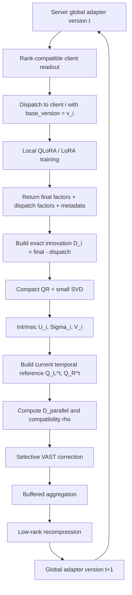
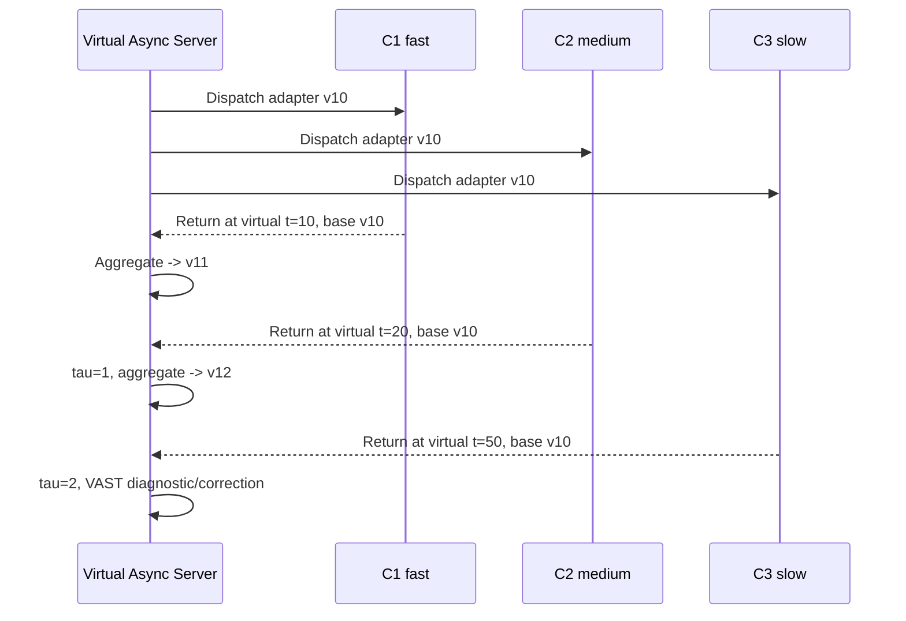
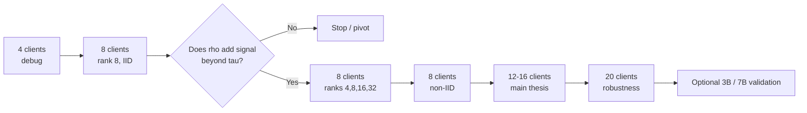
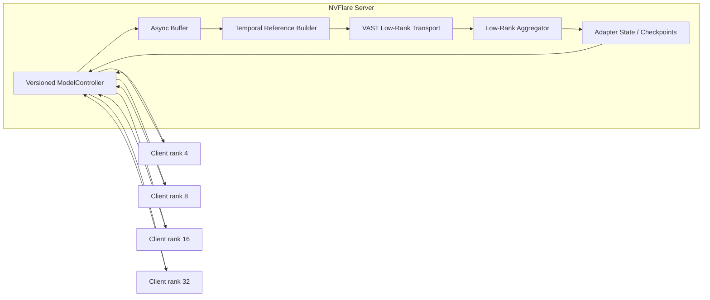
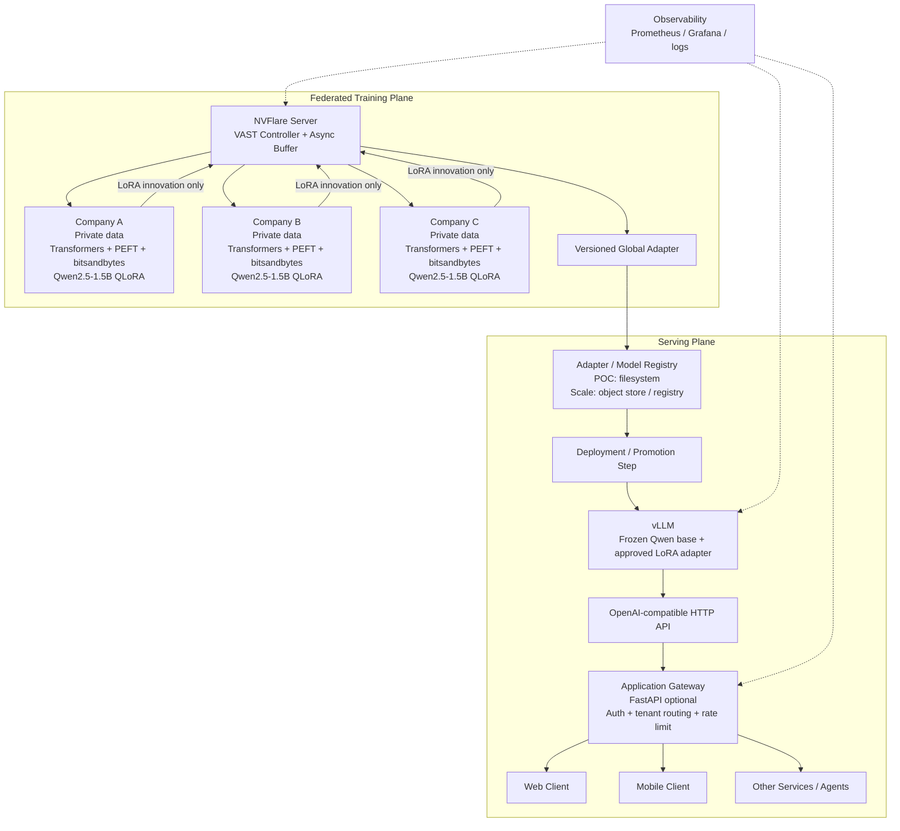
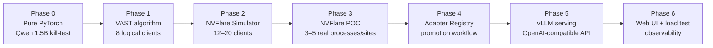
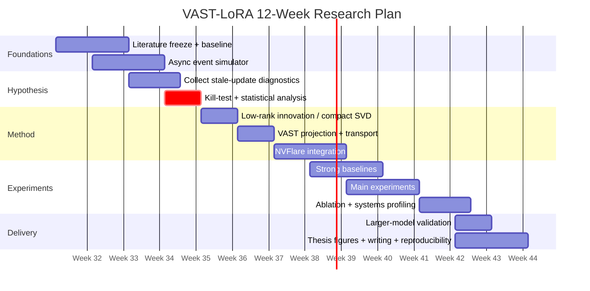
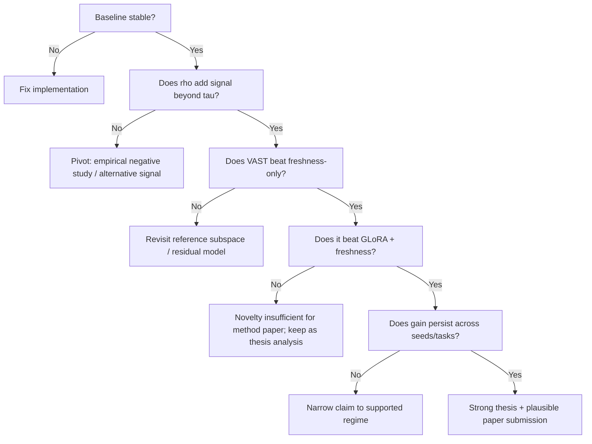

# VAST-LoRA — Research Feasibility Review & 12-Week Senior Research Guide

**Working title:**  
**VAST-LoRA: Version-Aware Subspace Transport for Asynchronous Federated LoRA under Rank Heterogeneity**

**Review date:** 2026-08-10  
**Target environment:** NVIDIA FLARE (NVFlare) 2.8.x, PyTorch, Hugging Face PEFT/Transformers, 16–24 GB VRAM class GPUs  
**Document purpose:** Turn the current thesis idea into a falsifiable, implementable, publication-oriented research plan rather than a collection of loosely combined methods.

---

## 0. Executive verdict

### Final assessment

| Dimension | Assessment | Notes |
|---|---:|---|
| Technical feasibility | **8/10** | Feasible if all server operations remain low-rank and main models stay around 0.5B–3B; 7B/8B is optional validation only. |
| 12-week feasibility | **7.5/10** | Feasible for a strong thesis MVP if the scope is frozen early and advanced extensions are not added mid-project. |
| Novelty potential | **6.5–7.5/10** | The intersection is still interesting, but GLoRA, AlignFed, FedSteer, FedRot-LoRA, FLoRG and 2026 geometry-aware work have already occupied nearby territory. |
| “Pioneer / first-ever” confidence | **Low–medium** | Do **not** claim pioneer yet. The safe claim is that asynchronous staleness, heterogeneous-rank FedLoRA and gauge-aware geometry have mostly been studied separately. |
| Paper potential | **Good if the hypothesis is validated** | The empirical observation can itself become a contribution: version age may be a weak proxy for stale-update usefulness, while intrinsic low-rank compatibility can add predictive signal. |
| Risk | **Medium-high research risk, low-medium engineering risk** | The largest risk is not GPU memory; it is that subspace compatibility may fail to predict useful stale updates. |

### One-sentence thesis

> **VAST-LoRA studies whether a stale LoRA innovation should be corrected according to how much of its intrinsic low-rank update remains compatible with the current optimization subspace, rather than attenuating the entire update solely because it is old.**

### The crucial scope decision

The thesis **must not** become:

- resource-aware rank scheduler,
- personalized private LoRA,
- fairness-aware client selection,
- MoE,
- differential privacy,
- adaptive routing,
- stale weighting,
- subspace alignment,
- and unlearning

all at once.

Those can be later extensions. The **core thesis** is only:

1. asynchronous stale LoRA updates;
2. heterogeneous client ranks;
3. gauge-invariant low-rank representation;
4. current-subspace compatibility;
5. selective correction of the stale innovation.

That is coherent enough to defend.

---

# 1. What problem are we actually solving?

Consider a frozen foundation-model weight for layer $\ell$:

$$
W_0^{(\ell)}\in\mathbb{R}^{d_{\text{out}}\times d_{\text{in}}}.
$$

LoRA adapts it using

$$
W^{(\ell)} = W_0^{(\ell)} + \Delta W^{(\ell)},
\qquad
\Delta W^{(\ell)} = s B^{(\ell)}A^{(\ell)},
$$

where

$$
B^{(\ell)}\in\mathbb{R}^{d_{\text{out}}\times r},
\qquad
A^{(\ell)}\in\mathbb{R}^{r\times d_{\text{in}}},
\qquad
r \ll \min(d_{\text{out}},d_{\text{in}}).
$$

The LoRA scaling $s=\alpha/r$ should be treated carefully when ranks differ. For the derivations below, **absorb $s$ into the factors** so that we can simply write

$$
\Delta W = BA.
$$

### Important experimental control

If client ranks differ and $\alpha$ is fixed, then $s_i=\alpha/r_i$ also differs. That creates a confound between **rank heterogeneity** and **update-scale heterogeneity**.

For the primary experiments, keep the effective scale constant:

$$
\frac{\alpha_i}{r_i}=c
\quad\Rightarrow\quad
\alpha_i=c\,r_i.
$$

Only vary scaling deliberately in a separate ablation.

---

# 2. Why asynchronous FedLoRA is different from ordinary FedLoRA

Suppose server version is $t$. Client $i$ was dispatched at version $v_i<t$.

Its **version staleness** is

$$
\tau_i = t-v_i.
$$

A naive asynchronous update treats the client update as merely “old” and often applies a scalar freshness function such as

$$
\mu_i=e^{-\lambda\tau_i}.
$$

Then the entire client update is scaled:

$$
D_i^{\text{naive}}=\mu_iD_i.
$$

The VAST hypothesis is more specific:

> Two updates with identical $\tau_i$ can have very different usefulness because one may still lie mostly in the current low-rank optimization geometry while the other may point into directions that have become obsolete or conflicting.

Therefore, **age and geometric compatibility should not be treated as the same signal**.

---

# 3. The first major correction to the earlier idea: transport the innovation, not the whole adapter

This is essential.

At dispatch time $v_i$, client $i$ receives a rank-$r_i$ LoRA adapter

$$
G_{i,0}^{(v_i)}
=
B_{i,0}A_{i,0}.
$$

After local training, it has

$$
G_{i,E}^{(v_i)}
=
B_{i,E}A_{i,E}.
$$

The server must **not** treat $G_{i,E}$ as a pure new update, because much of it is knowledge that already existed in the global adapter at dispatch.

The meaningful message is the **local innovation**

$$
\boxed{
D_i
=
G_{i,E}^{(v_i)}-G_{i,0}^{(v_i)}
}
$$

or

$$
D_i
=
B_{i,E}A_{i,E}
-
B_{i,0}A_{i,0}.
$$

This prevents double counting.

---

# 4. Exact low-rank representation of the innovation

A key feasibility result is that $D_i$ can be represented **without materializing a dense $d_{\text{out}}\times d_{\text{in}}$ matrix**.

Define

$$
L_i =
\begin{bmatrix}
B_{i,E} & B_{i,0}
\end{bmatrix}
\in
\mathbb{R}^{d_{\text{out}}\times 2r_i}
$$

and

$$
R_i =
\begin{bmatrix}
A_{i,E}\\
-A_{i,0}
\end{bmatrix}
\in
\mathbb{R}^{2r_i\times d_{\text{in}}}.
$$

Then

$$
\boxed{
D_i=L_iR_i
}
$$

exactly, and therefore

$$
\operatorname{rank}(D_i)\le 2r_i.
$$

This is one of the most important implementation tricks in the project.

For $d=4096$ and $r_i=16$, the server manipulates matrices of shape roughly

$$
4096\times32
$$

instead of a dense

$$
4096\times4096.
$$

---

# 5. Why raw LoRA factors cannot be compared directly

LoRA has a gauge / factorization ambiguity:

$$
BA=(BQ)(Q^{-1}A)
$$

for any invertible $Q$.

So raw values such as

$$
\cos(B_i,B_j)
$$

or direct Euclidean distances between $A_i$ matrices are not intrinsically meaningful.

This issue is directly highlighted by **GLoRA (2026)**, which argues that federated aggregation should operate on gauge-invariant update geometry rather than arbitrary factor coordinates.

Therefore VAST must first convert the factorized innovation $L_iR_i$ into an intrinsic low-rank form.

---

# 6. Gauge-invariant compact SVD without dense reconstruction

Given

$$
D_i=L_iR_i,
$$

Perform thin QR:

$$
L_i=Q_{L,i}T_{L,i}
$$

and

$$
R_i^\top=Q_{R,i}T_{R,i}.
$$

Shapes:

$$
Q_{L,i}\in\mathbb{R}^{d_{\text{out}}\times k_{L,i}},
\qquad
Q_{R,i}\in\mathbb{R}^{d_{\text{in}}\times k_{R,i}},
$$

where

$$
k_{L,i},k_{R,i}\le 2r_i.
$$

Now

$$
D_i
=
Q_{L,i}
\underbrace{
(T_{L,i}T_{R,i}^{\top})
}_{M_i\in\mathbb{R}^{k_{L,i}\times k_{R,i}}}
Q_{R,i}^{\top}.
$$

Compute SVD only on the small middle matrix:

$$
M_i=P_i\Sigma_iQ_i^\top.
$$

Use compact SVD, with

$$
P_i\in\mathbb{R}^{k_{L,i}\times m_i},
\qquad
Q_i\in\mathbb{R}^{k_{R,i}\times m_i},
\qquad
m_i\le \min(k_{L,i},k_{R,i}).
$$

Then

$$
\boxed{
D_i=U_i\Sigma_iV_i^\top
}
$$

where

$$
U_i=Q_{L,i}P_i,
\qquad
V_i=Q_{R,i}Q_i.
$$

This gives an intrinsic compact SVD of the client innovation without ever creating $D_i$ densely.

### Numerical rank

Discard singular values satisfying

$$
\sigma_j < \epsilon_{\text{svd}}\sigma_1,
$$

with a starting value such as

$$
\epsilon_{\text{svd}}\in[10^{-6},10^{-4}].
$$

This prevents almost-null directions from making the principal-angle calculation unstable.

---

# 7. What should represent the “current optimization subspace”?

Do **not** automatically use the current global adapter $G_t$ and call it “the optimization direction”.

The adapter state is a **position** in parameter space; recent accepted innovations are closer to a **directional trajectory**.

VAST should maintain a short rolling history of accepted global increments:

$$
\mathcal{H}_t
=
\{
\Delta G_{t-H+1},
\dots,
\Delta G_t
\}.
$$

Each accepted increment is stored in compact low-rank form:

$$
\Delta G_j=U_j\Sigma_jV_j^\top.
$$

Use a small history such as

$$
H\in\{3,4,6,8\}.
$$

---

# 8. Constructing the temporal reference subspace

Assign recency weights

$$
\gamma_h
=
\frac{
e^{-\delta h}
}{
\sum_{q=0}^{H-1}e^{-\delta q}
},
\qquad
h=0,\dots,H-1.
$$

Build the thin matrices

$$
M_L^t
=
\left[
\sqrt{\gamma_0}U_t,
\sqrt{\gamma_1}U_{t-1},
\dots
\right]
$$

and

$$
M_R^t
=
\left[
\sqrt{\gamma_0}V_t,
\sqrt{\gamma_1}V_{t-1},
\dots
\right].
$$

Take their leading singular vectors:

$$
Q_L^t=\operatorname{TopSVD}_{R_L}(M_L^t),
$$

$$
Q_R^t=\operatorname{TopSVD}_{R_R}(M_R^t).
$$

The corresponding projectors are

$$
P_L^t=Q_L^t(Q_L^t)^\top,
$$

$$
P_R^t=Q_R^t(Q_R^t)^\top.
$$

This constructs a **two-sided temporal low-rank reference space**.

### Why two-sided?

A matrix update has both:

- a column space;
- a row space.

VAST should test:

1. left-only projection;
2. right-only projection;
3. two-sided projection.

Do not assume two-sided is automatically superior. Make it an ablation.

---

# 9. Compatibility of a stale innovation with the current subspace

Given

$$
D_i=U_i\Sigma_iV_i^\top,
$$

its projection into the current reference space is

$$
D_i^{\parallel}
=
P_L^t D_i P_R^t.
$$

Do not compute that densely.

Define the small coordinate core

$$
C_i^t
=
(Q_L^t)^\top
U_i
\Sigma_i
V_i^\top
Q_R^t.
$$

Then

$$
\boxed{
D_i^{\parallel}
=
Q_L^t C_i^t (Q_R^t)^\top.
}
$$

The Frobenius energy of the projected component is

$$
\|D_i^\parallel\|_F^2
=
\|C_i^t\|_F^2.
$$

The full innovation energy is

$$
\|D_i\|_F^2
=
\|\Sigma_i\|_F^2.
$$

Define the **VAST compatibility score**

$$
\boxed{
\rho_i^t
=
\frac{
\|C_i^t\|_F^2
}{
\|\Sigma_i\|_F^2+\epsilon
}
}
$$

where

$$
0\le \rho_i^t\le1.
$$

Interpretation:

- $\rho\approx1$: most update energy remains in directions supported by recent global optimization;
- $\rho\approx0$: most update energy lies outside the current reference space.

This metric is rank-aware and factorization/gauge invariant.

---

# 10. VAST core operator: selective stale residual attenuation

This is the cleanest version of the method.

Decompose

$$
D_i
=
D_i^\parallel
+
D_i^\perp,
$$

where

$$
D_i^\perp=D_i-D_i^\parallel.
$$

Define a freshness coefficient

$$
\mu_i
=
e^{-\lambda\tau_i}.
$$

Instead of scaling the **whole** update as in freshness-only AsyncFL, VAST keeps the compatible component and decays only the residual:

$$
\boxed{
\mathcal{T}_t(D_i)
=
D_i^\parallel
+
\mu_i D_i^\perp
}
$$

or equivalently,

$$
\boxed{
\mathcal{T}_t(D_i)
=
\mu_iD_i
+
(1-\mu_i)D_i^\parallel.
}
$$

This is the central equation of VAST-LoRA.

---

# 11. Why this operator is attractive

## Property 1 — fresh updates are unchanged

If

$$
\tau_i=0,
$$

then

$$
\mu_i=1
$$

and

$$
\mathcal{T}_t(D_i)=D_i.
$$

So VAST does not distort fresh updates.

## Property 2 — perfectly compatible updates survive even if stale

If

$$
D_i=D_i^\parallel,
$$

then

$$
D_i^\perp=0
$$

and therefore

$$
\mathcal{T}_t(D_i)=D_i
$$

for any staleness.

This is the key conceptual distinction from whole-update freshness weighting.

## Property 3 — very stale incompatible directions are suppressed

As

$$
\tau_i\rightarrow\infty,
\qquad
\mu_i\rightarrow0,
$$

then

$$
\mathcal{T}_t(D_i)\rightarrow D_i^\parallel.
$$

## Property 4 — exact distortion expression

Because $P_L^tDP_R^t$ is the Frobenius-orthogonal projection onto

$$
\mathcal{S}_t=
\{
Q_L^t X (Q_R^t)^\top
\},
$$

we have

$$
\langle D_i^\parallel,D_i^\perp\rangle_F=0.
$$

Therefore

$$
\boxed{
\|
\mathcal{T}_t(D_i)-D_i
\|_F
=
(1-\mu_i)
\|D_i^\perp\|_F.
}
$$

## Property 5 — retained energy

Ignoring the tiny numerical stabilizer $\epsilon$ in the denominator of $\rho_i^t$, the exact retained-energy ratio is

$$
\boxed{
\frac{
\|\mathcal{T}_t(D_i)\|_F^2
}{
\|D_i\|_F^2
}
=
\rho_i^t
+
\mu_i^2(1-\rho_i^t).
}
$$

This equation gives a clear interpretation of the two signals:

- $\rho$: spatial/geometric compatibility;
- $\mu(\tau)$: temporal freshness.

---

# 12. A useful theoretical proposition to target

Let $G_t^\star$ denote an ideal current descent direction for the layer.

Suppose

$$
G_t^\star\in\mathcal{S}_t.
$$

Then

$$
\langle
G_t^\star,
D_i^\perp
\rangle_F
=0.
$$

Thus

$$
\boxed{
\langle
G_t^\star,
\mathcal{T}_t(D_i)
\rangle_F
=
\langle
G_t^\star,
D_i
\rangle_F.
}
$$

In words:

> If the current useful gradient lies inside the estimated reference subspace, damping the off-subspace stale residual reduces update energy without changing its first-order alignment with the current useful direction.

For an approximate subspace assumption,

$$
\|
(I-\Pi_{\mathcal S_t})G_t^\star
\|_F
\le\varepsilon,
$$

the change in first-order alignment can be bounded by a term proportional to

$$
\varepsilon
(1-\mu_i)
\|D_i^\perp\|_F.
$$

Do **not** promise a full non-convex convergence theorem in 12 weeks. A clean proposition + empirical verification is sufficient for a graduation thesis.

---

# 13. Low-rank form of the transported update

We have

$$
D_i=L_iR_i
$$

and

$$
D_i^\parallel
=
Q_L^t C_i^t(Q_R^t)^\top.
$$

Therefore

$$
\mathcal{T}_t(D_i)
=
\mu_iL_iR_i
+
(1-\mu_i)
Q_L^t C_i^t(Q_R^t)^\top.
$$

Represent it by factor concatenation:

$$
\widetilde L_i
=
\left[
\mu_iL_i,
(1-\mu_i)Q_L^t
\right],
$$

$$
\widetilde R_i
=
\begin{bmatrix}
R_i\\
C_i^t(Q_R^t)^\top
\end{bmatrix}.
$$

Then

$$
\boxed{
\mathcal{T}_t(D_i)
=
\widetilde L_i\widetilde R_i
}
$$

without dense reconstruction.

A small QR + SVD can recompress it to a desired rank budget.

---

# 14. Buffered asynchronous aggregation

For the first implementation, use **buffered asynchronous FL**, not pure immediate update.

Let the server process a buffer

$$
\mathcal B_t
$$

of $b$ returned client innovations.

For each update, perform VAST transport:

$$
\widetilde D_i=\mathcal T_t(D_i).
$$

Use simple data-size weights

$$
p_i
=
\frac{n_i}{
\sum_{j\in\mathcal B_t}n_j
}.
$$

Then

$$
\boxed{
\Delta G_t
=
\sum_{i\in\mathcal B_t}
p_i\widetilde D_i.
}
$$

Global adapter update:

$$
G_{t+1}
=
G_t+\eta_s\Delta G_t.
$$

Do not add fairness or quality weights to the core algorithm.

### Suggested buffer sizes

$$
b\in\{1,2,4,8\}
$$

with $b=4$ as a practical starting point.

- $b=1$: fully asynchronous;
- $b>1$: FedBuff-like asynchronous micro-batching.

---

# 15. Controlling rank growth on the server

Summing low-rank updates grows rank.

After aggregation, recompress to a global server rank budget $R_g$.

Suppose

$$
X=L_XR_X.
$$

Use the same compact procedure:

1. QR on $L_X$;
2. QR on $R_X^\top$;
3. SVD only on the small middle matrix;
4. keep the top $R_g$ singular components.

Record the **recompression error**

$$
\boxed{
\epsilon_{\text{rec}}
=
\frac{
\|X-X_{R_g}\|_F
}{
\|X\|_F+\epsilon
}.
}
$$

If this quantity becomes large, performance may be limited by the global rank budget rather than VAST itself.

---

# 16. Rank-compatible client readout

The server can maintain a canonical compact adapter

$$
G_t
=
U_t\Sigma_tV_t^\top
$$

of rank $R_g$.

For a client with rank $r_i\le R_g$, produce

$$
G_{t\rightarrow i}
=
U_t[:,1:r_i]
\Sigma_t[1:r_i,1:r_i]
V_t[:,1:r_i]^\top.
$$

A convenient canonical factorization is

$$
B_{i,0}
=
U_r\Sigma_r^{1/2},
$$

$$
A_{i,0}
=
\Sigma_r^{1/2}V_r^\top.
$$

This is not claimed as a novelty; it is infrastructure inspired by the rank-compatible / gauge-aware direction of recent FedLoRA work such as GLoRA.

---

# 17. Complete VAST lifecycle



---

# 18. Asynchronous sequence diagram

```mermaid
sequenceDiagram
    participant S as NVFlare Server
    participant F as Fast Client
    participant M as Medium Client
    participant L as Slow Client

    S->>F: Adapter v=10, rank=16
    S->>M: Adapter v=10, rank=8
    S->>L: Adapter v=10, rank=4

    F->>F: Local LoRA training
    F-->>S: Innovation based on v10
    S->>S: VAST correction, aggregate -> v11

    F->>F: Train again on v11
    M->>M: Still training old v10
    L->>L: Still training old v10

    F-->>S: Innovation based on v11
    S->>S: Aggregate -> v12

    M-->>S: Innovation based on v10, tau=2
    S->>S: Extract geometry
    S->>S: Keep compatible part; damp stale residual
    S->>S: Aggregate -> v13

    L-->>S: Innovation based on v10, tau=3
    S->>S: VAST correction using current reference
    S->>S: Aggregate -> v14
```

---

# 19. Why this is not simply “GLoRA + AlignFed + FedSteer”

This must be defended explicitly.

## GLoRA

GLoRA's contribution is primarily:

- gauge-aware server representation;
- consensus update subspace;
- low-rank aggregation in shared coordinates;
- rank-compatible heterogeneous-client readout.

VAST **borrows the principle** that raw factors are not intrinsic objects, but studies a different temporal problem:

> an innovation arriving at version $t$ was computed against version $v_i<t$.

## AlignFed

AlignFed addresses asynchronous LLM fine-tuning with:

- version-aware grouping;
- cross-version **semantic** alignment;
- a server-side public calibration mini-batch;
- freshness and fairness aggregation.

VAST should differentiate itself as:

> **server-data-free, adapter-factor-only, intrinsic low-rank correction.**

No calibration dataset is required by the VAST training algorithm.

## FedSteer

FedSteer:

- operates on generic dense/vector gradients;
- builds a dynamic gradient subspace from a representative core client set;
- caches projection coordinates and reuses them later.

VAST instead operates on:

- LoRA matrix innovations;
- heterogeneous ranks;
- factorization/gauge ambiguity;
- two-sided row/column update geometry;
- exact low-rank algebra.

## FedRot-LoRA / FLoRG

Both show that alignment/Procrustes ideas are already present in FedLoRA.

Therefore:

> **Do not claim that “alignment of LoRA factors” itself is novel.**

The novelty must come from the **asynchronous stale-innovation problem and selective temporal correction**.

---

# 20. Safe and unsafe novelty claims

## Unsafe claims

Do not write:

> “We are the first method to align LoRA subspaces.”

Do not write:

> “We are the first resource-aware heterogeneous-rank FedLoRA method.”

Do not write:

> “We are the first asynchronous federated LLM fine-tuning framework.”

Do not write:

> “We are the first to solve gauge ambiguity in federated LoRA.”

Those claims are already threatened by existing literature.

## Safer working claim

> **To the best of our current literature review, recent work has separately addressed gauge-aware heterogeneous-rank FedLoRA aggregation and asynchronous cross-version federated LLM alignment, while the interaction between stale client innovations and heterogeneous intrinsic LoRA update geometry remains underexplored. VAST-LoRA studies a data-free low-rank correction rule that preserves current-compatible stale components while selectively attenuating temporally outdated residual directions.**

Before paper submission or thesis defense, run the novelty search again.

---

# 21. The decisive research hypotheses

## H1 — staleness alone is insufficient

$$
H_1:
\quad
\tau_i
\text{ alone is a weak predictor of stale-update utility.}
$$

## H2 — intrinsic compatibility adds predictive signal

$$
H_2:
\quad
\rho_i
\text{ explains additional stale-update utility after controlling for }\tau_i.
$$

## H3 — selective correction beats whole-update decay

$$
H_3:
\quad
D_i^\parallel+\mu_iD_i^\perp
$$

outperforms

$$
\mu_iD_i
$$

under meaningful asynchronous heterogeneity.

## H4 — benefit increases under joint temporal + rank heterogeneity

The VAST improvement should be larger when both:

$$
\operatorname{Var}(r_i)
$$

and

$$
\operatorname{Var}(\tau_i)
$$

increase.

H4 is secondary; H1–H3 are the core.

---

# 22. The kill-test: do this before building the full method

This is the most important research-management recommendation.

## Step A — generate stale innovations

Train a simple asynchronous FedLoRA system and collect innovations across:

$$
\tau\in\{0,1,2,4,8\}
$$

and

$$
r\in\{4,8,16,32\}.
$$

## Step B — measure compatibility

For each returned innovation, compute

$$
\rho_i.
$$

## Step C — measure true post-hoc utility

For research evaluation only, use a held-out evaluator and measure:

$$
u_i
=
\mathcal L(W_t)
-
\mathcal L(W_t+\eta D_i).
$$

Positive $u_i$ means the update reduces loss.

Also evaluate transported utility:

$$
u_i^{\text{VAST}}
=
\mathcal L(W_t)
-
\mathcal L(W_t+\eta\mathcal T_t(D_i)).
$$

The method itself remains data-free; this validation data is only for offline scientific analysis.

## Step D — predictive comparison

Compare:

### Model A

$$
u_i\sim \tau_i
$$

against

### Model B

$$
u_i\sim \tau_i+\rho_i
$$

and optionally

$$
u_i\sim
\tau_i+\rho_i+\tau_i\rho_i.
$$

Use:

- Spearman correlation;
- partial correlation;
- linear / robust regression $R^2$;
- harmful-update classification AUROC where

$$
y_i=\mathbf1[u_i<0].
$$

### GO criterion

Proceed aggressively if:

1. $\rho$ is meaningfully associated with update utility after controlling for $\tau$; and
2. transported updates improve harmful-update rate or utility in the stale regime.

### STOP / pivot criterion

If $\rho$ is consistently uninformative across tasks and seeds, do **not** spend weeks polishing transport.

Possible pivot:

> empirical study on the limits of parameter-space geometry for stale federated adapters.

A negative result can still be scientifically useful.

---

# 23. Important warning from adjacent literature

Recent non-federated adapter-composition work has reported that simple angular/orthogonality geometry can be a weak predictor of adapter composition performance.

Therefore, do not assume the VAST hypothesis is true.

This is exactly why Week 3–4 is a **kill-test**, not an implementation sprint.

The VAST compatibility score is stronger than a simple angle because it is **energy-weighted and two-sided**, but it still must be experimentally validated.

---

# 24. Simulation strategy for one 16–24 GB GPU

You do **not** need 20 GPUs to study asynchronous FL.

Use an **event-driven virtual-time simulator**.

Each client $i$ has:

- rank $r_i$;
- data partition $\mathcal D_i$;
- virtual compute speed $s_i$;
- network delay $d_i$;
- dispatch version $v_i$.

When a client is dispatched at virtual time $T_d$, assign a virtual completion time

$$
T_f
=
T_d
+
T_i^{\text{compute}}
+
T_i^{\text{network}}.
$$

Store events in a priority queue ordered by $T_f$.

The actual GPU can execute local jobs sequentially, while the **logical delivery order** follows virtual completion time.

This gives controlled asynchronous semantics without requiring all clients to run physically in parallel.

### Why this is scientifically acceptable

The research variable is the ordering and version lag of client innovations.

As long as:

1. the client trains from the exact dispatched version;
2. its local data and optimizer state are correct;
3. the returned innovation is delivered according to the simulated finish event;

the logical asynchronous state evolution is reproducible.

Later, validate the implementation with a small real NVFlare deployment.

---

# 25. Do not equate LoRA rank with real device speed

A recent 2026 resource-adaptive foundation-model FL paper explicitly argues that merely reducing LoRA rank may yield only marginal compute savings because dense backbone operations still dominate.

Therefore use a **factorial experiment**:

## Independent rank heterogeneity

$$
r_i\in\{4,8,16,32\}.
$$

## Independent latency heterogeneity

Example groups:

- fast;
- medium;
- slow.

Run two settings:

1. **independent** rank and latency;
2. **correlated** rank and latency.

This prevents an incorrect causal claim that a rank-4 LoRA client is automatically much faster than a rank-32 client.

---

# 26. Recommended model tiers

## Tier A — algorithm development

Use a 0.5B–1.1B class causal LLM.

Purpose:

- many seeds;
- many clients;
- rapid debugging;
- matrix-geometry analysis.

## Tier B — primary thesis results

Use a ~1.5B class LLM, optionally ~3B if runtime allows.

Purpose:

- main non-IID experiments;
- 10–20 logical clients;
- rank heterogeneity;
- staleness sweeps.

## Tier C — stretch validation

3B–7B/8B with QLoRA on a 24 GB GPU only if Weeks 1–10 are already complete.

Do not make thesis success depend on 7B/8B.

QLoRA demonstrates that low-bit frozen-backbone training with LoRA dramatically reduces memory, but activation memory still depends strongly on sequence length and batch size.

### Recommended memory controls

- 4-bit base weights;
- bf16/fp16 LoRA factors;
- gradient checkpointing;
- batch size 1–2;
- gradient accumulation;
- sequence length 512 first, then 1024 if stable;
- target only `q_proj` and `v_proj` initially.

---


# 26A. Exact Qwen2.5-1.5B kill-test configuration

This section freezes the **first experiment that should be run before full VAST development**.

## 26A.1 Model

Use:

```text
Qwen/Qwen2.5-1.5B-Instruct
```

The purpose is **not** to demonstrate large-model scale. The purpose is to cheaply collect enough stale LoRA innovations to test whether VAST's core hypothesis is true.

## 26A.2 Training configuration

Recommended first configuration:

```yaml
backbone: Qwen/Qwen2.5-1.5B-Instruct
quantization: 4-bit NF4
double_quantization: true
compute_dtype: bfloat16

lora:
  target_modules:
    - q_proj
    - v_proj
  rank: 8            # homogeneous in Kill-Test 1
  effective_scale: constant

training:
  sequence_length: 512
  per_device_batch_size: 1
  gradient_accumulation_steps: 4
  gradient_checkpointing: true
  local_steps: small and fixed
```

For heterogeneous-rank experiments use:

$$
r_i \in \{4,8,16,32\}.
$$

Keep the effective LoRA scale controlled across ranks:

$$
\frac{\alpha_i}{r_i}=c.
$$

## 26A.3 Logical-client ladder

Do not start with 50 or 100 LLM clients.

### Stage 0 — code sanity

$$
N=4.
$$

Purpose:

- verify adapter dispatch / return;
- verify version IDs;
- verify innovation exactness;
- verify stale-event replay.

### Stage 1 — primary hypothesis kill-test

$$
\boxed{N=8}
$$

Start with:

```text
all clients: rank = 8
data: IID
staleness: controlled
```

Target version staleness:

$$
\tau\in\{0,1,2,4,8\}.
$$

This isolates the question:

> Does intrinsic current-subspace compatibility explain stale-update utility beyond version age?

### Stage 2 — heterogeneous-rank kill-test

Still use:

$$
N=8.
$$

Assign:

| Client | Rank | Virtual speed |
|---|---:|---|
| C1 | 4 | fast |
| C2 | 4 | slow |
| C3 | 8 | fast |
| C4 | 8 | medium |
| C5 | 16 | medium |
| C6 | 16 | slow |
| C7 | 32 | fast |
| C8 | 32 | slow |

Rank and latency are deliberately **not perfectly correlated**.

### Stage 3 — main thesis

If the kill-tests pass:

$$
N=12
$$

or

$$
N=16.
$$

Use heterogeneous ranks and non-IID data.

### Stage 4 — robustness

$$
N=20.
$$

Optional:

$$
N=32
$$

if runtime is still manageable.

The thesis does **not** require 100 physical clients. What matters is collecting many stale-update observations.

For example,

$$
8\text{ clients}\times100\text{ arrival events}
=
800\text{ stale/fresh update observations}.
$$

That is already useful for the statistical hypothesis study.

## 26A.4 Event-driven one-GPU simulation

Logical client count must not multiply VRAM usage.

Only one local QLoRA training job is active on the GPU at once.

Each client is assigned a virtual completion time:

$$
T_i^{finish}
=
T_i^{dispatch}
+
T_i^{compute}
+
T_i^{network}.
$$

Actual GPU execution may be sequential, while server delivery is replayed according to the virtual event queue.

Example:



This simulation is the recommended mechanism for Weeks 2–6.

## 26A.5 Engineering VRAM budget

These are **planning estimates, not benchmark guarantees**. Measure actual peak memory with:

```python
torch.cuda.reset_peak_memory_stats()
# local training
allocated = torch.cuda.max_memory_allocated()
reserved = torch.cuda.max_memory_reserved()
```

Expected planning budget for one active Qwen2.5-1.5B client:

| Configuration | Planning VRAM budget |
|---|---:|
| QLoRA 4-bit, seq 512, batch 1 | **~4–6 GB** |
| QLoRA 4-bit, seq 1024 | **~5–8 GB** |
| QLoRA 4-bit, seq 2048 | **~7–11 GB** |
| BF16 LoRA, seq 512 | **~6–9 GB** |
| BF16 LoRA, seq 1024 | **~8–12 GB** |

With sequential/multiplexed logical clients:

```text
4 logical clients   -> roughly single-client peak VRAM
8 logical clients   -> roughly single-client peak VRAM
20 logical clients  -> roughly single-client peak VRAM
```

The quantities that scale with client count are primarily:

- CPU RAM;
- adapter snapshots;
- metadata;
- event queue;
- disk;
- total wall-clock experiment time.

**Recommended 16 GB GPU starting point:**

```text
Qwen2.5-1.5B-Instruct
QLoRA NF4
seq = 512
batch = 1
8 logical clients
all rank = 8
IID
controlled staleness
```

This is the first scientific kill-test.

## 26A.6 Experiment progression



---

# 27. Recommended datasets

Use two levels.

## Diagnostic classification / short-form task

Purpose: cheap repeated experiments.

Candidates:

- GLUE subset;
- 20 Newsgroups;
- AG News / similar text classification.

## Instruction-tuning task

Purpose: demonstrate relevance to federated LLM adaptation.

Candidates used by nearby literature include:

- Dolly-style instruction data;
- Alpaca-style instruction data;
- SuperNI-style task collections.

The exact final choice is less important than having:

1. clear client partitioning;
2. reproducible non-IID controls;
3. a metric cheap enough to compute many times.

---

# 27A. Bảng benchmark cho thí nghiệm thesis 1.5B

Phần này đóng băng hướng benchmark sau khi rà lại ma trận đối thủ ở Week 1.

Bảng chính của thesis nên là **LLM / instruction**, không phải GLUE. GLUE vẫn hữu ích như một bộ diagnostic rẻ để kiểm tra pipeline, nhưng thesis đang nghiên cứu asynchronous federated LoRA cho LLM adaptation, stale LoRA innovations, rank heterogeneity và low-rank transport. Vì vậy, nếu chỉ có kết quả GLUE thì câu chuyện sẽ hơi xa thesis core.

Template chi tiết nằm ở:

```text
docs/week1/vastlora_1_5b_experiment_tables_vi.md
```

## Bảng chính: Qwen2.5-1.5B instruction benchmark

Dùng mô hình:

```text
Qwen/Qwen2.5-1.5B-Instruct
```

Dataset khuyến nghị:

```text
GSM8K, Dolly subset
```

Mở rộng nếu đủ thời gian:

```text
BoolQ, PIQA, SIQA, HellaSwag, WinoGrande, ARC-e, ARC-c, OBQA
```

Template:

| Strategy | Code source | GSM8K acc | Dolly score / ROUGE-L | Commonsense avg acc | Mean | Std | Training time | Peak VRAM | Upload MB/round | Ghi chú |
|---|---|---:|---:|---:|---:|---:|---:|---:|---:|---|
| Sync FedAvg-LoRA | In-house | TBD | TBD | TBD | TBD | TBD | TBD | TBD | TBD | Baseline synchronous |
| Naive Async-LoRA | In-house | TBD | TBD | TBD | TBD | TBD | TBD | TBD | TBD | Async không sửa stale update |
| Freshness-only Async-LoRA | In-house | TBD | TBD | TBD | TBD | TBD | TBD | TBD | TBD | Decay toàn bộ update |
| Buffered Async-LoRA | In-house | TBD | TBD | TBD | TBD | TBD | TBD | TBD | TBD | FedBuff-style |
| FLoRA / FedIT / Zero-Padding | Public repo | TBD | TBD | TBD | TBD | TBD | TBD | TBD | TBD | Heterogeneous-rank baseline |
| FedEx-LoRA | Public repo | TBD | TBD | TBD | TBD | TBD | TBD | TBD | TBD | Exact aggregation baseline |
| FedRot-LoRA | Public repo | TBD | TBD | TBD | TBD | TBD | TBD | TBD | TBD | Rotational alignment baseline |
| FSLoRA | Public repo | TBD | TBD | TBD | TBD | TBD | TBD | TBD | TBD | Sketching/rank-resource baseline |
| GLoRA-like + freshness | Reimplementation | TBD | TBD | TBD | TBD | TBD | TBD | TBD | TBD | Gauge-aware plus whole-update freshness |
| VAST-LoRA | In-house | TBD | TBD | TBD | TBD | TBD | TBD | TBD | TBD | Method chính |

## Bảng phụ: GLUE / NLU diagnostic benchmark

Dataset khuyến nghị:

```text
SST-2, QNLI, RTE, MNLI
```

Chỉ thêm `QQP` nếu còn compute.

Template:

| Strategy | Code source | SST-2 acc | QNLI acc | RTE acc | MNLI acc | QQP acc | Average | Std | Ghi chú |
|---|---|---:|---:|---:|---:|---:|---:|---:|---|
| Sync FedAvg-LoRA | In-house | TBD | TBD | TBD | TBD | TBD | TBD | TBD | Baseline synchronous |
| Naive Async-LoRA | In-house | TBD | TBD | TBD | TBD | TBD | TBD | TBD | Async không sửa stale update |
| Freshness-only Async-LoRA | In-house | TBD | TBD | TBD | TBD | TBD | TBD | TBD | Decay toàn bộ update |
| Buffered Async-LoRA | In-house | TBD | TBD | TBD | TBD | TBD | TBD | TBD | FedBuff-style |
| FLoRA / FedIT / Zero-Padding | Public repo | TBD | TBD | TBD | TBD | TBD | TBD | TBD | Heterogeneous-rank baseline |
| FedEx-LoRA | Public repo | TBD | TBD | TBD | TBD | TBD | TBD | TBD | Exact aggregation baseline |
| FedRot-LoRA | Public repo | TBD | TBD | TBD | TBD | TBD | TBD | TBD | Rotational alignment baseline |
| FSLoRA | Public repo | TBD | TBD | TBD | TBD | TBD | TBD | TBD | Sketching baseline |
| GLoRA-like + freshness | Reimplementation | TBD | TBD | TBD | TBD | TBD | TBD | TBD | Gauge-aware plus freshness |
| VAST-LoRA | In-house | TBD | TBD | TBD | TBD | TBD | TBD | TBD | Method chính |

## Độ ưu tiên kéo đối thủ về chạy

| Ưu tiên | Strategy | Khả dụng | Quyết định |
|---:|---|---|---|
| 1 | FedEx-LoRA | Có public repository | Kéo về test trước |
| 2 | FedRot-LoRA | Có public repository | Kéo về test trước |
| 3 | FLoRA / FedIT / Zero-Padding | Có public repository | Dùng làm hetero-rank baseline |
| 4 | FSLoRA | Có public repository | Dùng nếu đủ thời gian tích hợp |
| 5 | GLoRA-like + freshness | Chưa thấy official code rõ | Tự tái hiện lõi |
| 6 | AlignFed | Chưa thấy official code rõ | Không ưu tiên; dùng calibration và lệch khỏi data-free VAST |
| 7 | FLoRG | Chưa thấy official code rõ | Chỉ tái hiện nếu còn thời gian |
| 8 | SDFLoRA / PreLort / HetLoRA | Chưa thấy official code rõ hoặc khó reproduce | Để related work / optional |

Kết quả thesis không nên phụ thuộc vào việc reproduce toàn bộ paper chưa public code. Thesis nên phụ thuộc vào việc VAST-LoRA thắng các baseline mạnh có thể chạy được, cộng thêm một baseline GLoRA-like + freshness được tái hiện trung thực trong đúng regime stale và heterogeneous-rank.

---

# 28. Non-IID partitioning

For labeled classification, Dirichlet partition labels:

$$
p_i\sim\operatorname{Dirichlet}(\alpha).
$$

Suggested settings:

- nearly IID: $\alpha=10$;
- moderate: $\alpha=1$;
- strong non-IID: $\alpha=0.3$.

For instruction datasets, prefer **domain/task partitioning** rather than pretending instruction examples are ordinary class labels.

Example:

- client group A: summarization;
- B: QA;
- C: reasoning;
- D: dialogue;
- E: code.

---

# 29. Staleness regimes

Measure both:

## Version staleness

$$
\tau_i=t-v_i.
$$

## Virtual wall-clock delay

$$
\Delta T_i=T_{\text{return}}-T_{\text{dispatch}}.
$$

Suggested regimes:

| Regime | Typical $\tau$ |
|---|---|
| low | 0–1 |
| moderate | 2–4 |
| high | 5–8 |
| extreme | >8 |

Do not hard-code these as universal definitions; they are experimental buckets.

---

# 30. Baselines: minimum viable set

Do not attempt to reproduce ten papers in 12 weeks.

## Tier 0 — mandatory

1. **Sync FedAvg-LoRA**
2. **Naive Async-LoRA**
3. **Freshness-only Async-LoRA**

$$
D_i\leftarrow e^{-\lambda\tau_i}D_i
$$

4. **Buffered Async-LoRA / FedBuff-style**

## Tier 1 — mandatory strong comparisons

5. **Heterogeneous-rank baseline**  
   Use HetLoRA / a faithful heterogeneous-rank implementation.

6. **GLoRA-like gauge-aware aggregation baseline**  
   Important because it tests whether your gains merely come from fixing factor geometry.

7. **GLoRA + whole-update freshness**  
   This is arguably the most important compositional baseline.

If VAST cannot beat this baseline in the targeted regime, the novelty story becomes weak.

## Tier 2 — desirable

8. **AlignFed or an implementation of its cross-version semantic alignment core**  
   Compare accuracy and server cost; note that AlignFed uses a calibration set.

9. **FedSteer-inspired LoRA vectorized/projection baseline**  
   Optional if implementation time allows.

10. **FedRot-LoRA or FLoRG**  
    Use at least one alignment-aware FedLoRA baseline if code/reproduction is feasible.

---

# 31. Key ablations

A strong thesis needs these.

## A1 — no geometry

$$
D_i^{\text{fresh}}
=
\mu_iD_i.
$$

## A2 — geometry only

$$
D_i^{\text{proj}}
=
D_i^\parallel.
$$

## A3 — VAST full

$$
D_i^\parallel+\mu_iD_i^\perp.
$$

## A4 — left-only projection

$$
P_L^tD_i.
$$

## A5 — right-only projection

$$
D_iP_R^t.
$$

## A6 — two-sided

$$
P_L^tD_iP_R^t.
$$

## A7 — reference history

$$
H\in\{1,2,4,8\}.
$$

## A8 — reference rank

$$
R_{\text{ref}}\in\{4,8,16,32\}.
$$

## A9 — buffer size

$$
b\in\{1,2,4,8\}.
$$

## A10 — rank heterogeneity

- homogeneous rank;
- mild heterogeneous;
- severe heterogeneous.

---

# 32. Metrics

## Task quality

Depending on task:

- accuracy;
- F1;
- ROUGE-L;
- perplexity;
- exact match.

## Optimization

- loss vs accepted update count;
- loss vs virtual wall-clock time;
- convergence stability;
- time-to-target metric.

## Stale-update quality

- harmful update ratio;
- post-hoc update utility $u_i$;
- $\rho_i$ vs $u_i$;
- $\tau_i$ vs $u_i$.

## Systems

- bytes uploaded/downloaded;
- server correction time;
- local train time;
- peak client VRAM;
- peak server RAM/VRAM;
- accepted updates per virtual hour;
- recompression error.

## Rank behavior

- singular-value spectrum;
- effective numerical rank;
- energy retained by VAST;
- client-rank vs compatibility.

---

# 33. Statistical protocol

For the main thesis tables:

- at least 3 random seeds;
- preferably 5 for small-model diagnostic experiments;
- report mean ± standard deviation;
- use paired comparisons when the exact same partition/latency seed is shared across methods.

For the hypothesis phase:

- Spearman $\rho_s$;
- partial correlation controlling staleness;
- bootstrap confidence intervals;
- logistic regression for harmful-update prediction;
- compare AUC for:
  - staleness only;
  - compatibility only;
  - both.

Do not overfocus on p-values with tiny sample counts. Effect size and consistency across tasks matter more.

---

# 34. Expected figures for the thesis

Do not fabricate results. These are the figures you should generate after experiments.

## Figure F1 — utility vs staleness

Scatter:

$$
x=\tau_i,
\quad
y=u_i.
$$

Color/group by compatibility bucket only in the actual plotting stage.

Question:

> Does version age explain harmfulness cleanly?

## Figure F2 — utility vs compatibility

$$
x=\rho_i,
\quad
y=u_i.
$$

Question:

> Is geometry informative?

## Figure F3 — matched-staleness analysis

Hold $\tau$ fixed and compare high-$\rho$ vs low-$\rho$.

This is probably the most convincing diagnostic figure.

## Figure F4 — convergence vs virtual wall-clock

Compare:

- Sync FedAvg-LoRA;
- Async freshness;
- GLoRA + freshness;
- VAST.

## Figure F5 — performance vs staleness severity

Show robustness as $\tau_{\max}$ increases.

## Figure F6 — performance vs rank heterogeneity

Show whether gains increase as rank diversity grows.

## Figure F7 — server overhead

Correction/recompression time vs client count / rank budget.

---

# 35. NVFlare architecture

NVFlare 2.8.x is suitable because `ModelController.send_model()` supports non-blocking task dispatch with callbacks.

Recommended architecture:



---


# 35A. End-to-end training-to-serving product pipeline

The previous architecture described the **research training loop only**. A complete demonstrable system should separate the **Federated Training Plane** from the **Serving Plane**.



## 35A.1 Technology ownership by layer

| Layer | Recommended technology | Responsibility |
|---|---|---|
| Base model | Qwen2.5-1.5B-Instruct | Frozen foundation model for first experiments |
| Quantized local training | bitsandbytes + Transformers | 4-bit NF4 backbone |
| Adapter training | Hugging Face PEFT | LoRA / QLoRA factors |
| Federated orchestration | **NVFlare** | Site communication, task dispatch, callbacks, deployment |
| Research algorithm | **VAST Controller** | version tracking, stale innovation correction, low-rank aggregation |
| Simulation | Pure PyTorch event queue first; NVFlare Simulator later | Controlled staleness and logical clients |
| Adapter artifact format | PEFT adapter + metadata manifest | Portable versioned adapter checkpoint |
| Registry | POC: local filesystem; scalable option: object store / model registry | version, promotion, rollback |
| Inference engine | **vLLM** | Serve frozen base model with LoRA adapter |
| Public inference protocol | vLLM OpenAI-compatible server | Chat/completions-style HTTP interface |
| App gateway | FastAPI or equivalent | auth, tenant IDs, business rules, request validation |
| Load test | k6 / Locust | p50/p95/p99 latency, RPS, error rate |
| Monitoring | Prometheus/Grafana + structured logs | training and serving telemetry |
| Packaging | Docker | reproducibility |
| Scale-out | Kubernetes, optional | multi-service / multi-site deployment |

## 35A.2 Training artifact contract

A client should **not** upload private text or a full model.

It returns a payload conceptually like:

```json
{
  "client_id": "company-a",
  "base_version": 17,
  "rank": 8,
  "sample_count": 320,
  "adapter_after": "<LoRA factors or innovation artifact>",
  "training_metrics": {
    "local_loss": 1.82
  }
}
```

The server already stores the dispatch adapter, so it can compute the exact innovation:

$$
D_i
=
G_{i,\mathrm{final}}
-
G_{i,\mathrm{dispatch}}.
$$

Then VAST performs:

```text
innovation
    ↓
compact intrinsic low-rank representation
    ↓
staleness tau + current compatibility rho
    ↓
selective correction
    ↓
buffered aggregation
    ↓
global adapter v(t+1)
```

## 35A.3 Adapter registry manifest

Each promoted global adapter should have metadata:

```yaml
adapter_id: vast-qwen15b-v0042
base_model: Qwen/Qwen2.5-1.5B-Instruct
federated_algorithm: VAST-LoRA
global_version: 42
global_rank: 16

training:
  clients: 12
  buffer_size: 4
  history_size: 4
  lambda: 0.15

evaluation:
  validation_metric: ...
  validation_value: ...

artifacts:
  peft_adapter_path: adapters/v0042/
  config_path: adapters/v0042/adapter_config.json

status: candidate   # candidate -> approved -> production -> archived
```

This allows:

- reproducibility;
- rollback;
- A/B testing;
- distinction between research checkpoints and deployable adapters.

## 35A.4 Serving topology

For the thesis POC:

```text
Qwen base model
      +
one approved global VAST adapter
      ↓
vLLM
      ↓
OpenAI-compatible API
      ↓
Web UI
```

For a more advanced multi-tenant demo:

```text
same frozen Qwen base
      │
      ├── global adapter
      ├── company/domain adapter A
      └── company/domain adapter B
              ↓
             vLLM
```

vLLM supports LoRA adapters with its OpenAI-compatible server, including per-request adapter serving for supported models.

### Production safety note

Dynamic adapter loading should not be exposed as an unrestricted public operation. Keep adapter promotion/loading behind a trusted deployment control path.

## 35A.5 Training and serving must be decoupled

Do **not** make vLLM read an adapter while NVFlare is mutating the same files.

Use:

```text
TRAIN
  ↓
global adapter candidate
  ↓
offline evaluation
  ↓
registry
  ↓
approval
  ↓
immutable deployment artifact
  ↓
vLLM reload / controlled rollout
```

This gives clean rollback semantics.

## 35A.6 End-to-end development phases



## 35A.7 Product acceptance tests

### Federated training plane

Test:

- client dropout;
- delayed client;
- heterogeneous rank;
- stale update;
- server restart/checkpoint;
- corrupted/invalid adapter payload;
- version mismatch.

### Registry / promotion

Test:

- candidate adapter rejected;
- rollback from version $v_{t+1}$ to $v_t$;
- base-model compatibility check;
- hash/checksum validation.

### Serving plane

Measure:

- requests/second;
- tokens/second;
- p50 latency;
- p95 latency;
- p99 latency;
- peak VRAM;
- error rate.

### End-to-end acceptance

A production-like demo is successful when:

1. raw company data never leaves its site;
2. NVFlare produces a versioned global adapter;
3. the adapter is evaluated before promotion;
4. vLLM serves the approved adapter;
5. Web/Mobile clients consume the model through the OpenAI-compatible API;
6. training failures do not directly break the currently deployed serving version.

---

# 36. NVFlare server pseudocode

```python
class VASTController(ModelController):
    def __init__(self, ...):
        self.version = 0
        self.server_adapter = CompactLowRankState(...)
        self.history = deque(maxlen=H)
        self.buffer = []
        self.inflight = {}

    def dispatch(self, client):
        rank = client_rank[client]
        readout = self.server_adapter.readout(rank)

        payload = {
            "adapter": readout,
            "base_version": self.version,
            "rank": rank,
        }

        self.inflight[task_id] = {
            "version": self.version,
            "dispatch_adapter": readout,
        }

        self.send_model(
            task_name="train_lora",
            data=payload,
            targets=[client],
            callback=self.on_return,
        )

    def on_return(self, result):
        meta = self.inflight[result.task_id]

        innovation = exact_lowrank_difference(
            final=result.adapter,
            initial=meta["dispatch_adapter"],
        )

        compact = intrinsic_compact_svd(innovation)

        self.buffer.append({
            "compact_update": compact,
            "base_version": meta["version"],
            "num_samples": result.num_samples,
        })

        if len(self.buffer) >= buffer_size:
            self.process_buffer()

    def process_buffer(self):
        reference = build_temporal_reference(self.history)

        corrected = []
        for item in self.buffer:
            tau = self.version - item["base_version"]

            transported = vast_transport(
                update=item["compact_update"],
                reference=reference,
                staleness=tau,
                decay_lambda=lam,
            )
            corrected.append(transported)

        delta_global = lowrank_weighted_sum(corrected)
        delta_global = recompress(delta_global, rank=global_rank)

        self.server_adapter = lowrank_add_and_recompress(
            self.server_adapter,
            server_lr * delta_global,
            rank=global_rank,
        )

        self.history.append(delta_global)
        self.version += 1
        self.buffer.clear()
```

---

# 37. Client pseudocode

```python
def train_client(payload, local_dataset):
    base_version = payload["base_version"]
    rank = payload["rank"]
    initial_adapter = payload["adapter"]

    model = load_frozen_quantized_backbone()
    attach_lora(model, rank=rank)
    load_adapter(model, initial_adapter)

    # Preserve exact dispatch state.
    adapter_before = clone_adapter(model)

    local_train(model, local_dataset)

    adapter_after = extract_adapter(model)

    return {
        "base_version": base_version,
        "rank": rank,
        "adapter_before": adapter_before,
        "adapter_after": adapter_after,
        "num_samples": len(local_dataset),
    }
```

In production you can avoid returning `adapter_before` because the server already stored the dispatched adapter keyed by task ID.

---

# 38. Suggested project layout

```text
vast-lora/
├── README.md
├── pyproject.toml
├── configs/
│   ├── models/
│   ├── datasets/
│   ├── async/
│   └── experiments/
├── src/
│   └── vast_lora/
│       ├── lowrank/
│       │   ├── compact_svd.py
│       │   ├── algebra.py
│       │   └── recompress.py
│       ├── method/
│       │   ├── innovation.py
│       │   ├── reference.py
│       │   ├── compatibility.py
│       │   └── transport.py
│       ├── simulator/
│       │   ├── events.py
│       │   ├── scheduler.py
│       │   └── latency.py
│       ├── nvflare/
│       │   ├── controller.py
│       │   ├── executor.py
│       │   └── payloads.py
│       └── evaluation/
│           ├── utility.py
│           ├── metrics.py
│           └── plots.py
├── tests/
│   ├── test_factor_difference.py
│   ├── test_gauge_invariance.py
│   ├── test_projection.py
│   ├── test_recompression.py
│   └── test_async_versions.py
└── experiments/
    ├── 00_sanity/
    ├── 01_hypothesis/
    ├── 02_main/
    └── 03_ablation/
```

---

# 39. Unit tests that are mandatory

## T1 — factor difference exactness

Random matrices:

$$
D=B_1A_1-B_0A_0.
$$

Verify

$$
\|D-LR\|_F < 10^{-5}
$$

for fp32 reference.

## T2 — compact SVD exactness

Verify

$$
\|D-U\Sigma V^\top\|_F
$$

is near numerical tolerance.

## T3 — gauge invariance

Sample invertible $Q$.

Transform:

$$
B\leftarrow BQ,
\qquad
A\leftarrow Q^{-1}A.
$$

Verify:

- intrinsic update unchanged;
- compatibility score unchanged;
- VAST corrected update unchanged up to numerical tolerance.

This is a very important test.

## T4 — fresh identity

For $\tau=0$:

$$
\mathcal T(D)=D.
$$

## T5 — reference-contained identity

Construct $D\in\mathcal S_t$.

Verify for any $\tau$:

$$
\mathcal T(D)=D.
$$

## T6 — extreme stale projection

For very large $\tau$:

$$
\mathcal T(D)\approx D^\parallel.
$$

## T7 — no dense matrix path

Instrument the code so production VAST never allocates a tensor of shape

$$
d_{\text{out}}\times d_{\text{in}}
$$

for adapter updates.

---

# 40. Complexity

Let

$$
k_{L,i},k_{R,i}\le2r_i.
$$

For one LoRA layer:

## Innovation compact SVD

Thin QR:

$$
O(d_{\text{out}}k_{L,i}^2)
+
O(d_{\text{in}}k_{R,i}^2).
$$

Small SVD:

$$
O(\min(k_{L,i},k_{R,i})\max(k_{L,i},k_{R,i})^2).
$$

## Compatibility / projection

If reference ranks are $R_L,R_R$:

$$
O(d_{\text{out}}R_Lk_{L,i})
+
O(d_{\text{in}}R_Rk_{R,i})
$$

plus small matrix products.

This is dramatically smaller than a dense SVD of

$$
d_{\text{out}}\times d_{\text{in}}.
$$

### Practical warning

If you create an extremely large temporal history so that

$$
H R_{\text{ref}}
$$

becomes large, reference construction can become expensive.

Keep $H$ small.

---

# 41. Numerical stability

Use:

- fp32 for server QR/SVD even if client LoRA is bf16;
- singular-value thresholding;
- explicit `torch.linalg.qr(..., mode="reduced")`;
- `torch.linalg.svd` only on small cores;
- assert finite values after each decomposition.

Log:

$$
\kappa(M_i)
$$

when feasible, or at least singular-value spread.

Avoid explicit matrix inverse.

---

# 42. 12-week roadmap

The embedded plot below is a project plan, not experimental data.


<img alt="VAST-LoRA 12-week roadmap" src="data:image/png;base64,iVBORw0KGgoAAAANSUhEUgAABmQAAANxCAYAAAD6pNaiAAAAOnRFWHRTb2Z0d2FyZQBNYXRwbG90bGliIHZlcnNpb24zLjEwLjgsIGh0dHBzOi8vbWF0cGxvdGxpYi5vcmcvwVt1zgAAAAlwSFlzAAAXEgAAFxIBZ5/SUgAA4qNJREFUeJzs3Xd4FcXixvH3pAcCSWihdxAIYKgiBAhIkxIiodeAKGDDK6B4vQoiCti7/kSalADSmxSB0KtIL0qPSCehB0Kyvz+4Zy+HcxKSwJoo38/znOea3ZnZ2Z0l93nOm5mxGYZhCAAAAAAAAAAAAJZxy+wOAAAAAAAAAAAA/NMRyAAAAAAAAAAAAFiMQAYAAAAAAAAAAMBiBDIAAAAAAAAAAAAWI5ABAAAAAAAAAACwGIEMAAAAAAAAAACAxQhkAAAAAAAAAAAALEYgAwAAAAAAAAAAYDECGQAAAAAAAAAAAIsRyAAAAAAAAAAAAFiMQAYAAAAAAAAAAMBiBDIAAAAAAAAAAAAWI5ABAAAAAAAAAACwGIEMAAAAAAAAAACAxQhkAAAAAADIAoYOHSqbzaawsLDM7gpSERMTI5vNJpvNltld+Us9rPcNAMCDRCADAAAA/MM988wzstlsyp07t27cuJHmemXKlJHNZlN4eLjL86+99pr55VyXLl3S3O7Zs2f17rvvKjQ0VHny5JGnp6fy5Mmj4OBgtWrVSqNGjdL69evN8vYvqTPyKV68eJr6FBYW9pd/Ee6qv25ubsqZM6cqV66s559/Xnv37k1ze/v27TPbyZYtmy5dunTffbx27Zp++uknDR8+XG3atFGxYsXMawwdOvSe9U+cOKGvv/5a7dq1U+nSpeXr6ytfX1+VKFFCnTp10ooVK+67j8CDEh8fr6FDh2ro0KGKj4/P7O4AAIB/II/M7gAAAAAAaz399NP6/vvvdeHCBc2dO1ft27e/Z51Vq1bp4MGDZv273bp1Sz/88IP586xZsxQfH6+AgIBU212+fLnat2+vCxcumMeyZ8+uxMRE7d27V3v37tWCBQskSYZhSJL8/PwUFBTksr3Tp0+bbfj5+Tmdz5s3b6r9yQru7HtSUpLOnz+vXbt2adeuXRo9erS+/fZb9erV657tjBkzxvzv69evKzo6Wn369Lmvvm3evFnNmzfPUN3Y2FgVK1bMHEdJypYtmwzD0NGjR3X06FFNnTpVvXr10nfffSd3d/f76itwv+Lj4/X2229LkqKiolL8fZYtWzY98sgjf2HPAADAPwUzZAAAAIB/uFq1aqlChQqSpHHjxqWpjr1cUFCQWrRo4XR+4cKFOnXqlIKDg9WwYUMlJCRoypQpqbZ5/PhxRURE6MKFCypevLjGjh2ruLg4XblyRRcvXlR8fLyWLFmi559/XoGBgWa9gQMH6tSpUy4/9yqzZcuWNN1vZrqz72fPntX169c1Z84cFSlSRImJierTp48OHDiQahuJiYmaOHGiJOnFF1+U5BjQ3I/AwEA98cQTGjRokKKjo5U/f/401UtKSpJhGHriiSc0YcIEnThxQlevXtWVK1e0Z88etW7dWpI0duzYNM22AbKKmjVrav/+/dq/f39mdwUAAPzNEMgAAAAADwH7LJelS5fqxIkTqZa9fPmyZsyYIUnq3r27PDycJ9bbv+zv1q2bunfv7nAsJf/3f/+nK1euyMvLS6tWrVLPnj0d/gLd399fTZo00ZdffnnPPv6TeXt7q3Xr1po8ebKk27ORJkyYkGqd+fPn68yZMypfvrxGjBghPz8/bdmyRbt3776vvtStW1cXLlzQzz//rPfff18dO3aUt7d3muoGBgbql19+0c8//6zu3burYMGCkiQ3NzdVqFBBs2fPVrNmzSRJn376qRISEu6rrwAAAEBWRyADAAAAPAS6desmT09PJScna/z48amWnTZtmq5evSpJLpfKOnnypBYtWiQ3Nzd17dpVkZGRyp49u7Zt26YdO3ak2O727dslSSEhISpatGiqffD19U39hrKQQ4cOqV+/fipTpox8fX2VM2dOVa1aVcOGDbuvfVxCQ0OVPXt2SdKePXtSLWsPw7p3767s2bMrMjLS4XhG3c8yYv7+/qpatWqK5202m/l+XblyRfv27Uv3NSpVqiSbzaYvv/zS6dyGDRvM/W7atm3rdD4xMVE5cuSQzWbT8uXLnc4nJydr8uTJat68uYKCguTl5aW8efOqSZMmio6OdliKzZXdu3fr2WefVZkyZZQtWzb5+fmpcuXKeuONN3Tu3Ll036sk/frrr8qfP79sNpuaNm2qK1eupLuNdevWqWvXripWrJh8fHzk7++vmjVratSoUU7t3bhxQ1WqVJHNZlONGjWUmJjoss0OHTrIZrOpYMGCLu9t4cKFioyMVKFCheTt7a3AwEDVq1dP33zzjW7evJlqf2NjY/Xqq68qJCRE/v7+8vX1ValSpdS6dWv98MMPDkHe0aNHzTE/evRoim0WL15cNpvN4XdhWFiYSpQoYf5cokQJh/2d7txfKi2b2586dUqDBg1ScHCwsmfPruzZsys4OFivvvqqudTi3e7u/+nTp9W/f3+VKFFCPj4+CgoKUseOHTM8M+fufm/dulVt27ZVgQIF5OPjo9KlS2vQoEEZ2j8nOTlZy5cv10svvaRatWqpcOHC8vLyUu7cuVW/fn19++23Kb4/Vt83AABZigEAAADgoRAZGWlIMkqXLp1qudq1axuSjNq1a7s8P2LECEOS0bhxY/NY9+7dDUnGiy++mGK7zZs3NyQZhQsXNpKTkzN2E3eRZEgyhgwZcl/t1K9f35Bk1K9fP131pk2bZnh7e5v9yJEjh8PPRYoUMfbu3ZuhvicnJxvZs2c3JBktWrRIsQ9//PGH4e7ubri5uRmxsbGGYRjGihUrDElGnjx5jBs3bqTrnu6lWLFiD+SZG4ZhzJs3z3wOW7ZsSXf9F1980ZBkPPXUU07nhg8fbradO3dup3du7dq1hiTD29vbuH79usO58+fPG/Xq1TPrSzL8/f0dfg4PD0/x2Y4aNcpwc3Mzy2bLls3w8vIyfy5QoICxbds2p3pDhgxJ8T1ctmyZkSNHDkOS0bVrV+PmzZvpeFKGkZSUZLz00ksO9+Dn52e4u7ubPz/yyCPG0aNHHert27fPyJYtmyHJGDhwoFO7o0ePNiQZbm5uxs8//+xw7tq1a0bbtm0drpkzZ07DZrOZP9eqVcu4cOGCyz7/8MMPho+Pj1nWy8vLyJ07t+Hh4WEe+/XXX83yR44cMY8fOXIkxWdhf4fHjRtnHnvqqaeMPHnymPXz5MljBAUFmZ8737GVK1ea5VyJiYkxAgICzDLZs2c3/y1LMgIDA401a9Y41buz/wsWLDDy5ctnvj93/l7JmTOnsX379hTvLyV39nvOnDnmO5kzZ06H97NYsWIun19q931n3+3v1t3/ZurWrWtcu3btL79vAACyEmbIAAAAAA8J+7JlBw8e1OrVq12WOXDggNavX+9Q/m5jx46VJHOpMknq0aOHJGny5Mm6ceOGy3o1a9aUJP3xxx8aOHCgOQvn72rbtm3q2rWrbty4oTp16mjnzp26dOmSrl27pnnz5qlAgQKKjY1Vq1atMjSTYc2aNeYzKlmyZIrlxo8fr6SkJDVo0ECFCxeWdPuv/YsVK6Zz585p7ty5GbvBv0BMTIwkycvLS2XLlk13/QYNGkiSVq1apeTkZIdzK1eulCTlzJlT58+fd5q9ZT9fq1Yt+fj4mMeTkpLUpk0brV69WiEhIZo/f76uXr2q+Ph4XblyRRMmTFC+fPk0b948vfbaa059GjNmjF577TVly5ZN7777rk6ePKmrV6/q2rVr2rp1qxo2bKiTJ08qPDw8ze9FdHS0WrRoocuXL2vAgAH64Ycf5OnpmfYHJWnIkCH6/PPPlS9fPn311Vc6f/68Ll++rOvXr2vlypWqUqWKDhw4oDZt2jg8y3LlyumLL76QJH300UdaunSpeW7//v3q37+/JOnVV1/VE0884XDNZ599VjNmzFDJkiU1efJkXbx4URcvXtS1a9c0d+5clSxZUhs3bnQ5E2/hwoXq0aOHEhISVKdOHa1Zs0bXr1/XuXPndPXqVa1Zs0bPPPOMvLy80vUcUjJr1iyHPae2bNnisB/VrFmz0tRObGysIiIiFB8frwoVKmjt2rW6cuWKrly5otWrV+uRRx5RXFycWrdunerSjN26dVOZMmW0ZcsWc++lZcuWqUCBArp06ZK5V1RG9ejRQ7Vr19bevXt18eJFXb16VdOmTVNgYKCOHTum9u3bKykpKc3teXh4qEuXLpo3b575bsXHx+vy5csaN26cChYsqDVr1uiNN95ItR2r7xsAgEyX2YkQAAAAgL9GUlKSUbhwYUOS0aNHD5dlXn31VfOvmy9fvux0ftWqVeZMkKtXr5rHk5OTjSJFihiSjKlTp7ps++zZs0bBggUd/mq8WbNmxptvvmnMmTPHOH36dLrvyd5WZsyQadasmTnj6M5nYbdt2zbzL/k/+OADp/Mp9T0hIcGYM2eO+TwlGb/88ovLPiQnJxslS5Y0JBk//PCDw7k33njDkGQ0a9YszfeUFg9qhszhw4fNmRfdunXLUBsXLlwwZ6Lc+YwSEhIMX19fI1u2bMbAgQMNScZHH33kULdBgwaGJGPo0KEOx3/44QdDklGuXDkjPj7e5XW3bt1q2Gw2w8vLy+G9vXTpkjkzYvHixS7rJiYmGtWqVTMkGZ988onDOVczZD766CPDZrMZNpvN6R7S6siRI4a7u7vh6+ub4gyDS5cumb8fZs+e7XS+Y8eOhiQjKCjIOH36tJGQkGA8+uijhiSjZs2aTjN2Vq9ebUgy8uXLZxw/ftzlNWNjY82ZI3fOdElMTDRKlChhSDJCQ0PTPMvrfmbIpKd+ajNF+vbta86COXnypNP52NhYI2fOnIYk4/nnn0/x+uXKlXM5m+TOWWX2GXFpdWe/y5Yt67L9ZcuWmWWmT5+e5vu+ly1btpi/9++ekWb1fQMAkJUwQwYAAAB4SLi5uSkqKkqSNGPGDKe/zk9KStLEiRMlSe3bt5efn59TG/Y9SSIjI5UtWzbzuM1mU7du3RzK3C1Pnjxau3atGjduLEm6evWqFi9erHfeeUcREREKCgpS9erVNX78eKfZDllNfHy8lixZIkkaNGiQw7Owq1Klitq0aSPp9gyHlHz44YfKnz+/8ufPr7x588rX11cRERGKjY01z6e0F0tMTIwOHz4sPz8/81p29hlMS5cuNdvKKq5fv6527drp2rVrypMnj0aOHJmhdgIDA/Xoo49KklasWGEe37hxo65fv646deqoWbNmTudv3LihDRs2SPrfLBs7+/vbr18/+fv7u7xutWrVFBwcrJs3b5ozbSRp5syZio+PV5UqVdS0aVOXdT08PNSpUydJMt8hVwzD0KBBgzRgwAB5eHho0qRJeuWVV1Isnxr7LKpmzZqZz+tuOXLkUERERIr9+vbbb1WiRAmdPn1aPXr00MCBA7Vjxw7lyJFD0dHRTjN27M+xS5cuKlKkiMtrFi5c2Hz+d15z5cqVOnLkiCTpk08+eWCzYKxmGIamT58uSerbt6/y58/vVKZw4cLq27evJGnq1KkptjVgwACXe2k9+eST5vPYtWtXhvs6aNAgl+03atRItWvXvmf/0qt69erKly+frl69au4n5orV9w0AQGYjkAEAAAAeIj179pTNZjOXp7nTTz/9pJMnT0pyvVzZpUuXNGPGDEmOy5XZ2ZctW758uY4fP+7y+iVKlNDSpUu1d+9ejRw5Uq1bt1bRokXN87/88ot69uypJ5980mGz7qxm27Zt5qbujRo1SrGcPXzauXNnihtaX716VadPn9bp06d17tw5s93AwECtW7dOAwYMSLF9+/Jxbdq0Ufbs2R3OlS1bVo8//riSk5MdNi/PbLdu3VLnzp31yy+/yNPTU5MnT1bBggUz3F7Dhg0lOQYu9v9u2LChateuLW9vb61Zs8Zcgmn9+vVKSEiQr6+vatWqZdZLSkrSxo0bJUlDhw41gzJXnwMHDkiSjh07ZtZft26dJGnfvn2p1h02bJhT3TslJiaqe/fu+vDDD+Xn56eFCxeqc+fOGX5G9n4tXbo01X6NGzcuxX75+/srOjpaHh4eWrx4sb788ktJ0jfffONyST37NceMGZPqNX/++Wena9qXTcyfP7+qV6+e4fv+qx05ckQXLlyQlLbfC+fPnzeDp7s99thjLo97eHgob968kmReKyPs/25SO7d169Z0tXnz5k19++23atKkiQoWLChvb2/ZbDbzc+bMGUm3l61MidX3DQBAZiOQAQAAAB4iJUuWVFhYmKT/fZlvZ/+5XLly5l9I32nq1Km6du2aihYtarZxp7Jly6pWrVpKTk42v9hNSfny5fXaa69pzpw5OnbsmE6ePKlvv/1WxYoVk3T7i+P//Oc/GbjD/4mNjU3xS+APP/zwvtq2f7EoSYUKFUqxnH1Pl1u3bqX4JeKQIUNkGIYMw9DVq1e1efNmtWrVSnFxcYqKitKff/7pst7Fixc1c+ZMSa4DMul/Idn48ePNoCczJSUlqUuXLpozZ448PDw0ZcoUNWnSxGXZGjVquBy7u2cC2WdYrFmzRrdu3ZL0v/1hGjZsaIYuly5dMvcIsZ+vXbu2w+yLCxcumHsgxcXFmUGZq489YLt27ZpZ3z5WCQkJqda9dOmSU907rV+/XpMmTZIkjRs3zvwCP6Ps/boz/HP1se9ZlFK/HnvsMXPPGEnq0KGDunTpkuo1L126lOo17cHrndc8deqUJJm/D/4u0vt74e46d8qRI0eK9T08PCQpxZA3LVLrn/1cSn1z5cyZM6pevbr69eunZcuW6eTJk3Jzc1OePHkUFBSkoKAgubnd/goqtf3DrL5vAAAyG4EMAAAA8JCxz35Zv369fvvtN0nS2bNntWDBAklyucG29L8liI4fPy43NzeHv3y2f+yzC8aNG5euACB//vzq06ePNm3apHz58km6HRDdz9JlSUlJKX4JnNbN1P9q2bJlU40aNTRnzhw98cQT+v3339WlSxeXz3LKlCm6fv26pNt/je9qPOxLIx0+fNhhaa3MkJSUpK5du2r69Olyd3fXpEmT1LZt2xTLnz171uXY3R1s1atXTx4eHrpy5Yo2b96sa9euadOmTfL391e1atUkOc+isf/v3cuV3bmJ+U8//WQGZal9hg4d6lS/Q4cOaap79OhRl/deqVIlVa5cWZL0yiuv6NChQ/d6vKmy9+u1115LU79iYmJcthMfH68ff/zR/Hnbtm0p/luyX/Obb75J0zXvnMVls9nu637x1/vXv/6lXbt2KXfu3Bo7dqxOnjyp69ev6+zZszp16pROnTplzoTLCuEwAACZhUAGAAAAeMhERkYqICBA0v9mxUyaNEmJiYny8PBwOdti9+7d2rx5c5qvcezYMXMpovQICgpS69atJd2eoXD27Nl0t2FXvHjxNH2JnhH20EhKffkd+zkPDw/lypUrze27ubnpm2++kYeHh2JiYlzu5ZDSXj0pSW/5B8k+M2bq1KlmGNOhQ4dU6xw9ejRNYUGOHDnM4GXFihVau3atbt68qXr16snd3V3S/4KXFStWmLOQJOdlm3Lnzm3+FX5Ky4mlxr5nSEbq3ilXrlxasWKFQkJCFBsbq/r165vhaUY8qH4988wzOn78uAoVKqTcuXPr999/1wsvvPDAr5nRuvaxk5TqkocXL15Md5/SIr2/F+6u81c6ceLEPc+ltW+JiYmaNWuWJOnLL79Uz549nfbPSUpK0rlz5zLYWwAA/jkIZAAAAICHjI+Pj7kfxQ8//KCkpCRzibGWLVsqKCjIqY79y/yqVavq8uXLqX7sG4PfvSRaWvn5+Zn/7e3tnaE2rFa1alVz+Z3ly5enWM4eSj366KNOm57fS5kyZczloP7zn/+Yy3FJ0o4dO/TLL79IkrZs2ZLqeNj3/Zk1a5bi4+PT1YcHISkpSZ07d9a0adPMMKZjx44P9Bp3Bi53Lldm99hjjylbtmxav369li9frsTERPn5+alGjRoO7Xh6eqpmzZqSpPnz56e7H3Xq1JF0ey8k+35MGZU7d24tX75cVatW1YkTJxQWFmbuW5PRfv38888Z3ptp9OjRmjFjhtzc3DRx4kTzd8KECRMUHR2d4jXtM+/Sw75k4qlTp9K1j0lgYKD537GxsS7L/Pbbbyn+O7D/m5YyNoujRIkSZvCalt8LuXPnVokSJdJ9nQchtRlz9nNp3b/n7Nmz5ntVpUoVl2XWrl2bpfcFAwDgr0IgAwAAADyE7MuWnTx5Uu+884527dolyfVyZTdv3jT3s2jfvr38/PxS/dhnPsyePdtheak1a9akuDeF3ZUrV8y/tC5RooQ5kyerCQgIUNOmTSVJH3zwgcv72rFjh7nHS6dOnTJ0ncGDB8vNzU2HDx922JfH/mV4+fLlVb169VTHo2XLlvL391dCQoKmTJmSoX5klH1mzPTp0+Xh4aHJkyc/8DBG+l/4smHDBv30008OxyTJy8tLderU0fXr1/Xee+9JkkJDQx1mVNg9++yzkqRFixZp0aJFqV737uXT2rVrp4CAACUmJuqVV15J9Uv95OTkewZkuXLl0vLly1WjRg2dPHlSYWFh2rdvX6p1XOnVq5c8PDx07tw5DRkyJNWyN2/edFqGbN++fXr55Zcl3V72rEGDBmrdurWee+45SVLfvn2dNqe3P8fdu3frm2++SfWaV69e1c2bN82fGzRooJIlS0q6vRTWnedSkz17dpUqVUqSzH97d3v33XdTrJ8zZ07zvzMSXtpsNvP33//93/+Ze+Hc6c8//9T//d//Scr474UH4cMPP3QZkKxcuVLr1q2TpHvOYrPLmTOnuczcjh07nM7funVLb7zxxn30FgCAfw4CGQAAAOAhVLVqVYWEhEiS3nnnHUlSgQIF1Lx5c6eyc+fONZeaad++/T3bbtWqlXx9fXXjxg1NnjzZPP7ZZ5+paNGievHFF/Xzzz+bG5tLtzf+nj59umrXrm0uUzRgwIAM319GJSYm6ty5c6l+7BtSDx8+XJ6enjp48KCaNm1qhlrJyclatGiRmjdvrlu3bqlUqVLq06dPhvpTrlw5cxP74cOH6+bNmw7PtV27dvdsw9vbW+Hh4ZIytmxZXFycw/3b9/W5du2aw/G7v8S37xkzbdo0eXh4aMqUKWn+gje96tSpIy8vLyUkJGjHjh3KmzevKlWq5FDGHtBs2rRJkvP+MXZdu3ZVo0aNZBiGnnrqKQ0fPtzcoF66HR6sXLlSzz//vBka2AUEBOjTTz+VJE2dOlUtWrTQpk2bzGeWnJysffv26aOPPlJwcHCaZo8EBARo2bJlqlWrlk6dOqWwsDDt3r07bQ/mv0qVKqU333xTkvT++++re/fuDm3cunVL27dv17Bhw1S6dGlt377dPHfjxg116tRJ165d02OPPaZhw4aZ5z766CNVrFhRly5dUufOnR1mcdWvX189e/aUJD3//PP617/+pcOHDzu0u3HjRr366qsqVqyYwwby7u7u+vLLL2Wz2bR27Vo98cQTWrt2rfkcb968qZiYGHXt2lV79+51uFd7yDF27Fh9/fXX5j5LsbGx6t27t6ZNm6Zs2bK5fE4BAQHmhvbjxo1zuJ+0+ve//62AgABduHBBjRo10vr1681z69atU6NGjRQfH69cuXJp8ODB6W7/QTl58qRatGhhzrq6deuWZsyYYe7rVLVqVfN3z734+fmZM6JeeeUVrVixwhyr3bt3q3nz5tq6dauyZ89uwZ0AAPA3YwAAAAB4KH3xxReGJPMzePBgl+WaNm1qSDKqVauW5rbbtGljSDJCQkLMYx07dnS4niQjR44chp+fn8MxNzc347XXXkvTdex1hgwZkua+uVK/fn2nvqX06d+/v1lv6tSphpeXl3kuZ86cho+Pj/lzkSJFjL17995X37dt22aW/fLLL43o6Gjz5127dqXp/ubNm2fW2b59e1ofi2EYhlGsWLE0PZcePXo41Fu1apV5ztPT0wgKCkr1M3Xq1HT1625169Y1r9euXTun8xs3bnTo7+bNm1Ns6+LFi0bLli0dyufMmdMICAgwbDabeczDw8Nl/W+++cbhvfD29jZy585teHp6OrQ5adIkh3pDhgwxJBn169d3avPSpUtG7dq1DUlGnjx5jB07dqTr+SQnJxtvvvmmQ/99fX2N3LlzG+7u7g79Wrt2rVnvxRdfNP+tHjp0yKnd3bt3G76+voYk49///rfDuRs3bhi9e/d2aNvPz88IDAw03NzcHI7/8ccfTm1PmDDB8Pb2dnqOHh4e5rFff/3Voc7ly5eNChUqOPw+CQgIMN/D6Oho850eN26c0zXfeecdh+sVKVLEKFasmNGhQwezzMqVK80yrsTExBj+/v5mmezZsxvZs2c3fw4ICDBWr17tVO/IkSNmmSNHjrhs2zCMVPufmjv7PWfOHPN99Pf3d3jORYsWNQ4fPpxq/btt3brV4R69vb2NHDlymP9OfvjhhxT7bfV9AwCQlTBDBgAAAHhIdenSRT4+PubPrpYri42N1bJlyySlbXaMnb3s9u3btW3bNknSxIkTtWLFCr3++ut64oknVLhwYd28eVMJCQkKDAxUjRo19K9//Uu//vqrRo4ceT+39pfp0KGD9uzZoz59+qhUqVK6ceOGPDw8FBISorffflu7d+9W+fLl7+saVapUMWcuvffeew7LlVWsWDFNbTRt2lT+/v6SMjZLJiPsfyEv3Z55dPr06VQ/9pkMGXXnjJc7lyuzq169urkkVc6cOVW1atUU28qZM6fmz5+vRYsWqUOHDipatKhu3Liha9euqVChQmrSpIlGjBiR4p4uffv21YEDBzRw4EA9+uij8vb2Vnx8vPz8/FS9enW9+OKLWrZsWbqWrMqRI4eWLFmiunXr6ty5c2rYsKF+/fXXNNe32WwaNmyYdu7cqeeee07ly5eXu7u7Ll68qMDAQNWuXVuDBg3S+vXrHfZ/+eKLLyRJX3/9tdOMIEkKDg7WRx99JEkaOXKkw94kXl5eGj16tNavX6+oqCiVKlVKSUlJunLlivLly6ewsDC99dZb2rlzpzkz5U7du3fX/v379fLLL6tChQry8PDQ9evXVaxYMUVERGjixIlO/778/Py0du1avfLKKypRooQ8PDzk6empyMhIbdiw4Z5L5v373//WZ599purVq8vT01N//PGHjh075nL5sZTUr19f+/bt04ABA1S+fHklJyfLMAyVL19eAwcO1L59+1S3bt00t2eF1q1ba/369YqMjJSPj48Mw1CJEiU0YMAAbd++Pd1721SrVk2bN29W+/btlSdPHiUnJytHjhxq37691q9fr27dull0JwAA/L3YDCMDO9UBAAAAAADgbyMmJsYMLvkqCACAzMEMGQAAAAAAAAAAAIsRyAAAAAAAAAAAAFiMQAYAAAAAAAAAAMBiBDIAAAAAAAAAAAAWsxns5AYAAAAAAAAAAGApZsgAAAAAAAAAAABYjEAGAAAAAAAAAADAYgQyAAAAAAAAAAAAFiOQAQAAAAAAAAAAsBiBDAAAAAAAAAAAgMUIZADgLxIeHq7w8PDM7gYAAAAAAACADLjf7/dshmEYD7A/AIAU5MiRQ4mJiSpVqlRmdwUAAAAAAABAOh06dEienp66fPlyhuozQwYA/kJk4FlLUlKSkpKSMrsbuANjkvUwJlkPY5L1MCZZD2OS9TAmWQ9jkvUwJlkPY5L1MCb4u/PI7A4AwMOiaNGiSkpK0p49ezK7K/ivuLg4SVJgYGAm9wR2jEnWw5hkPYxJ1sOYZD2MSdbDmGQ9jEnWw5hkPYxJ1sOYILMFBwffV31myAAAAAAAAAAAAFiMQAYAAAAAAAAAAMBiBDIAAAAAAAAAAAAWI5ABAAAAAAAAAACwGIEMAAAAAAAAAACAxQhkAAAAAAAAAAAALEYgAwAAAAAAAAAAYDECGQAAAAAAAAAAAIsRyAAAAAAAAAAAAFiMQAYAAAAAAAAAAMBiBDIAAAAAAAAAAAAWI5ABAAAAAAAAAACwGIEMAAAAAAAAAACAxQhkAAAAAAAAAAAALEYgAwAAAAAAAAAAYDECGQAAAAAAAAAAAIsRyAAAAAAAAAAAAFiMQAYAAAAAAAAAAMBiBDIAAAAAAAAAAAAWI5ABAAAAAAAAAACwGIEMAAAAAAAAAACAxQhkAAAAAAAAAAAALEYgAwAAAAAAAAAAYDECGQAAAAAAAAAAAIsRyAAAAAAAAAAAAFiMQAYAAAAAAAAAAMBiBDIAAAAAAAAAAAAWI5ABAAAAAAAAAACwGIEMAAAAAAAAAACAxQhkAAAAAAAAAAAALEYgAwAAAAAAAAAAYDECGQAAAAAAAAAAAIt5ZHYHAOBhEnvhmooPXpjZ3cB/Fc1uSJKOX7Vlck9gVzS7obkv1MnsbgAAAAAAADxwzJABAAAAAAAAAACwGIEMAAAAAAAAAACAxQhkAAAAAAAAAAAALEYgAwAAAAAAAAAAYDECGQAAAAAAAAAAAIsRyAAAAAAAAAAAAFiMQAYAAAAAAAAAAMBiBDIAAAAAAAAAAAAWI5ABAAAAAAAAAACwGIEMAAAAAAAAAACAxQhkAAAAAAAAAAAALEYgAwAAAAAAAAAAYDECGQAAAAAAAAAAAIsRyAAAAAAAAAAAAFiMQAYAAAAAAAAAAMBiBDIAAAAAAAAAAAAWI5ABAAAAAAAAAACwGIEMAAAAAAAAAACAxQhkAAAAAAAAAAAALEYgAwAAAAAAAAAAYDECGQAAAAAAAAAAAIsRyAAAAAAAAAAAAFiMQAYAAAAAAAAAAMBiBDIAAAAAAAAAAAAWI5ABAAAAAAAAAACwGIEMAAAAAAAAAACAxQhk/mFsNptsNluayo4fP142m01Dhw61tlPINEePHpXNZlNYWFhmd+W+xMTEyGazKSoqyuE47zAAAAAAAACAvwsCGTiJioqSzWZTTExMZnclVSl9SQ8AAAAAAAAAQFbjkdkdQOZ56qmnVKtWLeXJkyezuwJkCO8wAAAAAAAAgL8LZsg8xPz9/VWuXDm+zM6C7EtxjR8/PrO7kqXxDgMAAAAAAAD4uyCQeYi52n/DZrNpwoQJkqQGDRqYe9LYbDYdPXrUof7ixYvVokUL5c2bV97e3ipZsqReeeUVnT9/3ulady6DtmTJEjVo0EABAQGy2WyKj4+XJK1Zs0YvvPCCKleurMDAQPn6+qpcuXIaPHiwWebO9ho0aCBJmjBhgkM/7fdzryXNUlqazWazqXjx4rp586aGDRumcuXKydvbWxEREWaZa9euacSIEapSpYr8/Pzk5+enWrVqmc8uK7p06ZL69++vIkWKyMfHR+XLl9cnn3yi5ORkp7Lbt2/Xq6++qmrVqjmM73PPPac///zTZfu7d+9W165dVbJkSfn4+Chv3rwKCQnRyy+/rJMnTzqV37dvn6KiolSkSBF5e3srKChIHTt21J49e9J8TyntIXPn2K5evVoNGzZUjhw5lDNnTrVo0UJ79+5Nsc30vNcAAAAAAAAAkFYsWQYHPXr00Nq1a3Xo0CE1bdpU+fPnN8/5+fmZ/z148GCNGjVKXl5eqlGjhgoUKKAdO3bok08+0bx587Ru3ToFBQU5tT9lyhR9//33ql69up588kkdOnRINptNkjRo0CDt2LFDlStX1hNPPKGEhARt27ZNo0aN0oIFC7Rx40azD6GhoTp16pSWLFmiUqVKKTQ01LxGSEjIfT+H5ORkRUREaPXq1apfv74qV66s3LlzS5LOnDmjxo0ba+fOncqfP7/q168vwzC0fv16RUVFaevWrfriiy/uuw8P0o0bN9SwYUMdOnRIDRs21M2bN7V8+XK98sor2rFjh9NMnJEjR2rmzJmqXLmy+Wy3b9+ub775RnPmzNHWrVtVsGBBs/wvv/yi0NBQJSQkqHLlymrdurWuXbumw4cP67PPPlNERIQKFChglp8zZ446duyoGzduKCQkRLVq1VJsbKymT5+u+fPn66efflK9evXu+77nz5+vzz77TNWrV1fz5s21fft2LVq0SJs2bdLu3bsd3m8p4+81AAAAAAAAANwLgQwcjB8/XlFRUTp06JAGDx6ssLAwpzI//vijRo0apYoVK2r27NkqXbq0JMkwDA0dOlTDhg1T//79NXXqVKe6o0eP1tSpU9WhQwenc0OGDFHt2rXl7+9vHrtx44Zeeuklfffdd/r444/11ltvSZJ69+6t0qVLa8mSJQoNDX3gS3vFxsbK29tbBw4cUKFChRzO9ezZUzt37lT//v01atQoeXt7S5JOnz6tli1b6ssvv1SLFi3UrFmzB9qn+7Fx40ZVrlxZv//+u7m816FDh1SvXj1NmDBBERERDjOA+vTpo88++8whfEhOTtbw4cM1ZMgQ/ec//9HYsWPNc59//rkSEhL04YcfasCAAQ7X3r9/v8OYHj16VF27dpWnp6cWLFigRo0amecWL16s8PBwde3aVQcPHpSXl9d93fenn36qmTNnmveWlJSkDh06aObMmfr66681bNgws+z9vNcAAAAAAAAAcC8sWYZ0e/fddyVJ0dHR5pfWksylo0JCQjRjxgydO3fOqW6LFi1chjGS9OSTTzp8cS9J3t7e+vTTT+Xh4aG5c+c+wLu4txEjRjiFMfYZFjVq1NDHH39shjGSFBQUpO+++06S9M033/ylfU2LDz/80GGvlVKlSunNN9+UJH355ZcOZRs0aOA0E8TNzU1vvfWWChUqpHnz5jmcO3v2rCQ5hCt25cqVc5gd8+mnn+rq1asaMWKEU/lmzZqpX79+io2N1cKFCzNwl446derkEDS5u7vr9ddflyStXr3aoez9vNd3Cw4Odvk5dOjQfd8TAAAAAAAAgL8nZsggXc6cOaMdO3aoTJkyqlixotN5m82mOnXqaPv27frll1/UtGlTh/Ph4eGptn/ixAnNnz9f+/fv16VLl8z9Tby8vPT7778/uBu5B5vNplatWjkdX7p0qSQpIiJCbm7OeaZ9T5nNmzen+Vqu9rg5ePCgJOn777932uNGcg5X7iVXrlxq3Lix0/FOnTqpX79+Wr9+vZKTkx3u6fz585o3b552796t+Ph4JSUlSZISExN1/vx5XbhwQbly5ZIkVatWTT/99JOef/55DR8+XKGhofLwcP3rxf4M27Rp4/J83bp19fnnn2vz5s166qmn0nyPrjRp0sTpWNmyZSXJYV+b+32vAQAAAAAAAOBeCGSQLkePHpUk/f777+beLylxNZOgaNGiKZb/+OOPNXjwYCUmJt5XHx+EfPnyOcx+sbPf/xtvvKE33ngjxfoJCQlpvtaECRNSPLdu3TqtW7fO6fjQoUPTFcgUK1bM5XF/f38FBAQoPj5ecXFx5j450dHRevbZZ3XlypUU27x8+bIZyAwaNEhr165VTEyMGjRoID8/Pz3++ONq0aKFoqKinJYsk+Q0++huaZmJci+FCxd2OpYjRw5Jt5fDu7tPGX2v77Znzx6Xx4ODg3X07OV71gcAAAAAAADwz0Mgg3Sxz1jJnz//PWcJuAoBfHx8XJbduHGjBgwYIH9/f3322WcKCwtT/vz5zVCkYMGCDjMaHgT7vbiSUj/tdUJDQ1WqVKkH0g/DMJyOjR8/Xj179tS4ceNczqCx0rFjx8xrfvrpp2rRooUKFSokX19fSVLt2rW1YcMGh37nzJlTK1as0Lp16zR//nzFxMRoxYoVWrZsmUaMGKE1a9aoTJkykv73DHv06JFqPx577LH7vhdXs5hcud/3GgAAAAAAAADuhUAG6WKfcZAnTx6NHz/+gbU7e/ZsSbf38bj7i/rr16/r1KlT6W7TviF8SrM8YmNj092m/f4jIiKcNq/Pyo4fP+7y+KVLlxQfHy9fX18FBARIkhYtWqSbN29q4MCB6t+/v1Odw4cPu2zLZrMpNDRUoaGhkm4vA/byyy8rOjpab7zxhqZPny7p9jM8dOiQPvroI3NGTmaz6r0GAAAAAAAAALu0/fk4Hir2IOPWrVtO5woXLqxy5cpp7969+u233x7YNePi4sz27/bjjz+6nEWSWj8lmRvJu+rnhQsXtG3btnT3074Piz1A+rs4f/68li9f7nR86tSpkqTHH39c7u7uklIfi9WrV+v06dNpuma+fPk0dOhQSdLu3bvN41nxGVr1XgMAAAAAAACAHYEMnBQsWFCSdODAAZfn33zzTSUnJysyMlLbt293On/+/HmNHj06Xde0b7Q+ZswYhz1k9u7dq9deey1D/SxRooSKFi2qXbt2ae7cuebxq1ev6tlnn9WlS5fS1Ufp9jJajRs31rp16/T888+7bGPHjh1avHhxutu22sCBA3X+/Hnz5yNHjmjYsGGSpOeff948bh+LSZMm6erVq+bxEydOqG/fvi7b/vbbb3XkyBGn44sWLZIkFSlSxDw2YMAA+fr6auDAgZo1a5ZTnRs3bmjGjBn6448/0nN7982K9xoAAAAAAAAA7Fiy7B+qVq1aKZ7r3bu3evfuneL5Vq1aadiwYRo4cKCWLVtmbh4/atQo5c6dW507d9aePXv03nvvqVq1agoJCVGpUqVkGIYOHTqknTt3ys/PT88880ya+9uzZ0999NFHmj9/vh555BHVqFFDFy5c0KpVqxQREaHNmzfr2LFjDnWKFy+uypUra+vWrapZs6aCg4Pl7u6u8PBwhYeHS5KGDBmip59+WpGRkapXr578/Py0efNm5cyZU61bt3YIatJq0qRJatasmb7++mtNmTJFISEhKliwoC5evKidO3cqNjZW/fv3V7NmzdLdtlVq1aqlmzdvqnTp0mrYsKESExO1fPlyXbt2TV27dlWbNm3MsuHh4QoODtbWrVtVunRp1alTRwkJCVq5cqVCQkJUu3ZtrV+/3qH9b7/9Vv369VOFChVUvnx5eXh4aP/+/dqxY4d8fHz01ltvmWVLly6t6Ohode7cWZGRkSpdurTKly+v7Nmz68SJE9q2bZuuXr2qX3/91eUsHatY8V4DAAAAAAAAgB0zZP6hNm3alOLnXjMPqlWrpkmTJqlChQpaunSpxowZozFjxujy5ctmmXfffVerVq1SZGSkTp06pTlz5mjlypVKSkpSv379NG/evHT1N3fu3NqyZYs6d+6smzdvat68eTpx4oTeeecdRUdHp1hv5syZioiI0OHDh/XDDz9ozJgxDkuR9erVS+PGjVP58uW1bt06bd68Wa1atdKGDRvMPVPSK1++fFq/fr0+//xzVahQQb/++qtmzJihnTt3qmTJkvrggw80cODADLVtFW9vb61YsUKdO3fWxo0btWTJEhUpUkQffvih054pXl5eWrNmjfr16ycfHx8tWLBA+/bt04svvqhly5bJ09PTqf133nlHvXr1ks1m0/LlyzV//nxdv35dvXv31vbt21WnTh2H8q1bt9bOnTv13HPPyWazadmyZVq4cKHOnDmjVq1aafr06apQoYKVj8SlB/1eAwAAAAAAAICdzXC1OQcA4IELDg7W0bOXlbfXN5ndFfxX0ey3/y/w+FVbJvcEdkWzG5r7Qh0FBgZmdlfwX/a9xRiTrIMxyXoYk6yHMcl6GJOshzHJehiTrIcxyXoYE2S24OBgSdKePXsyVJ8ZMgAAAAAAAAAAABYjkAEAAAAAAAAAALAYgQwAAAAAAAAAAIDFCGQAAAAAAAAAAAAsRiADAAAAAAAAAABgMQIZAAAAAAAAAAAAixHIAAAAAAAAAAAAWIxABgAAAAAAAAAAwGIEMgAAAAAAAAAAABYjkAEAAAAAAAAAALAYgQwAAAAAAAAAAIDFCGQAAAAAAAAAAAAsRiADAAAAAAAAAABgMQIZAAAAAAAAAAAAixHIAAAAAAAAAAAAWIxABgAAAAAAAAAAwGIEMgAAAAAAAAAAABYjkAEAAAAAAAAAALAYgQwAAAAAAAAAAIDFCGQAAAAAAAAAAAAsRiADAAAAAAAAAABgMQIZAAAAAAAAAAAAixHIAAAAAAAAAAAAWIxABgAAAAAAAAAAwGIEMgAAAAAAAAAAABYjkAEAAAAAAAAAALCYR2Z3AAAeJkVyZdP+kS0yuxv4r7i4OElSYGBgJvcEdvYxAQAAAAAA+KdhhgwAAAAAAAAAAIDFCGQAAAAAAAAAAAAsRiADAAAAAAAAAABgMQIZAAAAAAAAAAAAixHIAAAAAAAAAAAAWIxABgAAAAAAAAAAwGIEMgAAAAAAAAAAABYjkAEAAAAAAAAAALAYgQwAAAAAAAAAAIDFCGQAAAAAAAAAAAAsRiADAAAAAAAAAABgMQIZAAAAAAAAAAAAixHIAAAAAAAAAAAAWIxABgAAAAAAAAAAwGIEMgAAAAAAAAAAABYjkAEAAAAAAAAAALAYgQwAAAAAAAAAAIDFPDK7AwAAZKrRDaRrRzK7F7DLVuL2/zImWUe2EtIzKzO7FwAAAAAA/O0xQwYAAAAAAAAAAMBiBDIAAAAAAAAAAAAWI5ABAAAAAAAAAACwGIEMAAAAAAAAAACAxQhkAAAAAAAAAAAALEYgAwAAAAAAAAAAYDECGQAAAAAAAAAAAIsRyAAAAAAAAAAAAFiMQAYAAAAAAAAAAMBiBDIAAAAAAAAAAAAWI5ABAAAAAAAAAACwGIEMAAAAAAAAAACAxQhkAAAAAAAAAAAALEYgAwAAAAAAAAAAYDECGQAAAAAAAAAAAIsRyAAAAAAAAAAAAFiMQAYAAAAAAAAAAMBiBDIAAAAAAAAAAAAWI5ABAAAAAAAAAACwGIEMAAAAAAAAAACAxQhkAAAAAAAAAAAALEYgAwAAAAAAAAAAYDECGQAAAAAAAAAAAIsRyAAAAAAAAAAAAFiMQAYAAAAAAAAAAMBiBDIAAAAAAAAAAAAWI5D5G9m8ebNsNptsNpuGDRuW2d3B38T48eNls9k0dOjQzO6Kk6NHj8pmsyksLCyzuwIAAAAAAAAAliKQ+RuZOHGi+d+TJ0/OxJ7gQSCMeLCioqJks9kUExOT2V0BAAAAAAAAACcemd0BpE1iYqKmTp0qScqfP79+++03bdq0SY899lgm9wxZ3VNPPaVatWopT548md0VAAAAAAAAAHhoMUPmb2Lx4sU6d+6c6tSpo+eee06S44wZICX+/v4qV64cgQwAAAAAAAAAZCICmb+JSZMmSZK6du2qrl27SpKmTZumxMREl+XPnj2rwYMHq0KFCvLz85O/v7/Kli2r7t27a/PmzZKkkydPytPTU0WKFFFSUpLLdqZMmSKbzaYePXqYx+5cGmr16tVq2LChcuTIoZw5c6pFixbau3dvivexePFihYeHKygoSN7e3ipSpIhatmypmTNnput5bNq0Se3atVOBAgXk5eWlwoULq3fv3jp+/LhDuZdeekk2m03ffPNNim1Vq1ZNNptNO3fudDgeGxurF154QaVKlZKPj49y5cqlli1bav369U5txMTEyGazKSoqShcuXFC/fv1UoEABeXt7q2LFiho7dqxD+aFDh6pEiRKSpFWrVpl7A9nbSItFixapcePGKlSokLy9vVWwYEGFhobq7bffdiiX0h4yd47jzz//rHr16ilHjhzKly+fnnnmGV28eFGSdObMGfXp00eFChWSj4+Patas6XJZsKFDh8pms2n8+PEu+1u8eHHZbLY03VtCQoLGjBmj1q1bq2TJkvL19VVAQIDq1atnzhS7k81m04QJEyRJDRo0cHieR48eNcvdunVLX3zxhapVqyY/Pz/5+fmpZs2a+uabb1z+GwgLCzPbmDJlimrVqqUcOXIoICAgTfcBAAAAAAAAAHYEMn8DFy9e1Lx58+Tl5aX27durRIkSql27ts6dO6fFixc7lb98+bIee+wxjRo1SleuXFHjxo3VpEkTBQYGaurUqVq0aJEkqUCBAgoPD9cff/zhsh1JGj16tCTp2WefdTo3f/58NWzYUNeuXVPz5s1VoEABLVq0SPXq1dOpU6ecyg8YMEBPPvmkFi5cqDJlyigyMlKlSpXSunXr9M4776T5eXz99deqXbu2Zs2apWLFiikiIkK5c+fWmDFjVL16de3bt88s26VLF0m3gyVX9u/fr23btqlSpUqqXLmyeXzDhg169NFH9dVXX8nT01MtWrRQxYoVtWTJEtWrV0/Tpk1z2V58fLwef/xxzZs3T3Xr1lWdOnW0f/9+Pf300/r+++/NciEhIYqMjJQkBQUFqUePHuYnNDT0ns/gq6++UosWLbRy5UqVLl1akZGRqlixoo4dO+YUvNzL7Nmz1axZMxmGoWbNmsnb21vff/+9WrdurXPnzunxxx/XkiVLVLduXYWEhGjLli1q1qyZdu3ala7rpMfRo0fVu3dvbd26VcWLF1fr1q0VEhKijRs3qlOnTk732KNHD5UqVUqS1LRpU4fn6efnJ0lKSkpS69at9dJLL+ngwYNq3LixGjVqpP379+u5555Tu3btlJyc7LI/I0aMULdu3eTl5aWWLVuqYsWKlt07AAAAAAAAgH8m9pD5G5gxY4YSEhLUunVr5cqVS9LtmTLr16/XxIkT1apVK6fyR44cUXh4uGbPni03t//lbmfPntXp06fNn/v27atZs2Zp9OjRatGihUM7Bw8eVExMjMqXL686deo49evTTz/VzJkzFRERIen2F94dOnTQzJkz9fXXX2vYsGFm2UmTJunjjz9WwYIFtXDhQoWEhJjnrl+/rrVr16bpWWzcuFEvvfSSChQooLlz56patWrmuTFjxqh3797q2bOnNm7cKEl67LHHVLp0aa1bt07Hjx9X0aJFHdqbPHmypP8FN5J06dIlRUZG6tKlS5o0aZLDua1bt6pJkybq3bu3GjZsqLx58zq0N3fuXHXs2FHjx4+Xt7e3JGnOnDl66qmn9M4776h3796SpIiICIWEhGjmzJkqV65cirNKUvL+++/LZrNp48aNql69unncMAytWrUqXW19+eWXmjdvnjn+ly9fVu3atbVq1SrVr19ftWvX1tixY+Xp6SlJevPNNzV8+HB9+OGH5qyUBy1v3rxatmyZnnjiCYdZNUeOHFHDhg31zjvvKCoqSsWLF5d0exZQVFSUDh06pMGDByssLMypzU8//VSLFi1ScHCwli9frqCgIEm3Z4o1aNBAs2fP1tdff60XXnjBqe4PP/ygFStWqH79+pbcLwAAAAAAAIB/PmbI/A3Y94qxL1UmSe3bt5enp6fmz59vLi1ld/bsWUlSw4YNHcIY6fYX3Xf+dX+jRo1UunRpLVy4UCdPnnQoa5/R8cwzz7jsV6dOncwwRpLc3d31+uuvS5JWr17tUPa9996TJH388ccOYYwk+fr6qnHjxi6vcbeRI0cqKSlJ3377rUMYI0lPP/20wsPDtWnTJv3666/m8S5dusgwDJezZOxLsnXu3Nk8NnbsWJ08eVIvv/yyQxgjSdWrV9ebb76pK1eumMvI3Slnzpz68ssvzTBGuh2+VKxYUcePH3dYPut+nD17VgEBAQ5hjHR76S5XYURqOnfu7BDG5ciRwxzzP/74Q59//rkZxkjSwIEDZbPZ0h38pEfu3LnVqFEjpyXOSpQooTfeeEPJycmaP39+utr8/PPPJd1+B+1hjHR7ptgHH3wgSfrss89c1n366afTFcYEBwe7/Bw6dChdfQYAAAAAAADwz0Egk8UdP35cq1evVkBAgMNMmNy5c6t58+ZKSEjQjz/+6FDHHlR88MEHmjp1qi5fvpxi+zabTc8++6xu3bqlcePGmccTExPNWR7du3d3WbdJkyZOx8qWLStJDuHOn3/+qX379ikgIEDt27dPw127lpycrOXLlytbtmxq2rSpyzJ169aVJHOfHCnlZcs2bNigw4cPq169eipSpIh5fOnSpZKkNm3apPkadtWqVVPu3Lmdjrt6LvejWrVqiouL09NPP609e/bcV1uuxrFkyZKSbgdQgYGBDuf8/f2VK1euB3YvqVm7dq2GDx+ufv36qWfPnoqKijLf999//z3N7Rw/flzHjx9X3rx5Xd5vy5YtFRAQoIMHD7pcbi88PDzjNwEAAAAAAAAAYsmyLG/y5MkyDENt27Z1mHUh3Z4xM3fuXE2aNMlcCkuSnnjiCf3rX//Sp59+qk6dOsnDw0NVq1ZV48aN1atXL/PLdruePXvqzTff1JgxY/T666/LZrNp/vz5On36tDp16uQyYJCkwoULOx3LkSOHJOnGjRvmsdjYWEm3v+RP66burpw7d05XrlyRJHl5ed2zrF2ZMmVUo0YNbdmyRbt27VKlSpUkuV6uTJI5i8XVMm0pXcPO1TORXD+X+/HVV18pIiJCY8eO1dixYxUUFKT69eurTZs2atu2rdzd3dPcVqFChZyO2fddcXXOfv78+fMZ63waXLx4UW3atNGKFStSLJNa0Hi3P//8U5JUrFgxl+dtNpuKFSum+Ph4nThxQvnz53c4f/dSd/eSUkgWHByspKSkdLUFAAAAAAAA4J+BQCaLsy9XFhMT47TZ+82bNyXdXh7s2LFjDl82f/zxx+rTp4/mzp2rn3/+WevWrdPmzZv1/vvvKzo62txQXpLy5MmjyMhITZkyRcuXL1ejRo3uuVyZJKfl0Kxm33Ddz8/Pof+uBAcHO/zctWtXbdmyRVOmTNGIESN069YtTZ8+Xd7e3mrbtq3L67Rt21bZs2dP8RrlypVzOvZXPZPKlStr7969Wrx4sRYtWqSYmBhNnz5d06dP1+OPP66YmJh7hlZ2qfX5Qd6P/bmmxWuvvWbu2fL222+rYsWKCggIkLu7u5YuXaqmTZvKMIwH1jdJqYaFPj4+D/RaAAAAAAAAAB4+BDJZ2C+//KJ9+/ZJkg4ePKiDBw+6LGcYhiZPnqx///vfDscfeeQRvfrqq3r11VeVkJCgL7/8UoMGDVK/fv2cAo2+fftqypQpGj16tMqWLaslS5aoTJkyatCgwX3fh305sMOHD8swjAzPksmTJ498fHzk5uamcePGpaudDh066JVXXlF0dLTee+89LV26VGfPntVTTz3ltCRX4cKFdeDAAQ0ePNhpn5qsxMfHRxEREeY+Pnv27FHnzp21YcMGff/993ruuef+0v7YAyD7LKY7JSUluVwKLCWzZ8+Wu7u75s2bp5w5czqcO3z4cLr7VrBgQUnSsWPHUixjP5fSrCAAAAAAAAAAuB/sIZOF2TeNHzhwoAzDcPmJiYlxKJsSHx8fDRw4UAUKFNDZs2d15swZh/N169ZVcHCw5syZo/fff1/JyckOy6Ddj4IFC6p8+fKKj4932u8mPTw8PBQWFqZLly5p+fLl6aobFBSkRo0a6dixY1q3bl2Ky5VJUuPGjSXdDgWsZA8wbt269UDaCw4O1vPPPy9J2r179wNpMz0KFCggSfrtt9+czq1cuVKJiYlpbisuLk45c+Z0CmMkafr06S7rpPY8ixYtqqJFi+rs2bMu352FCxcqLi5OpUuXdlquDAAAAAAAAAAeBAKZLCopKUnR0dGSpE6dOqVYrm7duipUqJD27dunX375RZI0Z84cbdy40ansL7/8otOnT8vPz08BAQFO5/v06aObN2/qq6++kqenp6Kioh7IvUjS4MGDJUmvvPKKdu7c6XAuISFBy5YtS1M7b7zxhtzc3NSzZ08zjLrTlStXNHbsWF2/ft3pXNeuXSVJ3333nebOnSt/f3+1bNnSqVyfPn2UL18+vf/++/ruu++cltq6deuWlixZct+hR548eeTp6alDhw6la1+Ra9eu6fPPP1d8fLzD8eTkZC1evFjS/2Yl/ZXq1asn6XY4aN+HR5KOHDmil156KV1tlS1bVnFxcZo2bZrD8U8++UQrV650Wcc+C+bAgQMuz7/44ouSbr+DZ8+eNY+fOnVKgwYNkiT1798/Xf0EAAAAAAAAgLQikMmili5dqtOnT6ts2bKqWrVqiuXc3NzUoUMHSY77zTz++OMqXLiwWrVqpS5duqhBgwZ67LHHlJycrLffftvl/iLdu3dXtmzZJEmtW7dWvnz5Htj9dO/eXS+++KJOnDihqlWrqm7duurcubMaNGigAgUKmF+I30toaKi++uornTx5Ug0aNFClSpUUGRmpjh07qlatWsqTJ4+efvpp3bhxw6luRESEsmXLpokTJ+rq1atq27atvL29ncoFBASYgU2fPn1UvHhxNW/eXF26dNETTzyhvHnzqlmzZikuIZdWXl5eatasmU6dOqVHH31U3bt3V+/evTVu3LhU6928eVP9+/dXvnz59Pjjj6tTp06KjIxU8eLFNXv2bBUvXlzPPvvsffUtI0qVKqXu3bsrLi5OISEhCg8PV6NGjVSpUiVVrFjRYY+je3n99dclSR07dlS9evXUuXNnBQcHa+DAgfrXv/7lsk6rVq1ks9k0cOBARUREqHfv3urdu7fOnz8vSfrXv/6lJ598Ujt37lSZMmXUpk0bPfXUUypbtqz27duniIiIv3yZNwAAAAAAAAAPDwKZLMoerqQ2O8bOXiY6Olq3bt1SVFSUBgwYoIIFC2rz5s2aOXOmjhw5oubNm+vnn3/WK6+84rIdf39/M/x55plnHtCd/M/nn3+uuXPnqlGjRtq7d69mzpypgwcPKjQ0VEOGDElzO3379tXWrVvVo0cPXb58WQsWLNCSJUt05coVdenSRQsWLJC/v79TPT8/P7Vu3dr82dVyZXa1atXSrl279OqrrypnzpxatWqV5syZo2PHjql+/foaP368GjVqlL4H4ML333+vbt266fz585oyZYrGjBmjVatWpVrHz89PX331lVq1aqWzZ89q3rx5WrFihQIDA/X222/rl19+Ue7cue+7bxkxevRoDR48WDlz5tSSJUt09OhRvf766+Zsr7Tq0qWLFi5cqFq1amn79u366aefVLBgQa1YsULh4eEu61SrVk2TJk1ShQoVtHTpUo0ZM0ZjxozR5cuXJcnck+azzz5TyZIltWTJEi1dulSPPPKIvvrqK82YMUNubvxKBAAAAAAAAGANm2EYRmZ3AllDbGysSpQooSJFiujw4cOy2WyZ3SXgHyU4OFhJSUnav39/ZncF/xUXFyeNbqDAa0cyuyv4r7hsJSSJMclC4rKVkJ5ZqcDAwMzuCv4rLi5OkhiTLIQxyXoYk6yHMcl6GJOshzHJehiTrIcxQWYLDg6WJO3ZsydD9flzcJhGjhyppKQkPf/884QxAAAAAAAAAAA8QB6Z3QFkrgMHDuiDDz7QkSNHtGLFChUuXFh9+/bN7G4BAAAAAAAAAPCPQiDzkDt58qTGjBkjX19f1atXT1988YX8/Pwyu1sAAAAAAAAAAPyjEMg85MLCwsQ2QgAAAAAAAAAAWIs9ZAAAAAAAAAAAACxGIAMAAAAAAAAAAGAxAhkAAAAAAAAAAACLEcgAAAAAAAAAAABYjEAGAAAAAAAAAADAYgQyAAAAAAAAAAAAFiOQAQAAAAAAAAAAsBiBDAAAAAAAAAAAgMUIZAAAAAAAAAAAACxGIAMAAAAAAAAAAGAxAhkAAAAAAAAAAACLEcgAAAAAAAAAAABYjEAGAAAAAAAAAADAYgQyAAAAAAAAAAAAFiOQAQAAAAAAAAAAsBiBDAAAAAAAAAAAgMUIZAAAAAAAAAAAACxGIAMAAAAAAAAAAGAxAhkAAAAAAAAAAACLEcgAAAAAAAAAAABYjEAGAAAAAAAAAADAYgQyAAAAAAAAAAAAFiOQAQAAAAAAAAAAsJhHZncAAIBM9cxKKTAws3sBu7i42//LmGQd9jEBAAAAAAD3hRkyAAAAAAAAAAAAFiOQAQAAAAAAAAAAsBiBDAAAAAAAAAAAgMUIZAAAAAAAAAAAACxGIAMAAAAAAAAAAGAxAhkAAAAAAAAAAACLEcgAAAAAAAAAAABYjEAGAAAAAAAAAADAYgQyAAAAAAAAAAAAFiOQAQAAAAAAAAAAsBiBDAAAAAAAAAAAgMUIZAAAAAAAAAAAACxGIAMAAAAAAAAAAGAxAhkAAAAAAAAAAACLEcgAAAAAAAAAAABYjEAGAAAAAAAAAADAYh6Z3QEAAIA7dVrYSSeSTmR2N/BfhdwLSRJjkoUUci+k6BbRmd0NAAAAAEA6MUMGAAAAAAAAAADAYgQyAAAAAAAAAAAAFiOQAQAAAAAAAAAAsBiBDAAAAAAAAAAAgMUIZAAAAAAAAAAAACxGIAMAAAAAAAAAAGAxAhkAAAAAAAAAAACLEcgAAAAAAAAAAABYjEAGAAAAAAAAAADAYgQyAAAAAAAAAAAAFiOQAQAAAAAAAAAAsBiBDAAAAAAAAAAAgMUIZAAAAAAAAAAAACxGIAMAAAAAAAAAAGAxAhkAAAAAAAAAAACLEcgAAAAAAAAAAABYjEAGAAAAAAAAAADAYgQyAAAAAAAAAAAAFiOQAQAAAAAAAAAAsBiBDAAAAAAAAAAAgMUIZAAAAAAAAAAAACxGIAMAAAAAAAAAAGAxAhkAAAAAAAAAAACLEcgAAAAAAAAAAABYjEAGAAAAAAAAAADAYgQyAAAAAAAAAAAAFiOQAQAAAAAAAAAAsBiBzEPGZrPJZrOlWmb8+PGy2WyKior6azr1F7DZbCpevHhmd8PBX9Wnd999VzabTStXrky13NGjR2Wz2RQWFpbmtl3dQ0rtxMTE/OPeKwAAAAAAAABIKwIZ/O1lJEh4mMyfP18BAQGqW7duZnclQzIzTOPdAgAAAAAAAPCgeGR2B4CH1b59++Tp6WnpNU6fPq3NmzerY8eO8vB48P/c/4p7AAAAAAAAAIB/AgIZIJOUK1fO8mssWLBAhmEoPDzckvb/insAAAAAAAAAgH8ClixDmrzwwguy2Wz67rvvUizzyCOPyM3NTYcPH5bkuNzTpUuX1L9/fxUpUkQ+Pj4qX768PvnkEyUnJ7tsKzY2Vn369FGxYsXk7e2tfPnyqU2bNtqyZYtDuaFDh6pEiRKSpFWrVpl75KS0V0lSUpJGjRqlsmXLytvbW0WKFNFrr72mGzduuOzHtWvXNGLECFWpUkV+fn7y8/NTrVq1NGHCBJfljx07pn79+qls2bLKli2bcuXKpeDgYPXp00cHDhxwKJvSUlzr169XRESEee/58+dXzZo1NXjwYF25csXldVMyb948eXh4qFmzZumqd7eYmBj5+/srR44cWrFixT3v4UGw72Uk3X6ud47t3UuIWTFO6X23AAAAAAAAACA1zJBBmvTp00dfffWVRo8erWeffdbp/KpVq/Tbb7+pUaNGKlmypMO5GzduqGHDhjp06JAaNmyomzdvavny5XrllVe0Y8cOjR8/3qH8rl271LBhQ507d06PPPKI2rRpo+PHj2v27NmaP3++pkyZonbt2kmSQkJCFBkZqZkzZyooKMgheAgNDXXqZ+fOnbVo0SKFhYXpkUce0Zo1a/T+++/rxIkTmjRpkkPZM2fOqHHjxtq5c6fy58+v+vXryzAMrV+/XlFRUdq6dau++OILs3xsbKyqVq2qCxcuqEyZMmrevLmSkpJ07NgxjR49Wo8//rgeeeSRVJ/z/PnzFRERIcMwVLNmTdWuXVvx8fH6/fffNWrUKPXt21d+fn6ptmGXkJCgn3/+WfXq1VNAQECa6rgyd+5cdezYUX5+flq0aJFq1KiR4bbSo3Tp0urRo4cmTJig7Nmzq23btua5O2fmWDVO6X23AAAAAAAAACA1BDJIk0qVKql27dpav369tm/frpCQEIfzo0ePliQ988wzTnU3btyoypUr6/fff1eePHkkSYcOHVK9evU0YcIERUREKCIiQpJkGIa6dOmic+fO6dVXX9XIkSPNWRIzZ85U+/bt1atXL4WGhqpAgQKKiIhQSEiIZs6cqXLlyjmFO3c6duyYsmXLpt9//1358+eXJB05ckRVq1bV5MmT9fbbb6tUqVJm+Z49e2rnzp3q37+/Ro0aJW9vb0m392Vp2bKlvvzyS7Vo0cL8ov7777/XhQsX9MILLzgEAJJ0/PhxJSYm3vM5f/jhh0pOTtaMGTMUGRnpcG7Lli3KnTv3Pduw+/nnn3Xt2jW1atUqzXXuNn78ePXu3VsFCxbU0qVL/9IlykJDQxUaGqoJEyYoT548KY6tVeOUnncLAAAAAAAAAO6FJcseUncuv3T3p2fPni7r9O3bV9L/whe7uLg4zZw5U3nz5jWDlbt9+OGHZhgjSaVKldKbb74pSfryyy/N4zExMdq1a5eKFi2q4cOHm2GMJEVGRioiIkJXrlzR2LFjM3Tfn3/+uRnGSFKJEiXUtWtXSdKaNWvM49u3bzdng3z88cfml/ySFBQUZC7d9s0335jHz549K0lq1KiR03WLFi3qEPakJLU2atSooRw5ctyzDbv58+dLUob3j/n444/Vq1cvlS5dWmvXrs2S+8Vk1jjdS3BwsMvPoUOH7rttAAAAAAAAAH9PBDIPqR49eqT4qVOnjss67dq1U+7cuTV58mRdu3bNPD5p0iQlJCSoR48e8vLycqqXK1cuNW7c2Ol4p06dJN3eM8W+l4w9FGnfvr08PT2d6nTr1s2hXHp4enqqQYMGTsfLli0rSTp58qR5bOnSpZJuz5Jwc3P+Z2Lfq2Tz5s3msWrVqkmS/v3vf2vBggVKSEhIdx/tbXTr1k1btmxJcY+dezEMQwsWLFCFChWclpBLizfeeEMDBgxQlSpVtGbNGhUtWjRD/bBaZo0TAAAAAAAAAKQXS5Y9pFJbfmn8+PFat26d03EfHx/16NFDH3/8sX788Uf16NFD0u0loCSpd+/eLtsrVqyYy+P+/v4KCAhQfHy84uLilDt3bv3555+SlOJG8fbjJ06cSLH/KcmfP7/c3d2djttnndy4ccM8dvToUUm3g4k33ngjxTbv/DI/KipKS5cu1fTp09WqVSv5+PioRo0aatasmXr16uUwMycl7733nnbt2qX58+dr/vz5CgwMVGhoqMLDw9W1a1f5+Pik6V5/+eUX/fnnn+revXuayt9p3bp1WrVqlfLnz6+VK1cqZ86c6W4jrdauXWu+P3e6e0ZVSjJrnO5lz549Lo8HBwcrKSnpvtsHAAAAAAAA8PdDIIN06dOnjz755BONHj1aPXr00ObNm7Vz507Vq1fvnhvWPwh3LmGWXq5mUKTEPjMlNDQ0zUtYubu7a9q0aRo8eLDmzp2rFStWaNOmTVqzZo1GjhypxYsXq3bt2qm2UaRIEW3dulUrVqzQggULtGrVKjOcef/997Vhw4Y07SMzb948ScrQ/jEVKlSQJO3cuVNDhgzRJ598ku420urgwYOaMGGC0/GhQ4emKZDJrHECAAAAAAAAgPQikEG6lC1bVg0aNNCKFSu0b98+cz+ZZ599NsU6x48fd3n80qVLio+Pl6+vrwICAiRJBQsWlCQdO3bMZR37jIhChQpl8A7SpnDhwpJuL4U1YMCAdNWtUqWKqlSpoqFDh+rSpUsaOnSoPvnkE7388ssOS2elxMPDQ02aNFGTJk0k3X4WvXr10ooVKzRq1Ci9//7792xj/vz5yps3r2rVqpWuvktSYGCgfvzxRzVs2FCffvqp3Nzc9NFHH6W7nbSIiopSVFRUhutn5jgBAAAAAAAAQHqwhwzSrW/fvpJub/o+depUBQYGKjIyMsXy58+f1/Lly52OT506VZL0+OOPm0uJ1a1bV5L0448/ulzaadKkSQ7lJJn71ty6dSsjt+OSfc+b2bNn31c7OXPm1IgRI2Sz2bR79+4MtVGsWDG99tprkpSmNmJjY7V9+3a1aNEiXbOC7pQ3b14tX75cwcHB+vjjj/Xqq69mqJ0HwdPTM8WxtXqcrHi3AAAAAAAAADycCGSQbhEREcqfP7++//57XblyRd26dbvn3iYDBw7U+fPnzZ+PHDmiYcOGSZKef/5583hYWJgqVaqko0eP6q233pJhGOa52bNna9asWfLz81OvXr3M43ny5JGnp6cOHTr0wPbneOyxx9S4cWOtW7dOzz//vC5duuRUZseOHVq8eLH588SJE10GJj/99JMMw1CRIkXued1PPvlEp06dcjq+aNEiSUpTG/Pnz5ckhYeH37NsavLly6fly5erfPny+uCDD/T666/fV3sZVbBgQZ0+fVrx8fFO56weJyveLQAAAAAAAAAPJ5YsQ7p5enqqV69eeu+99ySlvlyZJNWqVUs3b95U6dKl1bBhQyUmJmr58uW6du2aunbtqjZt2phlbTabJk+erAYNGui9997T7NmzFRISouPHj2vdunXy8PDQmDFjVKBAAbOOl5eXmjVrpvnz5+vRRx9V1apV5eXlpTp16qhnz54Zvs9JkyapWbNm+vrrrzVlyhSFhISoYMGCunjxonbu3KnY2Fj1799fzZo1kyTNnDlT3bt3V6lSpVSpUiX5+vrqyJEj2rRpk9zc3DR8+PB7XvPtt9/WwIED9eijj6pMmTIyDEM7duzQb7/9ply5cmngwIH3bGPevHny9vY2lzy7H0FBQVqxYoXCwsI0cuRIubu7p+k+HqTw8HB98cUXqlq1qmrXri0fHx898sgjGjRokCRrx8mqdwsAAAAAAADAw4cZMsiQhg0bSrq93FhwcHCqZb29vbVixQp17txZGzdu1JIlS1SkSBF9+OGHGj9+vFP5SpUqadu2bXrmmWd05coVzZgxQwcOHFBERITWrVun9u3bO9X5/vvv1a1bN50/f15TpkzRmDFjtGrVqvu6x3z58mn9+vX6/PPPVaFCBf3666+aMWOGdu7cqZIlS+qDDz5wCEheeeUVPf/888qRI4fWrFmj2bNn68yZM+rQoYM2bdqkdu3a3fOaX3zxhTp27Khr167pp59+0uLFi+Xh4aFXXnlFO3fuVJkyZVKtf+XKFcXExKhhw4bKnj37fd2/Xf78+bVy5UqVLVtW7777roYMGfJA2k2rESNG6IUXXtCtW7c0bdo0jRkzRgsXLjTPWz1OVrxbAAAAAAAAAB4+NuPONaGANOrTp4++++47jRs3LsVN2Y8ePaoSJUqofv36iomJ+Uv797CaOXOm2rZtq6+//lr9+vXL7O7gLsHBwUpKStL+/fszuyv4r7i4OElSYGBgJvcEdnFxceq0sJNOJJ3I7K7gvwq5F5IkxiQLKeReSNEtovndlYXw/ydZD2OS9TAmWQ9jkvUwJlkPY5L1MCbIbPbJCXv27MlQfWbIIN2OHTumiRMnKk+ePOrQoUNmdwd3yJEjh4YMGeKwDBwAAAAAAAAAIPOxhwzS7IMPPtDOnTu1bNkyXb9+XSNGjJCvr29mdwt3aNKkyQPZOwYAAAAAAAAA8GARyCDNFi5cqFWrVqlgwYIaMmSIXnrppczuEgAAAAAAAAAAfwsEMkiz9O4DU7x4cbFFEQAAAAAAAAAA7CEDAAAAAAAAAABgOQIZAAAAAAAAAAAAixHIAAAAAAAAAAAAWIxABgAAAAAAAAAAwGIEMgAAAAAAAAAAABYjkAEAAAAAAAAAALAYgQwAAAAAAAAAAIDFCGQAAAAAAAAAAAAsRiADAAAAAAAAAABgMQIZAAAAAAAAAAAAixHIAAAAAAAAAAAAWIxABgAAAAAAAAAAwGIEMgAAAAAAAAAAABYjkAEAAAAAAAAAALAYgQwAAAAAAAAAAIDFCGQAAAAAAAAAAAAsRiADAAAAAAAAAABgMQIZAAAAAAAAAAAAixHIAAAAAAAAAAAAWIxABgAAAAAAAAAAwGIEMgAAAAAAAAAAABYjkAEAAAAAAAAAALCYR2Z3AAAA4E7RLaIVGBiY2d3Af8XFxUkSY5KF2McEAAAAAPD3wgwZAAAAAAAAAAAAixHIAAAAAAAAAAAAWIxABgAAAAAAAAAAwGIEMgAAAAAAAAAAABYjkAEAAAAAAAAAALAYgQwAAAAAAAAAAIDFCGQAAAAAAAAAAAAsRiADAAAAAAAAAABgMQIZAAAAAAAAAAAAixHIAAAAAAAAAAAAWIxABgAAAAAAAAAAwGIEMgAAAAAAAAAAABYjkAEAAAAAAAAAALAYgQwAAAAAAAAAAIDFCGQAAAAAAAAAAAAsRiADAAAAAAAAAABgMY/M7gAAAACA9Dnarr1O/fFHZncD/5VQuLAkMSZZSELhwir+4/TM7gYAAADggBkyAAAAAAAAAAAAFiOQAQAAAAAAAAAAsBiBDAAAAAAAAAAAgMUIZAAAAAAAAAAAACxGIAMAAAAAAAAAAGAxAhkAAAAAAAAAAACLEcgAAAAAAAAAAABYjEAGAAAAAAAAAADAYgQyAAAAAAAAAAAAFiOQAQAAAAAAAAAAsBiBDAAAAAAAAAAAgMUIZAAAAAAAAAAAACxGIAMAAAAAAAAAAGAxAhkAAAAAAAAAAACLEcgAAAAAAAAAAABYjEAGAAAAAAAAAADAYgQyAAAAAAAAAAAAFiOQAQAAAAAAAAAAsBiBDAAAAAAAAAAAgMUIZAAAAAAAAAAAACxGIAMAAAAAAAAAAGAxAhkAAAAAAAAAAACLEcgAAAAAAAAAAABYjEAGAAAAAAAAAADAYgQyAAAAAAAAAAAAFiOQAQAAAAAAAAAAsBiBDAAAAAAAAAAAgMUIZP7GbDabbDZbZnfjH8Fms6l48eIZrp+cnKwiRYrIZrNpzZo19yz//vvvy2azKTIy0uncc889J5vNJjc3Nx07duyebc2aNUvNmzdXvnz55OnpqTx58ig4OFjdunXT999/r5s3b0qSihcvbr4zaf3cy9ChQ2Wz2TR+/Ph7lv27u993BAAAAAAAAMDDzSOzOwD8E7i5ualz5856//33NWnSJNWtWzfV8pMmTZIkdevWzeH4zZs3NW3aNEmSYRiaPHmy/v3vf6fYztNPP62xY8dKkqpUqaL69evLMAzt2bNHkyZN0qRJk9SyZUvlz59fbdu21blz5xzqb9++XTt27FCpUqUUGhqa7vsGAAAAAAAAAKQNgQzwgHTr1k3vv/++fvzxR33xxRfy8vJyWW7nzp3atWuXcuXKpebNmzucW7RokS5cuKACBQro5MmTmjhxYoqBzKxZszR27Fj5+/tr0aJFql27tsP5o0ePasyYMfL29pYkffjhh05tDB06VDt27FBoaOhDMcsFAAAAAAAAADILS5YBD0jFihUVEhKiuLg4LVy4MMVy9tkx7du3dwptJk6cKEl6++23VapUKe3fv19bt2512c7MmTMlSS+88IJTGCPdXqLsnXfeUWBgYIbuBwAAAAAAAADw4BDIPERiY2PVp08fFStWTN7e3sqXL5/atGmjLVu2OJRLSEiQj4+Py/0yIiIiZLPZXC5vVb16dbm5uens2bNp6s+d+49s3rxZLVu2VO7cuWWz2bR9+3ZJt5fUevXVV1WtWjXlzZtX3t7eKlmypJ577jn9+eefTm0ePXpUNptNYWFhun79ugYPHmzeb+nSpTVq1CgZhpGm/knS7t27VahQIXl6emry5Mn3LN+1a1dJSrGsYRiKjo6W5LxcWXx8vBYuXChvb2+1b99eXbp0kfS/kOZu9uecN2/etN3MX8gwDL388svmuxIfH2+e27dvn6KiolSkSBF5e3srKChIHTt21J49e5zaGT9+vGw2m4YOHarffvtNHTt2VFBQkNzc3DRnzpz7Gu8LFy7o9ddfV4UKFeTr6yt/f381bNhQCxYssOqxAAAAAAAAAHiIEcg8JHbt2qWqVavqu+++k6+vr9q0aaMyZcpo9uzZql27tn788UezrI+Pjx577DEdO3ZMR48eNY8nJydr9erVkqQtW7bo2rVr5rmLFy/q119/VYUKFdIdEKxevVqhoaE6evSomjRponr16snN7farOXLkSH3yySeSpNDQUDVv3lyGYeibb75R9erVXYYy0u29WJo0aaLRo0erevXqatCggU6cOKHBgwfrzTffTFO/NmzYoHr16ikuLk5z5841A5LUdO7cWe7u7lqwYIEuXrzodD4mJkZ//PGHSpUq5TSrZfr06bpx44Zatmwpf39/M9yZOnWqbt265dRWkSJFJEk//PCDrly5kqZ7+ivcunVLPXr00GeffaYnn3xSS5cuVUBAgCRpzpw5qlKliiZMmKA8efIoPDxcJUqU0PTp01WzZk3z/brbgQMHVKNGDW3evFkNGjRQ48aN5enpaZ5P73j/9ttvCgkJ0ciRI3X9+nU1bdpU1atX16ZNm9SqVSuXy7sBAAAAAAAAwP0gkHkIGIahLl266Ny5c3r11Ve1b98+RUdHa926dZoxY4aSk5PVq1cvnTx50qwTFhYm6XaAYLdjxw7FxcUpODhYN2/e1Pr1681zq1evVnJyslkvPcaNG6fhw4dr9+7dio6O1qpVq1S5cmVJUp8+ffTHH3/ol19+0ezZszV79mwdOnRIb7/9tk6ePKn//Oc/LtvcsGGD3N3ddeTIEc2cOVOLFy/WmjVr5O7urk8++eSeAcaSJUvUuHFjGYahpUuXOu31kpICBQroiSee0I0bNxxCLjv7cmX2sOVO9pkw9nNlypRRzZo1debMGS1dutSpfK9eveTm5qZt27apZMmS6tevnyZOnKi9e/emaxbQg3T9+nU99dRTmjhxojp16qS5c+cqW7Zskm7PXuratas8PT21bNky/frrr/rxxx+1ceNGLVq0SImJieratatu3rzp1O7UqVPVvXt3/f7775o6daqWLFmiFi1amOfTM95JSUlq27atYmNj9f777+vQoUOaM2eOli9frh07dqhEiRIaPHiwdu/ebf0DAwAAAAAAAPDQIJB5CMTExGjXrl0qWrSohg8fLpvNZp6LjIxURESErly5orFjx5rHXQUy9v9+6623UjxXv379dPevUqVKGjRokMtzDRo0UFBQkMMxNzc3vfXWWypUqJDmzZvnsp6bm5v+7//+Tzlz5jSPVa9eXU8++aSuXbuW4r4skjRt2jS1atVKfn5+iomJcbk8W2rsS5HZwxe7hIQEc9+XuwOZI0eOaN26dcqVK5dD+GMv52rZsjp16mjSpEnKnTu3zp49q2+//Vbdu3dXcHCwChQooNdff93lLB2rXLx4UU2bNtWCBQv03HPPafLkyQ6zWD799FNdvXpVI0aMUKNGjRzqNmvWTP369VNsbKzL/Xfy5s2rUaNGyd3d3eW10zPe8+fP165duxQZGalBgwaZs7EkqXTp0vroo4+UlJSk0aNHZ/hZBAcHu/wcOnQow20CAAAAAAAA+HsjkHkIrFmzRtLtTeTv/ILczh4g2MtJUq1ateTt7e0UuuTIkUORkZEqVqyYy0AmIzNkWrZs6RAS3e38+fMaN26cBgwYoKefflpRUVGKiopSYmKizp8/rwsXLjjVKVasmB555BGn42XLlpUkh9lAd/r222/VuXNnFS5cWGvXrtWjjz6a7vt56qmnlD17dq1evVqxsbHmcfsyZrVq1VLp0qUd6kyePFmGYah9+/by8vIyj3fs2FEeHh6aO3euLl++7HStTp066dixY5o0aZJ69uypihUrymaz6fTp0xo5cqSqV6+uM2fOpPse0uvMmTMKCwvTmjVr9J///EdfffWV05jaZ/m0adPGZRt169aVJG3evNnpXKNGjcyZNq6kZ7zvpx8AAAAAAAAAkFEemd0BWM++z0rx4sVdnrcfP3HihHnM19dXNWvW1Jo1a3T06FEVLVpUa9asUd26deXu7q6wsDBFR0fr2rVrSkxM1Pbt2532jxk4cKDOnTvncK3Q0FD17t3b4VjRokVT7Ht0dLSeffbZVJcYu3z5snLlyuVwrHDhwi7L5siRQ5J048YNp3N//PGH+vXrJx8fH61cuVLFihVL8ZqpyZ49u5566ilNmjRJU6ZM0WuvvSbpfzNm7AHYne5erswub968atq0qRYuXKiZM2cqKirK5fW6dOli7nFz+vRpjRs3TsOGDdPBgwf1xhtv3Ndsj7R44403dOvWLfXr10/vvPOOyzL2/YgKFSqUalt3vzNS6u+IlL7xtvfjzmeW1n6k1Z49e1weDw4OVlJSUobbBQAAAAAAAPD3RSCDFGen2Gc8xMTE6NFHH1VcXJw5AyYsLEwTJkzQ+vXrdf36dSUnJzstVzZjxgwdO3bMqd27AxkfHx+X1z927JgZQHz66adq0aKFChUqJF9fX0lS7dq1tWHDBpf7pdy5DFVa5cuXTxUqVNDy5cs1cOBARUdHy8MjY/9EunXrpkmTJmny5Ml67bXXdOHCBf3000/y9PRUhw4dHMpu3rxZv/32mySZ4c2d/vjjD0m3QxtXgczdgoKCNHjwYGXLlk39+/d3uQTYg9amTRvNmTNHEydOVOfOnV0u85acnCxJ6tGjR6ptPfbYY07HUnpH7NIz3vZ+NGvWzGk5vDvlyZMnzW0CAAAAAAAAwL0QyDwEChYsKEkuwxEp5ZkL9evX1zvvvKOYmBjFxcVJkkMgI91equz69esOx+5uN6MWLVqkmzdvauDAgerfv7/T+cOHD99X+3fz8vLS/Pnz1aJFC82YMUNubm6aMmVKivuWpOaJJ55QgQIFtGvXLu3YsUMbNmzQzZs3FR4erty5czuUvXN/mHXr1qXYZkxMjP74448UZ4PcrWHDhpLub6ZHWj355JPq0qWL2rZtqyeffFJLlixR7dq1HcoULlxYhw4d0kcffeT0DP5K9ufXu3dvRUZGZlo/AAAAAAAAADxc2EPmIWDfE+PHH390uVySfSktezm72rVry8vLSzExMYqJiVHOnDlVtWpVSbeXObPvI2PfP+buGTL3yx4CuQogVq9erdOnTz/Q60m3l2pbsGCB6tevr+nTp6tbt24ZWmLK3d1dnTp1knR7f5jJkydLcl6u7NatW5o2bZokaffu3TIMw+UnKipKycnJZjuSXM4MutPBgwcl3XuJsAclPDxc06dP140bN9SsWTNt3LjR4Xzjxo0lSbNnz/5L+pOSrNIPAAAAAAAAAA8XApmHQFhYmCpVqqSjR4/qrbfecvgif/bs2Zo1a5b8/PzUq1cvh3r2fWSOHTumpUuXmvvH3Nnu5s2btX37dpUrVy7V5Z8ywr4h+6RJk3T16lXz+IkTJ9S3b98Heq07ZcuWTQsXLlTdunUVHR2tHj16mMtcpYc9fBk7dqzWrVungIAAtWrVyqHM4sWLdfbsWVWqVEnBwcEptmUPd+zhmXR7hsfw4cPNPYLudODAAQ0YMECS1LZt23T3PaMiIiI0depUXb9+Xc2aNdPmzZvNcwMGDJCvr68GDhyoWbNmOdW9ceOGZsyYYS7RZpXIyEhVqFBBkydP1jvvvOO0n5BhGFq3bl2qs5UAAAAAAAAAIL0IZP4BatWqleLn+++/l81m0+TJk5U7d2699957Cg4ONvf5aNOmjdzc3DRmzBgVKFDAqW37rJeEhASnJcnCwsKUmJio5ORkp3MPQnh4uIKDg7V161aVLl1abdu2VcuWLVW2bFkFBgY6LYn1IGXPnl2LFi1SnTp1NHnyZPXs2TPdoUxISIgqVqyo8+fPyzAMtWvXTt7e3g5l7MuV2QOXlDzxxBPKly+fdu/ere3bt0uSzp8/rzfffFNFihRR5cqV1bZtW3Xo0EG1atVShQoVdPjwYdWsWVNvvvlmuvp9v9q0aaPo6GhdvXpVTZs21datWyVJpUuXVnR0tBITExUZGakyZcooPDxcnTp1Ur169ZQ7d261a9fO8iXWPDw8NGfOHJUoUUJvvfWWihYtqsaNG6tLly5q2rSp8ufPr9DQUG3ZssXSfgAAAAAAAAB4uBDI/ANs2rQpxY99tkGlSpW0bds2PfPMM7py5YpmzJihAwcOKCIiQuvWrVP79u1dtn1n0OIqkEnp3IPg5eWlNWvWqF+/fvLx8dGCBQu0b98+vfjii1q2bJk8PT0f+DXv5Ofnp59++km1a9fWDz/8oKeffjrdocydS5R17drV4dylS5c0b948SVLHjh1Tbcfd3V3t2rWT9L8Q56uvvtLo0aPVpk0bJSUlafny5Zo1a5YOHz6sBg0a6Ntvv9XatWuVM2fOdPX5QWjbtq0mT56sy5cvq0mTJtq2bZskqXXr1tq5c6eee+452Ww2LVu2TAsXLtSZM2fUqlUrTZ8+XRUqVLC8f2XKlNGvv/6q4cOHq3Dhwtq4caNmzZql3377TVWqVNFXX33lNF4AAAAAAAAAcD9sxr02ogAAPBDBwcFKSkrS/v37M7sr+C/7XlWBgYGZ3BPYMSZZD2OS9cTFxelou/bysXiZT6Rdwn/3PGRMso6EwoVV/Mfp/O7KQvj/k6yHMcl6GJOshzHJehgTZDb7thN79uzJUH1myAAAAAAAAAAAAFiMQAYAAAAAAAAAAMBiBDIAAAAAAAAAAAAWI5ABAAAAAAAAAACwGIEMAAAAAAAAAACAxQhkAAAAAAAAAAAALEYgAwAAAAAAAAAAYDECGQAAAAAAAAAAAIsRyAAAAAAAAAAAAFiMQAYAAAAAAAAAAMBiBDIAAAAAAAAAAAAWI5ABAAAAAAAAAACwGIEMAAAAAAAAAACAxQhkAAAAAAAAAAAALEYgAwAAAAAAAAAAYDECGQAAAAAAAAAAAIsRyAAAAAAAAAAAAFiMQAYAAAAAAAAAAMBiBDIAAAAAAAAAAAAWI5ABAAAAAAAAAACwGIEMAAAAAAAAAACAxQhkAAAAAAAAAAAALEYgAwAAAAAAAAAAYDECGQAAAAAAAAAAAIsRyAAAAAAAAAAAAFiMQAYAAAAAAAAAAMBiHpndAQAAAADpU/zH6QoMDMzsbuC/4uLiJIkxyULsYwIAAABkJcyQAQAAAAAAAAAAsBiBDAAAAAAAAAAAgMUIZAAAAAAAAAAAACxGIAMAAAAAAAAAAGAxAhkAAAAAAAAAAACLEcgAAAAAAAAAAABYjEAGAAAAAAAAAADAYgQyAAAAAAAAAAAAFiOQAQAAAAAAAAAAsBiBDAAAAAAAAAAAgMUIZAAAAAAAAAAAACxGIAMAAAAAAAAAAGAxAhkAAAAAAAAAAACLEcgAAAAAAAAAAABYjEAGAAAAAAAAAADAYgQyAAAAAAAAAAAAFiOQAQAAAAAAAAAAsJhHZncAAAAAAIAH7ceRW5V40T2zu4H/8vRPkiTGJAvx9E9Su8HVM7sbAAA8VJghAwAAAAAAAAAAYDECGQAAAAAAAAAAAIsRyAAAAAAAAAAAAFiMQAYAAAAAAAAAAMBiBDIAAAAAAAAAAAAWI5ABAAAAAAAAAACwGIEMAAAAAAAAAACAxQhkAAAAAAAAAAAALEYgAwAAAAAAAAAAYDECGQAAAAAAAAD/3959R0dVrm8fvyakQRJ6CTWUUCQIoQcTuoReA0qVoIggKL14fI8G9RwUlaqAIEg1gHQEAQUCCR2kQ0BKQKpU6SXJvH9wZn7EmUASZpPC97NW1vHseu99z5Bkrjz7AQAYjEAGAAAAAAAAAADAYAQyAAAAAAAAAAAABiOQAQAAAAAAAAAAMBiBDAAAAAAAAAAAgMEIZAAAAAAAAAAAAAxGIAMAAAAAAAAAAGAwAhkAAAAAAAAAAACDEcgAAAAAAAAAAAAYjEAGAAAAAAAAAADAYAQyAAAAAAAAAAAABiOQAQAAAAAAAAAAMBiBDAAAAAAAAAAAgMEIZAAAAAAAAAAAAAxGIAMAAAAAAAAAAGAwAhkAAAAAAAAAAACDEcgAAAAAAAAAAAAYjEAGdplMJplMJmXPnl3Xr1+3u83nn38uk8mksLAwSdLRo0dlMpnk5eWlO3fuPPUcTZo0kclk0vjx4yVJERER1vMm9mU51+Pbh4aGPuPVPn8mk0lFixZN7TLSvfT8GgAAAAAAAADwYiGQwRP9/fffGjVqVJK2LVWqlKpVq6Zbt25p6dKlT9z2r7/+0q+//ipnZ2e1b98+wbp8+fKpa9eudr/8/f1TeikZUkxMjEwmk+rUqZPapRgiLCxMJpNJ06dPT+1SAAAAAAAAAOCZOKd2AUi7TCaT3NzcNHbsWPXv3185cuR46j5dunTR9u3bNXv2bHXo0CHR7ebOnavY2Fg1a9ZMefLkSbCuTJkyGf4D+MOHD8vFxSW1y0j3qlWrpsOHDytbtmypXQoAAAAAAAAAPBEjZJAoJycn9ejRQzdu3NBXX32VpH3at28vFxcXrVmzRpcuXUp0u9mzZ0uSOnfu7JBa05syZcqoRIkSqV1GupclSxaVKVNG+fPnT+1SAAAAAAAAAOCJCGTwRMOGDVPmzJk1fvx4Xbly5anb586dWw0bNlRsbKzmzZtnd5s//vhDO3bsUNasWdWiRQtHl6zr169r/PjxatiwoXx8fOTm5qZcuXKpUaNG+vXXX+3uU6dOHZlMJsXExOjHH39UQECAvLy8lD17dus2ZrNZ4eHhqlevnnLkyCF3d3e99NJLCgsLS9KcOY+zN4fM4/OhXL16Vb169VL+/Pnl5uamcuXKadq0aQm2DwsLU7FixSRJGzZsSDDXzj/nVLl69ao++OADlS1bVpkzZ1a2bNlUr149/fzzz4nWuGjRIgUEBChLlizKnTu32rVrp2PHjiX6GLGiRYvKZDLJbDZr/PjxqlChgrJkyWJ9zJzl/rVv316lSpWSh4eHvLy8VK1aNU2YMEHx8fE2xxs+fLgkqVu3bgmuLyIiwuae/VNsbKzGjx+vypUry9PTU56enqpWrZomTpyouLg4m+0ffw0sWbJEAQEB8vDwUM6cOdWhQwedOXMm0XsFAAAAAAAAAE9DIIMnyp8/v3r27KmbN2/qyy+/TNI+Xbp0kfR/o2D+ybK8bdu2ypw5s2MKfczWrVv1/vvv6+jRoypdurRat26t0qVLa82aNWrYsKFNsPG4ESNGqEuXLnJ1dVWzZs1Urlw5SVJ8fLw6deqkjh07aseOHfL391eTJk10+/ZtDR8+XHXr1tXdu3cdUv/169dVo0YNLVu2TDVr1lRgYKCio6P11ltv6fvvv7du5+/vr5CQEEm28+4EBQVZtzt69Kj8/f31+eef6+7du2rYsKGqVKmibdu2qXnz5nZHP40dO1YhISHasWOHqlevrgYNGmjXrl2qVq2aTp48+cT6e/bsqYEDBypv3rxq0aKFihcvLkm6f/++OnbsqN9++03e3t5q3ry5AgICdPDgQfXu3VtvvvlmguO0bdtWFSpUkCQFBgYmuD5vb+8n1hAXF6eWLVvq/fff17Fjx9SgQQO9+uqrio6O1rvvvqt27drZBEAWEyZMsL42mzRpIk9PT82dO1f16tVzWI8BAAAAAAAAvHiYQwZPNXToUH333Xf65ptvNHDgQJs5X/6pRYsWypYtm7Zt26Zjx47J19c3wfo5c+ZI+r/gxtFKly6tLVu2KCAgIMHy3bt3q169eurfv79ee+01eXp62uw7c+ZMrVu3TrVr106w/Ouvv1Z4eLjq1Kmj8PBwayDw4MEDvfvuu5o6daqGDx+uzz///JnrX7p0qdq3b6/p06fLzc1NkrRkyRK1bt1an376qbp37y5JatWqlfz9/bVw4cJE592Ji4tT27Zt9eeff2rkyJEaOHCgnJwe5bDHjh1TcHCwhg0bpkaNGlnDpxMnTmjIkCFydXXVqlWrVLduXUmPRpz06NFDP/zwwxPrX7RokXbv3i0/P78Ey52dnbV48WI1bdo0wfw5ly5dUpMmTTRjxgy9+eabqlWrliTpq6++UlhYmPbu3avu3bvbHQWTmDFjxmjlypXy8/PT2rVrlS9fPknS+fPnVbduXS1evFgTJkxQnz59bPb99ttvFRkZqRo1akiS7ty5owYNGmjz5s0KDw+3CY4AAAAAAAAAICkYIYOnypcvn3r16qXbt2/riy++eOr27u7uatu2rSTbUTJbtmzR8ePHVbhwYZvQw+Kfj9+yfP3zEV+JKVasmE0YI0kVK1ZU7969dePGDa1fv97uvm+99ZZNXbGxsRo5cqQ8PDw0d+7cBKMzXF1dNX78eHl7e2vy5MmJjrpIjqxZs+qbb76xhjHSo/ClXLlyOn36tGJiYpJ8rOXLl2v//v0KCQnR4MGDrWGMJPn6+urrr79WXFycpkyZYl0+bdo0PXjwQF26dLGGMdKjQGXUqFF2g6zHDR061CaMsezfqlWrBGGMJOXJk0cjRoyQ9CiMcoRx48ZJkkaNGmUNY6RHI74sI73Gjh1rd9/+/ftbwxjp0Tw1AwYMkCRt3LgxSef38/Oz+3X8+PEUXQ8AAAAAAACA9I8RMkiSoUOHatKkSZo4caIGDx6c4ENuezp37qypU6dqzpw5CgsLsy63jI7p1KmTTCaT3X3z5cunRo0a2SzPnTt3kuuNi4vT2rVrtXnzZp0/f17379+X9Gj+msf/95/szWnz+++/6/Lly2rQoIHd686cObMqV66sFStW6I8//lDp0qWTXKc9lStXVq5cuWyWlypVSgcOHND58+eTHE6tWbNGktSmTRu762vWrClJ2r59u3XZpk2bJEnt2rWz2T579uwKDg7WokWLEj3n0+YF2rNnj9asWaNTp07pzp07MpvNunnzpqTE+5Icp0+f1unTp5UnTx4FBwfbrG/WrJmyZ8+uY8eO6cKFCzaPP7O3T6lSpSQ9GmEDAAAAAAAAAClBIIMkyZMnj3r37q2RI0fq888/1+jRo5+4fe3atVWkSBEdO3ZM27ZtU/Xq1RUbG6t58+ZJevLjyhJ7/FZSnTlzRs2aNdPevXsT3cYSAPxTkSJFbJZZRqT8+uuviYZIFpcvX37mQKZQoUJ2l3t5eUmSNVxKCkvtnTp1UqdOnRLd7vLly9b/toQOhQsXtrutvXuUlPUPHjxQaGiowsPDE903sb4kx7lz5yRJPj4+dtebTCb5+Pjo+vXrOnv2rE0gY+/+J/feHzx40O5yPz8/xcXFJekYAAAAAAAAADIWAhkk2eDBgzVhwgRNmjRJQ4YMeeK2JpNJnTp10ogRIzR79mxVr15dq1at0uXLl1WpUiWVLVvWsDq7d++uvXv3KiQkREOGDFHp0qXl5eUlJycnTZ48We+8847MZrPdfd3d3W2WWR5D5uvrq8DAwCee297IluR6/LFiz8pSe6NGjZ44qik5o4+ext49lB49Piw8PFwvv/yyRo4cqUqVKilHjhxycXHR0aNHVbp06UT74mhPCtYcef8BAAAAAAAAwIJABkmWO3duvffeexoxYoRGjBihAgUKPHH7Ll26aMSIEZo3b55Gjx5tnU+mc+fOhtV4+/Zt/frrr8qXL5/mzZunTJkyJVh/4sSJZB/TMmLiWUfupAZL7d27d1dISEiS9smfP7+OHDmiP//8025w9ueff6aolsWLF0uSwsPDbeaYSUlfEmN5XZ46dSrRbSzrChYs6LDzAgAAAAAAAMCT8KfgSJaBAwfKy8tLkydP1tmzZ5+47UsvvaRKlSrp0qVLWrhwoZYtW6ZMmTKpQ4cOhtX3999/Kz4+Xvnz57cJYx4+fGgNBZKjatWqypYtmzZs2KCrV686qlSHcHV1lSTFxsbaXd+gQQNJStZ1W0YBLVy40Gbd33//bZ2XJrmuXbsmyf4jwebPn293n6ddnz1FihRRkSJFdOnSJa1du9Zm/YoVK3Tt2jX5+vraPK4MAAAAAAAAAIxCIINkyZUrl95//33dv39fU6dOfer2lrli+vTpo7t376pBgwaGfgieN29eZcuWTQcOHLBOTi9JcXFxGjp0qI4ePZrsY7q5uWnIkCG6efOm2rRpY3c0x9mzZzVr1qxnqj0lcufOLRcXFx0/ftzu3CQhISEqW7as5syZo08//dRmDhSz2axNmzYluFfdunWTq6urZs6cqY0bN1qXx8XFaeDAgSme56VUqVKSpEmTJiVYvmDBAs2cOdPuPpbRLkeOHEnWud577z1J0oABA3Tp0iXr8gsXLmjw4MGSpL59+ybrmAAAAAAAAADwLAhkkGwDBw5U1qxZdffu3adu26FDB2XKlMk6abwloDGKs7OzhgwZotjYWNWuXVvBwcFq3769fH19NWnSJPXu3TtFxx02bJi6dOmiDRs26KWXXlJAQIA6dOigkJAQlStXToULF9bXX3/t4Kt5OldXVzVq1EgXLlxQhQoV9MYbb6h79+764YcfJD26H0uWLFGxYsX00UcfqUiRImrQoIE6deqkhg0bytvbW0FBQdqxY4f1mCVKlNDIkSN1//591a1bV/Xq1VOHDh1UqlQpLVy40PrIOcvolaQaMmSIMmXKpGHDhqlKlSrq2LGjqlatqnbt2ql///529wkODpa7u7tGjx6txo0b66233lL37t2fGtD0799fjRs31r59+1SyZEm1adNGrVu3VqlSpXT48GG1atVK7777brLqBwAAAAAAAIBnQSCDZMuRI4f69euXpG3z5cun4OBgSZKnp6datWplXGH/869//UszZsxQ+fLltWnTJv3222+qUKGCtm7dqipVqqTomE5OTpo5c6aWLl2qBg0a6OTJk1q4cKGioqLk7u6uwYMHa9q0aQ6+kqT5/vvv1aVLF125ckU//vijpk6dqg0bNljXlyxZUrt379Znn32mQoUKaevWrVq0aJGOHj2qihUr6ttvv7WZ16dv375asGCBqlSpoq1bt2r16tXy9/fXtm3b5O7uLunRaKnkqFWrlqKiolSvXj2dOHFCP//8s1xdXbVw4cJEg7ICBQpo6dKlCggIUFRUlKZNm6apU6fq/PnzTzxXpkyZtGzZMo0dO1bFixfX6tWrtWbNGpUuXVrffvutFixYICcn/vkDAAAAAAAA8PyYzGazObWLAJA+xMXFqXz58jp8+LDOnTvHHCzJ5Ofnp7i4OEVHR6d2Kfgfy9xGOXLkSOVKYEFP0h56kvbQk7SHnqQ9165d00+f79TDvzM9fWM8Fy7ZHj1imZ6kHS7Z4tRuWBX+7UpD+H6S9tCTtIeeILX5+flJkg4ePJii/fkTcQA2jh8/ruvXrydYdv/+fQ0ZMkSHDh1S/fr1CWMAAAAAAAAAIBmcU7sAAGnPTz/9pI8//liVK1dW4cKFdePGDe3du1fnz59X7ty59c0336R2iQAAAAAAAACQrhDIALBRv3597d27V1u3btW+ffsUGxurggULqlevXvrggw9UuHDh1C4RAAAAAAAAANIVAhkANqpWrarw8PDULgMAAAAAAAAAMgzmkAEAAAAAAAAAADAYgQwAAAAAAAAAAIDBCGQAAAAAAAAAAAAMRiADAAAAAAAAAABgMAIZAAAAAAAAAAAAgxHIAAAAAAAAAAAAGIxABgAAAAAAAAAAwGAEMgAAAAAAAAAAAAYjkAEAAAAAAAAAADAYgQwAAAAAAAAAAIDBCGQAAAAAAAAAAAAMRiADAAAAAAAAAABgMAIZAAAAAAAAAAAAgxHIAAAAAAAAAAAAGIxABgAAAAAAAAAAwGAEMgAAAAAAAAAAAAYjkAEAAAAAAAAAADAYgQwAAAAAAAAAAIDBCGQAAAAAAAAAAAAMRiADAAAAAAAAAABgMAIZAAAAAAAAAAAAgxHIAAAAAAAAAAAAGMw5tQsAAAAAAMDR2g2rohw5cqR2Gfifa9euSRI9SUMsPQEAAM8PI2QAAAAAAAAAAAAMRiADAAAAAAAAAABgMAIZAAAAAAAAAAAAgxHIAAAAAAAAAAAAGIxABgAAAAAAAAAAwGAEMgAAAAAAAAAAAAYjkAEAAAAAAAAAADAYgQwAAAAAAAAAAIDBCGQAAAAAAAAAAAAMRiADAAAAAAAAAABgMAIZAAAAAAAAAAAAgxHIAAAAAAAAAAAAGIxABgAAAAAAAAAAwGAEMgAAAAAAAAAAAAYjkAEAAAAAAAAAADAYgQwAAAAAAAAAAIDBCGQAAAAAAAAAAAAM5pzaBQAAAAAAgIxvzr/66/7Vy6ldBv7HLWduSaInaQg9SXvccuZWp/+OTu0yAGQgjJABAAAAAAAAAAAwGIEMAAAAAAAAAACAwQhkAAAAAAAAAAAADEYgAwAAAAAAAAAAYDACGQAAAAAAAAAAAIMRyAAAAAAAAAAAABiMQAYAAAAAAAAAAMBgBDIAAAAAAAAAAAAGI5ABAAAAAAAAAAAwGIEMAAAAAAAAAACAwQhkAAAAAAAAAAAADEYgAwAAAAAAAAAAYDACGQAAAAAAAAAAAIMRyAAAAAAAAAAAABiMQAYAAAAAAAAAAMBgBDIAAAAAAAAAAAAGI5ABAAAAAAAAAAAwGIEMAAAAAAAAAACAwQhkAAAAAAAAAAAADEYgAwAAAAAAAAAAYDACGQAAAAAAAAAAAIMRyAAAAAAAAAAAABiMQAYAAAAAAAAAAMBgBDIAAAAAAAAAAAAGI5ABAAAAAAAAAAAwGIEMAAAAAAAAAACAwRwSyJhMJpsvFxcXFShQQCEhIdq8ebMjTmO4iIgImUwmhYaGJlg+ffp0mUwmhYWFpUpdSLo6derIZDIpJiYmtUvJMMLCwmQymTR9+vTULgUAAAAAAAAA0i2HjpDp2rWr9atFixbKkiWLFi1apKCgIP3444+OPBUApAgBEwAAAAAAAIDU4OzIg/3zA874+Hj961//0hdffKH3339f7dq1k4uLiyNP+Vy0bt1aAQEByp07d2qXgqeYOXOm7ty5o4IFC6Z2KRlGnz591L59e+XPnz+1SwEAAAAAAACAdMvQOWScnJz0ySefyNnZWVeuXNHBgweNPJ1hsmXLpjJlymTIQCYmJsbuY9rSqyJFiqhMmTLpMvhLq3Lnzq0yZcooW7ZsqV0KAAAAAAAAAKRbhgYykuTq6mr9IDc2NjbBuj179mjIkCGqXLmy8uTJIzc3NxUvXlzvvvuuzp07Z/d4Bw4cUOfOnVW8eHG5u7srT5488vf3V79+/XT+/Hmb7Q8fPqzQ0FAVLlxYbm5uypcvn9q3b5+scCixOWRCQ0NlMpkUERGhjRs3ql69evLy8lLWrFnVtGlTHTp0KNFjrlq1Sk2bNk1w3QMGDNCVK1dstn3w4IEmTJigqlWrKleuXMqSJYuKFi2qZs2aae7cuUm+DqMVLVpUJpNJkvTtt9+qXLlyypw5s4oVK6aRI0fKbDZLkn7//Xc1b95cOXPmlKenp1q2bKlTp07ZHO/8+fMaOXKkateurYIFC8rV1VXe3t5q06aNduzYYbeGxOaQMZlMKlq0qOLi4vTFF1+oVKlScnNzU+HChTV06FDdv38/2deb1NfWypUrZTKZVKJECd28eTPBOrPZrIYNG8pkMmnEiBHW5Y+/5o4cOaKQkBDlypVLHh4eCgwM1MqVKxOt688//1SfPn1UokQJubu7K2fOnGrWrJnduZwenzfpwoUL6t69uwoVKiRnZ2eNGTNGUuKP+Hr8Xs+bN09Vq1ZVlixZVLBgQQ0ZMkQPHjyQJB0/flwdOnRQ3rx5lSVLFtWtW1f79u1LtP7kvDeS+x4sWrSohg8fLknq1q1bgnmvIiIirNutXLlSDRo0UMGCBeXm5qYCBQooKCjIui8AAAAAAAAAJJfhgczJkyd15coVubi4yNfXN8G6zz//XKNHj5YkBQUFqUmTJjKbzZo4caKqVKliE8rs2rVLVatW1Zw5c+Tl5aWWLVsqICBADx8+1NixY3XkyJEE2y9ZskQVK1bUjBkzlDt3brVo0ULFihXT/PnzVa1aNW3cuNEh17h8+XLVq1dPd+7cUZMmTZQ/f36tXLlStWrV0oULF2y2HzZsmBo3bqzffvtNpUuXVosWLeTs7KzRo0erevXqunjxYoLtO3XqpN69e+vIkSMKCAhQy5YtVaRIEUVFRWnSpEkOuQZH6t+/vwYPHiwfHx+9+uqrunLlioYOHaqwsDBt2rRJNWvW1Llz59SgQQPlz59fy5YtU/369XX37t0Ex1m6dKmGDh2qixcvqnz58mrdurUKFCigxYsXKzAwUGvWrEl2bR07dtRnn32m0qVLKzg4WDdv3tTIkSP11ltvJes4yXltNWnSRL1799aJEyf0/vvvJzjO2LFjtWbNGtWqVUtDhw61Oc/x48dVvXp17d69W8HBwapSpYq2bNmiZs2a6YcffrDZfsuWLapQoYK+/fZbubi4qGnTpipXrpxWr16tWrVqad68eXav59KlS6patapWrFihGjVqqHHjxsqSJUuS7sXYsWPVuXNnZc+eXY0aNdKDBw/05Zdf6u2339Yff/yhgIAA7dmzR/Xq1ZOvr68iIiJUt25dm9e5lPz3hkVS34Nt27ZVhQoVJEmBgYEJ5r3y9vaW9ChMbNq0qdavXy9fX1+FhISoXLlyOnXqlE0oCwAAAAAAAABJ5dA5ZB5369Yt7dmzR/3795ck9erVS9mzZ0+wzTvvvKOxY8cqX7581mXx8fH67LPP9PHHH+v//b//p2nTplnXjRs3Tvfu3dNXX32lgQMHJjhWdHR0gkcqxcTEqHPnznJxcdHPP/+sV1991bpu1apVatGihTp37qxjx47J1dX1ma51zJgxWrhwoVq1aiVJiouL0+uvv66FCxdqwoQJ+uSTT6zb/vTTT/riiy9Urlw5LV682BpSmc1mhYWF6ZNPPlHfvn2tI19OnjypBQsWyMfHR7t27VKuXLmsx7p375527979TLUbYf78+dq/f79KlCgh6VFv/P399dVXX2nmzJn6+uuv1bNnT0mPRv80btxY69at09y5c9WtWzfrcQIDA3XgwAH5+fklOP7q1avVokULvfvuu/rjjz+so3Ke5tSpU8qSJYv++OMP64fvJ0+eVKVKlTRnzhwNHz7cWvOTpOS19eWXX2rdunWaPn26mjZtqrZt22r//v0aNmyYsmXLppkzZ8rJyTYfnT17tt544w1NnTpVzs6P3q4///yzWrVqpT59+ig4ONg6X86NGzcUEhKiGzduaPbs2erUqZP1ODt37lRwcLC6d++uevXqKU+ePAnOs3LlSrVu3Vo//vij3N3dk3Q/Lb7//ntt2bJFVapUkSRduHBB/v7+mjVrlnbs2KHu3bvrv//9r0wmk8xms7p27apZs2ZpwoQJCUacJPe98bikvge/+uorhYWFae/everevbvdR/WNHDlSJpNJW7dutV6TpY4NGzYk694AAAAAAAAAgIVDR8g8/vgfLy8v1axZU0eOHNH48eOtjz96XN26dROEMdKjeWc++ugjFSxYUMuWLUuw7tKlS5KU4ANwizJlyiSYdHzMmDG6ffu2RowYYbN9o0aN1KtXL/35559asWJFSi/XqkOHDtYPgiUpU6ZM+uCDDyTJZhTOf/7zH0lSeHh4ghFDlsdT+fv7a8GCBbp8+bKk/7vmihUrJghjJMnd3V01atR45vod7ZNPPkkQbJQpU0ZNmjTRnTt3VKhQIWsYIz16pF3fvn0lyebD7pdfftkmjJGkhg0bql27djp+/LgOHDiQrNrGjRtnDWMkqVixYurcubMkKTIyMknHSMlrK3PmzJozZ45cXV31zjvv6Pjx4+rUqZPu37+vb7/9Vj4+PnbP5enpqTFjxljDGElq1qyZ2rZtqzt37iQYJTNt2jSdP39e/fr1SxDGSFKVKlX073//W7du3dLs2bNtzuPm5qbx48cnO4yRpH79+iUILry9vdWxY0eZzWbdv39fn3zyiTU0M5lMGjRokCTbfif3vfG45LwHn+bSpUvKnj17gmuy1FGnTp0kHcPPz8/u1/Hjx5NVCwAAAAAAAICMw6EjZLp27Wr97/v37+vUqVPatm2b9QP6xo0b2+xz5coVLVu2TAcOHND169cVFxcnSXr48KGuXLmiq1evKmfOnJKkypUr65dfflHv3r312WefKSgoKMEH1Y+zPM6qTZs2dtfXrFlT48aN0/bt29W6detnuu7g4GCbZaVKlZKkBPPa/PXXX9q7d69KliypcuXK2exjMpkUGBioPXv2aNeuXWrYsKHKlCkjDw8PrVixQl9++aU6deqkAgUKpKjOzz//XNHR0QmW3bp1S5IUFRVld7RA9+7dFRQUlKzz2LsfxYsXf+o6e3MA3b9/X6tWrdL27dt16dIl67wk+/fvlyT98ccfevnll5NUl4uLi+rWrWuz3F6vniSlr62KFSvqs88+05AhQ1SpUiXduHFDHTp0sAlPHhccHKwcOXLYLO/QoYPmzZuXIERKSl2StH37dpt1lSpVso60Sa4n9bROnTpycXGxu+5Z3xtPqyG5fbWoXLmyoqKi9NZbb2nAgAF2Q0EAAAAAAAAASC6HBjL/nPRbknbv3q3atWurRYsWOnDggEqXLm1dFx4erh49elhDAXtu3rxpDWQGDx6sqKgo6xwUnp6eqlGjhpo2barQ0FCbR5ZJeuqHzPb+2j65ChUqZLPMy8tLkhJMFm+pKSmP2bLUlTVrVk2ZMkU9evTQkCFDNGTIEJUqVUp169ZVly5dFBgYmOQ6V61alegjl44fP273r/fr1KmT7EDG3j339PR86rrH75X0KHRp0aKF9b7Zc/PmzSTX5e3trUyZMtkst9erJ3mW19bAgQM1b9487dq1S/nz59eECROeeIzERs4ULVpUkhLMs2Sp62mvCXt1FSlS5In7PIkj+p2S98bjkvoeTIpvv/1WrVq10rRp0zRt2jTly5dPtWvXVps2bdS2bVu7r6F/OnjwoN3lfn5+1tAZAAAAAAAAwIvFsDlkLCpWrKh33nlHX331lSZOnGh9dNmpU6esIzLGjBmjpk2bqmDBgsqcObMk6ZVXXtGWLVtkNputx8qaNavWrVunTZs2afny5YqIiNC6dev066+/asSIEYqMjFTJkiUlPZqLRko4asee6tWrP/M12pv7wx5LTd7e3jZ/4f9Pj38Q36FDB7366qtaunSp1qxZow0bNui7777Td999pwEDBujrr79O0vkjIiJslsXExKhYsWLq2rWr3UAtJZ50P5J6r8xms1577TXFxMSoZ8+e6tmzp4oXLy5PT0+ZTCb961//0ogRIxK8Pp6lruR4ltfWoUOHrI9Zu3LlimJiYuTv7+/Qutq2bSsPD49EtytTpozNspQ8qszCEf1O6XsjuedJivLly+vQoUNatWqVVq5cqYiICM2fP1/z589XjRo1FBER8czzTgEAAAAAAAB48RgeyEiP5umQHv31u8XKlSv14MEDDRo0yDqHyONOnDhh91gmk0lBQUHWURt//fWX+vXrp/DwcH344YeaP3++pEd/MX/8+HF9/fXXNnOvpBbLX/Hnzp072eFHnjx51L17d3Xv3l1ms1mrV6/W66+/rlGjRunNN9/McI9Vio6OVnR0tKpUqaKJEyfarE/s9fE8pPS1df/+feu8MZ07d9bs2bPVqVMn7dq1K9FA5NSpU09c/vjj6woVKqQjR45o2LBhqly5cjKuKPU9y3vDCO7u7mrVqpV1XpqDBw+qY8eO2rJli77//nu9++67qVsgAAAAAAAAgHTHcX9W/gSWD88tjyqSpGvXrkmy/6ihjRs36uLFi0k6dt68eRUWFiZJCSZ4b9CggSRp8eLFKarZCIUKFVKZMmV06NAhHT16NMXHMZlMatSokZo2bSop8ccjpWdPen1cu3ZNv/766/MuySqlr60PPvhA+/btU/v27TVr1iy98cYbOnTokAYPHpzoPmvWrNH169dtls+dO1eSEjxOLi2+5pPKUe+NpLCMbomNjU3yPn5+furdu7ekhP/OAAAAAAAAAEBSGR7I7N69W5MnT5YkNWnSxLrcMuH27Nmzdfv2bevys2fPqmfPnnaPNWnSJJ08edJm+cqVKyVJhQsXti4bOHCgMmfOrEGDBmnRokU2+9y/f18LFizQmTNnUnBVKffvf/9b8fHxCgkJ0Z49e2zWX7lyRVOmTLH+/927d2vRokXWyewtrl69qm3btklKeN0Zha+vr5ycnLRu3boEI6vu3bunnj176urVq6lWW0peW2vXrtWYMWNUuHBh64if8ePHq2jRovrmm2+0atUqu+e6deuWBgwYkCA8+OWXXzR//nxlzpxZ3bp1sy5/5513lDdvXo0cOVKTJ0+2PgbMIjY2VqtXr06zgUJy3xspZRlVdOTIEZt1d+7c0bhx42xCsPj4eGuPMuL7DQAAAAAAAIDxHPrIMsucMJL04MEDnTp1Slu3blV8fLyaN2+uLl26WNe3aNFCfn5+2rlzp3x9fRUYGKh79+5p/fr18vf31yuvvKLNmzcnOP6kSZPUq1cvlS1bVi+99JKcnZ0VHR2tvXv3yt3dXR999JF1W19fX4WHh6tjx44KCQmRr6+vXnrpJXl4eOjs2bP6/fffdfv2be3evdvuKAyjdOzYUQcPHtR///tfVa5cWf7+/ipRooTMZrOOHz+uffv2ydPTU2+//bakR4+mCgkJUbZs2VSlShV5e3vr+vXr2rhxo27evKnmzZurRo0az63+5yVv3rx66623NGXKFFWoUEH16tVT5syZFRkZqbi4OIWGhqbao62S+9q6du2aunbtKpPJpJkzZyp79uySHs2JNGvWLNWuXVvdunXT/v37lTt37gTn6tSpkxYtWqSIiAhVr15d58+f18aNG2U2mzVu3LgEr93s2bNr6dKlat68ud555x199tlnKleunHLkyKELFy7o999/1/Xr17V48WKVK1fued6yJEnueyOlgoOD5e7urtGjR+vAgQMqUKCATCaTBg8erHz58qlv374aNGiQKleurKJFi+rBgwfasWOH/vzzTxUtWlQ9evRw0BUDAAAAAAAAeJE4dITMjBkzrF/z5s1TdHS0atWqpalTp2rJkiUJJt52dXVVZGSkevXqJXd3d/388886fPiw3nvvPf36669ycXGxOf6nn36qN998UyaTSWvXrtXy5ct19+5dde/eXXv27FFgYGCC7Vu2bKl9+/bp3Xfflclk0q+//qoVK1bor7/+UvPmzTV//nyVLVvWkbcgSf7zn/9ow4YNCgkJ0YULF7RkyRKtX79ecXFx6tWrl5YtW2bdNiAgQJ999pkqV66sI0eO6KefftLOnTtVvnx5TZs2TQsXLnzu9T8vEydO1Ndff61ixYpp7dq1ioyM1KuvvqqdO3fandj9eUrOa6tnz546e/asBg4cqDp16iQ4TlBQkIYOHaoLFy6oe/fuNufx9fXVli1bVL58ea1evVrbt29XQECAli9fbnf7gIAA7d+/X0OGDFHWrFm1YcMGLVmyRKdOnVLt2rU1ffp0vfrqq4bcE0dIznsjpQoUKKClS5cqICBAUVFRmjZtmqZOnarz58/L09NT3377rZo3b65Lly5p2bJlWrdunXLkyKHhw4dr165daWZOKgAAAAAAAADpi8lsNptTuwgACU2fPl3dunXTxx9/bJ0jCemfn5+f4uLiFB0dndql4H8s81XlyJEjlSuBBT1Je+hJ2kNP0h56kvbQk7Tn2rVrmvOv/rp/9XJql4L/ccv56AkN9CTtoCdpj1vO3Or039F8P0lD+B6P1Obn5ycp5fO6Gz6HDAAAAAAAAAAAwIuOQAYAAAAAAAAAAMBgBDIAAAAAAAAAAAAGc07tAgDYCg0NVWhoaGqXAQAAAAAAAABwEEbIAAAAAAAAAAAAGIxABgAAAAAAAAAAwGAEMgAAAAAAAAAAAAYjkAEAAAAAAAAAADAYgQwAAAAAAAAAAIDBCGQAAAAAAAAAAAAMRiADAAAAAAAAAABgMAIZAAAAAAAAAAAAgxHIAAAAAAAAAAAAGIxABgAAAAAAAAAAwGAEMgAAAAAAAAAAAAYjkAEAAAAAAAAAADAYgQwAAAAAAAAAAIDBCGQAAAAAAAAAAAAMRiADAAAAAAAAAABgMAIZAAAAAAAAAAAAgxHIAAAAAAAAAAAAGIxABgAAAAAAAAAAwGAEMgAAAAAAAAAAAAYjkAEAAAAAAAAAADAYgQwAAAAAAAAAAIDBCGQAAAAAAAAAAAAM5pzaBQAAAAAAgIyv039HK0eOHKldBv7n2rVrkkRP0hB6kvZYegIAjsIIGQAAAAAAAAAAAIMRyAAAAAAAAAAAABiMQAYAAAAAAAAAAMBgBDIAAAAAAAAAAAAGI5ABAAAAAAAAAAAwGIEMAAAAAAAAAACAwQhkAAAAAAAAAAAADEYgAwAAAAAAAAAAYDACGQAAAAAAAAAAAIMRyAAAAAAAAAAAABiMQAYAAAAAAAAAAMBgBDIAAAAAAAAAAAAGI5ABAAAAAAAAAAAwGIEMAAAAAAAAAACAwQhkAAAAAAAAAAAADEYgAwAAAAAAAAAAYDACGQAAAAAAAAAAAIM5p3YBAAAAAAAAAKS/vtmj27f5uC6tuO0R++h/6UmacdsjVnn7+Kd2GUCKMUIGAAAAAAAAAADAYAQyAAAAAAAAAAAABiOQAQAAAAAAAAAAMBiBDAAAAAAAAAAAgMEIZAAAAAAAAAAAAAxGIAMAAAAAAAAAAGAwAhkAAAAAAAAAAACDEcgAAAAAAAAAAAAYjEAGAAAAAAAAAADAYAQyAAAAAAAAAAAABiOQAQAAAAAAAAAAMBiBDAAAAAAAAAAAgMEIZAAAAAAAAAAAAAxGIAMAAAAAAAAAAGAwAhkAAAAAAAAAAACDEcgAAAAAAAAAAAAYjEAGAAAAAAAAAADAYAQyAAAAAAAAAAAABiOQAQAAAAAAAAAAMBiBDAAAAAAAAAAAgMEIZAAAAAAAAAAAAAxGIAMAAAAAAAAAAGAwAhkAAAAAAAAAAACDEcgAAAAAAAAAAAAYjEAGAAAAAAAAAADAYAQyAAAAAAAAAAAABiOQeUFt375dJpNJJpNJn3zyyRO3LVq0qEwmU7KOHxYWJpPJpOnTpz9DlUlTp04dmUwmxcTEGH4uPLu4uDh99NFHKlGihFxdXWUymRQaGiop8V4m9ho0mUwqWrSo8UUDAAAAAAAAwDMikHlBzZo1y/rfc+bMScVKno4P3TOWsWPH6tNPP9W9e/fUpk0bde3aVUFBQaldFgAAAAAAAAAYyjm1C8Dz9/DhQ82dO1eS5O3traNHj2rbtm2qXr16KleWMjNnztSdO3dUsGDB1C4FSbBkyRJJUmRkpIoXL55gXXJ7efjwYbm4uDi6RAAAAAAAAABwOEbIvIBWrVqly5cvKzAwUO+++66khCNm0psiRYqoTJkyGfKD+dDQ0Az3OLYzZ85Ikk0YIyW/l2XKlFGJEiUcWh8AAAAAAAAAGIFA5gU0e/ZsSVLnzp3VuXNnSdK8efP08OHDJ+5nNps1duxYlS1bVu7u7ipYsKDef/99Xb9+PcnnPnbsmMLCwlSjRg15e3vL1dVVhQoV0htvvKGjR48m2Hb69OnWeUNOnTplnfPGZDKpTp061u2eNIfMoUOH1KlTJ+XPn1+urq4qWLCg3njjDR05csRm24iICOt8JlevXlWvXr2UP39+ubm5qVy5cpo2bZrdazpw4IA6d+6s4sWLy93dXXny5JG/v7/69eun8+fPJ/neGMlyL8PCwnTkyBGFhIQoV65c8vDwUGBgoFauXGmzT0xMjPVe37hxQwMGDFCxYsXk4uKifv36WbdL6j22hEsnT56UpAT9tPQuufMB2XucXUr7KEmLFi1SQECAsmTJoty5c6tdu3bW1+zzmhMJAAAAAAAAQMbEI8teMH///beWLVsmV1dXvfbaa8qZM6deeeUVbd68WatWrVLz5s0T3fe9997T5MmTVadOHb388svasGGDxo8frw0bNigyMlJZs2Z96vm///57jRw5UuXKlVPVqlXl5uamQ4cOadasWVq6dKkiIyNVvnx5SZKvr6+6du2qGTNmyMPDQ23btrUep0yZMk8919q1a9W8eXPdvXtXFStWVJ06dRQdHa1Zs2Zp8eLFWrlypWrWrGmz3/Xr11WjRg3dunVLNWvW1OXLl7Vx40a99dZbio+PV/fu3a3b7tq1S0FBQbp3757Kly+vli1b6s6dOzpx4oTGjh2rVq1aKX/+/E+t9Xk5fvy4qlevrpw5cyo4OFjnzp1TZGSkmjVrpqlTp6pbt242+9y9e1e1a9fWqVOnVLt2bVWqVEk5cuSQlLx7bJknZsGCBbp9+7a6du1qPYenp6fDrzU5fZQezW3Tr18/OTk5qVatWvL29ta2bdtUrVq1J74vAAAAAAAAACApCGReMAsWLNC9e/fUsmVL5cyZU9KjkTKbN2/WrFmznvjB86xZs7RlyxZVrlxZknTr1i21bNlS69at00cffaQxY8Y89fytWrXSO++8o2LFiiVY/sMPP+jNN99Uv379tG7dOkmPPsAPCgrSjBkzlDt37mSNTrh9+7Y6deqku3fv6ptvvlHv3r2t60aPHq0BAwaoY8eO+uOPP+Tu7p5g36VLl6p9+/aaPn263NzcJD2a96R169b69NNPE3yQP27cON27d09fffWVBg4cmOA40dHRypYtW5Jrfh5mz56tN954Q1OnTpWz86O3/88//6xWrVqpT58+Cg4Otpm/Zfv27apRo4ZOnDih7NmzW5cn9x53795d3bt3V0REhG7fvm34aJPk9PHEiRMaMmSIXF1dtWrVKtWtW1eSFBsbqx49euiHH34wtFYAAAAAAAAAGR+PLHvBWOaKsTyqTJJee+01ubi4aPny5fr7778T3bdPnz7WMEZ6NKph/PjxMplMmjp1qu7du/fU8wcEBNiEMZLUrVs3BQYGKiIi4ok1JNX8+fN18eJF1ahRI0FQIEn9+/dX5cqVdebMGS1cuNBm36xZs+qbb76xfogvPQqSypUrp9OnTyd4nNalS5ckSa+++qrNccqUKZOmRsdIj3o2ZswYaxgjSc2aNVPbtm11586dRIOHcePGJQhjpGe7x89Dcvo4bdo0PXjwQF26dLGGMZLk7OysUaNGJXsEj5+fn92v48ePP/N1AQAAAAAAAEifCGReIKdPn9bGjRuVPXv2BCNhcuXKpSZNmujevXv66aefEt2/ffv2NsvKli2rChUq6NatW9q9e3eS6rh165bCw8M1dOhQvf322woNDVVoaKjOnz8vs9nskA+tIyMjJUmdOnWyu94SSFm2e1zlypWVK1cum+WlSpWSpATzwlgCqt69eysiIkKxsbEpqjc6Otp6Hx7/ioqKkiQNGjTIZt2gQYOSfZ7g4GDr48Ye16FDB0n270f+/PlVpUoVm+XPco+fh+T0cdOmTZKkdu3a2WyfPXt2BQcHG1QlAAAAAAAAgBcFjyx7gcyZM0dms1lt27ZNMGpAevTh+dKlSzV79mybuTUsfHx87C4vWrSo9uzZo3Pnzj21hnXr1ql9+/bWkSX23Lx586nHeRpLLf+c8N3Csvzs2bM26woVKmR3Hy8vL0nS/fv3rcsGDx6sqKgoRUREqG7duvL09FSNGjXUtGlThYaGJvmRZRcuXNCMGTMSXW9vlImPj4+++uqrJB3/8X3ssdwPez0sUqSI3X2e5R4/D8npoyWcKVy4sN19ErsHiTl48KDd5X5+foqLi0vWsQAAAAAAAABkDIyQeYFYHlcWERFhnZ/F8jVy5EhJ0saNG3Xq1ClDzn/r1i299tprunz5sj766CMdOnRIt2/fVnx8vMxms3WUhtlsNuT8jzOZTImuc3JK+tsia9asWrdunSIjIzVkyBCVLVtW69atU79+/VS6dGn98ccfSTpOnTp1ZDabbb4sE9+fPHnSZt3jj9wy0j/n2EmqJ93j5yE5fQQAAAAAAAAAo/GJ5Qti165dOnz4sCTp2LFj2rRpU4KvHTt2SHoUhsyZM8fuMRILaizLCxQo8MQaIiMjdeXKFYWEhGj48OF66aWXlCVLFusH9ydOnEjRtdljqSWxmi1hxj8nsE8Jk8mkoKAgffHFF9q2bZvOnTunDh066OLFi/rwww+f+fiO9Kw9fNzzvMdGs8z18+eff9pdn9hyAAAAAAAAAEgqApkXxOzZsyU9movE3kgMs9msiIiIBNv+0/z5822WRUdHa8+ePfL09JS/v/8Ta7h27Zok+4+SOnbsmH7//Xe7+7m4uCR7bpaaNWtKksLDw+2ut1yjZTtHyps3r8LCwiRJBw4ccPjxn8WaNWt0/fp1m+Vz586VJAUFBSX5WKl5jx0tMDBQkv1Hw/39999as2bN8y4JAAAAAAAAQAZDIPMCiIuLs35obnksmD01a9ZUwYIFdfjwYe3atctm/fjx47V7927r/79z547ee+89mc1mdevWTZkzZ35iHZbJ1BctWpRgDpnr16/rrbfe0sOHD+3uV6BAAV28eNFukJCY1157Tfny5VNUVJQmT56cYN24ceO0c+dOFSxYUCEhIUk+pj2TJk3SyZMnbZavXLlSUuJzkqSWW7duacCAAQkCrl9++UXz589X5syZ1a1btyQf63nd4+ehW7ducnV11cyZM7Vx40br8ri4OA0cONAh8xoBAAAAAAAAeLERyLwA1qxZo4sXL6pUqVKqVKlSots5OTnp9ddfl/R/8808rnPnzqpevboaNWqk119/XSVKlNBvv/0mPz8/ffrpp0+to0qVKmrQoIFOnz6tUqVKqXXr1mrdurWKFSumc+fOqWXLlnb3a9GihWJjY1WpUiV17txZ3bt315dffvnEc3l4eGjOnDnKnDmz3nnnHVWpUkUdO3ZUpUqV1LdvX3l6eio8PDzF86NYTJo0ScWLF5efn5/atm2r9u3by9/fX/3795e7u7s++uijZzq+o3Xq1EmLFi1SqVKl1KFDB9WpU0dNmzZVXFycxo0bZ3f0UmKe1z1+HkqUKKGRI0fq/v37qlu3rurVq6cOHTqoVKlSWrhwoTp37ixJcnV1TeVKAQAAAAAAAKRXBDIvAEu48qTRMRaWbcLDw20eEzZu3DiNGDFCp06d0tKlS2UymdS7d29FRkYqW7ZsSapl6dKl+vDDD5UnTx798ssv2rVrl9q3b6+tW7cqe/bsdvcZMWKE+vTpo9jYWM2bN09Tp07VihUrnnqu+vXra8eOHerQoYPOnDmjBQsW6MKFC+rcubN27tzpkEdpffrpp3rzzTdlMpm0du1aLV++XHfv3lX37t21Z88e66Ow0gpfX19t2bJF5cuX1+rVq7V9+3YFBARo+fLl6t69e7KP9zzu8fPSt29fLViwQFWqVNHWrVu1evVq+fv7a9u2bdZQKVeuXKlcJQAAAAAAAID0ymQ2m82pXQQAY02fPl3dunXTxx9/bJ3fBkkTFxen8uXL6/Dhwzp37py8vb1TfCw/Pz/FxcUpOjragRXiWVjmtsqRI0cqVwILepL20JO0h56kPfQk7aEnaQ89SXvoSdpz7do1/fXNHnncdk7tUvA/tz0e/bEyPUk7bnvEKm8ff/7tQqrx8/OTJB08eDBF+zNCBgAkHT9+3Gaeovv372vIkCE6dOiQ6tev/0xhDAAAAAAAAIAXG/EuAEj66aef9PHHH6ty5coqXLiwbty4ob179+r8+fPKnTu3vvnmm9QuEQAAAAAAAEA6RiADAHo0H87evXu1detW7du3T7GxsSpYsKB69eqlDz74QIULF07tEgEAAAAAAACkYwQywAsgNDRUoaGhqV1Gmla1alWFh4endhkAAAAAAAAAMijmkAEAAAAAAAAAADAYgQwAAAAAAAAAAIDBCGQAAAAAAAAAAAAMRiADAAAAAAAAAABgMAIZAAAAAAAAAAAAgxHIAAAAAAAAAAAAGIxABgAAAAAAAAAAwGAEMgAAAAAAAAAAAAYjkAEAAAAAAAAAADAYgQwAAAAAAAAAAIDBCGQAAAAAAAAAAAAMRiADAAAAAAAAAABgMAIZAAAAAAAAAAAAgxHIAAAAAAAAAAAAGIxABgAAAAAAAAAAwGAEMgAAAAAAAAAAAAYjkAEAAAAAAAAAADAYgQwAAAAAAAAAAIDBCGQAAAAAAAAAAAAMRiADAAAAAAAAAABgMAIZAAAAAAAAAAAAgxHIAAAAAAAAAAAAGIxABgAAAAAAAAAAwGDOqV0AAAAAAAAAAClvH3/lyJEjtcvA/1y7dk2S6EkaYukJkF4xQgYAAAAAAAAAAMBgBDIAAAAAAAAAAAAGI5ABAAAAAAAAAAAwGIEMAAAAAAAAAACAwQhkAAAAAAAAAAAADEYgAwAAAAAAAAAAYDACGQAAAAAAAAAAAIMRyAAAAAAAAAAAABiMQAYAAAAAAAAAAMBgBDIAAAAAAAAAAAAGI5ABAAAAAAAAAAAwGIEMAAAAAAAAAACAwQhkAAAAAAAAAAAADEYgAwAAAAAAAAAAYDACGQAAAAAAAAAAAIMRyAAAAAAAAAAAABjMObULAAAAAAAAAIC0aMqUKbpz505ql4H/yZIliyTRkzQkLCwstUtIVxghAwAAAAAAAAAAYDACGQAAAAAAAAAAAIMRyAAAAAAAAAAAABiMQAYAAAAAAAAAAMBgBDIAAAAAAAAAAAAGI5ABAAAAAAAAAAAwGIEMAAAAAAAAAACAwQhkAAAAAAAAAAAADEYgAwAAAAAAAAAAYDACGQAAAAAAAAAAAIMRyAAAAAAAAAAAABiMQAYAAAAAAAAAAMBgBDIAAAAAAAAAAAAGI5ABAAAAAAAAAAAwGIEMAAAAAAAAAACAwQhkAAAAAAAAAAAADEYgAwAAAAAAAAAAYDACGQAAAAAAAAAAAIMRyAAAAAAAAAAAABiMQAYAAAAAAAAAAMBgBDIAAAAAAAAAAAAGI5ABAAAAAAAAAAAwGIEMAAAAAAAAAACAwQhkAAAAAAAAAAAADEYgAwAAAAAAAAAAYDACGQAAAAAAAAAAAIMRyCSTyWR64ledOnUkSWFhYTKZTJo+fXqq1FmnTh2ZTCbFxMSkyvntiYmJSXCPLCIiImQymRQaGpqs4xUtWlQmk8lxBSYipfUh6VLay+f1GgAAAAAAAACAZ+Wc2gWkV127drW7vEyZMs+5EjyrsLAwDR8+XD/88AOhSxoSExOjYsWKqXbt2oqIiEjtcgAAAAAAAADgmRDIpNDTRr706dNH7du3V/78+Z9PQelYtWrVdPjwYWXLli21S7ErrdeXEaxdu1YPHz58bvsBAAAAAAAAwPNGIGOQ3LlzK3fu3KldRrqQJUuWND2yKK3XZ4/JZEpXI0tKlCjxXPcDAAAAAAAAgOeNOWQMktgcMo/P7bJkyRIFBATIw8NDOXPmVIcOHXTmzBmbY50/f14jR45U7dq1VbBgQbm6usrb21tt2rTRjh07nrnWUaNGyWQyaejQoYluExISIpPJpGXLllmXRUZGqk+fPipfvrxy5MihzJkzq0yZMho2bJiuX7+e5PM/aY6Wu3fv6sMPP1SxYsXk7u6uEiVK6OOPP9aDBw/sHstsNis8PFzt27dXqVKl5OHhIS8vL1WrVk0TJkxQfHx8gu2LFi2q4cOHS5K6deuWYD4gS5jxpPpiY2M1fvx4Va5cWZ6envL09FS1atU0ceJExcXF2Wyfkv6nltDQ0AT3wWLJkiXWe3Ts2LEE67755huZTCZ99dVXdo+zevVq1a1bV9mzZ5fJZLK+Tv45F0xYWJiKFSsmSdqwYUOCvjzeB3tzyDw+V9Hdu3c1bNgw+fj4yM3NTb6+vvriiy9kNpvtXvOGDRtUr149eXl5KUeOHGrSpIl27typ6dOny2QyKSwsLJl3EQAAAAAAAAAeIZBJJRMmTFDbtm2VOXNmNWnSRJ6enpo7d67q1aunu3fvJth26dKlGjp0qC5evKjy5curdevWKlCggBYvXqzAwECtWbPmmWpp3769nJycNHfuXLsfVP/9999asWKFcuXKpcaNG1uXDx48WFOnTlXmzJlVv3591a9fXzdu3NAXX3yhoKAg3bp165nqevDggRo2bKj//ve/+vvvv9W0aVO99NJL+vLLL9W2bVu7td6/f18dO3bUb7/9Jm9vbzVv3lwBAQE6ePCgevfurTfffDPB9m3btlWFChUkSYGBgeratav1y9vb+4n1xcXFqWXLlnr//fd17NgxNWjQQK+++qqio6P17rvvql27djYBkEVy+p9aateuLUk2gcz69eut/53Yujp16tgc78cff1Tjxo11+/ZtNW7cWFWrVrUJUyz8/f0VEhIiScqXL1+CvgQFBSWp/gcPHig4OFhTpkxRlSpVVLduXZ09e1bDhg3Tv//9b5vtFy1apPr162v9+vUqV66cGjVqpNOnTysoKEjbtm1L0jkBAAAAAAAAIDE8siyVfPvtt4qMjFSNGjUkSXfu3FGDBg20efNmhYeHJwgOAgMDdeDAAfn5+SU4xurVq9WiRQu9++67+uOPPxL9cPtpChQooLp162rt2rWKiopSzZo1E6xfsGCB7t+/r27dusnFxcW6/OOPP9Yrr7ySYG6V+/fv6/3339fkyZM1atQoffTRRymqSZJGjx6tyMhIVaxYUb/++qty5colSTp27Jhq166tc+fO2ezj7OysxYsXq2nTpglqvXTpkpo0aaIZM2bozTffVK1atSRJX331lcLCwrR37151797d7iiYxIwZM0YrV66Un5+f1q5dq3z58kl6NKKpbt26Wrx4sSZMmKA+ffrY7Juc/qcWS6jyz9AlIiJCJUqU0NmzZxUREaHu3btLejQ6aePGjcqaNasqVqxoc7wpU6Zo7ty5ev3115967latWsnf318LFy5UmTJlnjpnkz1btmxR7dq1dfLkSWXNmlWStHPnTgUEBGj06NEaNmyYPD09JUk3btzQ22+/rbi4OM2ZM0cdO3a0Huejjz7Sp59+muzzAwAAAAAAAMDjGCGTQo8/Qunxr5iYmCTt379/f+uH8dKjeUoGDBggSdq4cWOCbV9++WWbMEaSGjZsqHbt2un48eM6cOBAyi9GUufOnSVJc+bMsVlnWdapU6cEyxs3bmwz0b2bm5vGjBkjZ2dnLV269JlqmjBhgiTp66+/toYxkuTr62t3hIP0KJBp1apVgjBGkvLkyaMRI0ZI0jPXZTFu3DhJjx75ZgljJCl//vz68ssvJUljx461u29y+p9aihUrpiJFimjr1q26d++eJOnq1avav3+/goODVb16dW3YsMG6/YEDB3T58mUFBQUpU6ZMNsdr2rRpksIYR3FyctJ3331nDWMkqUqVKmrcuLHu3LmjnTt3WpfPnz9fV69eVf369ROEMdKjQMbHxydZ5/bz87P7dfz48We7KAAAAAAAAADpFiNkUqhr1652l1v+4v5pgoODbZaVKlVK0qMRFv90//59rVq1Stu3b9elS5esc6js379fkvTHH3/o5ZdfTtK57WnTpo169eqlBQsWaPz48dZA4+zZs9qwYYOKFi2qwMBAm/3Onj2r5cuXKzo6Wjdu3LA+osvV1VV//PFHius5ffq0Tp8+rbx586pu3bo26zt06KBevXoluv+ePXu0Zs0anTp1Snfu3JHZbNbNmzcl6Znq+md9efLksdvLZs2aKXv27Dp27JguXLhg8/iz5PY/Md9//72ioqLsrouOjrY74qdVq1Zq1apVko5fu3ZtzZo1S1u3blWdOnW0YcMGmc1m1alTR3nz5tWGDRt07Ngx+fr6WkfS2HtcmSS1aNEiSed0FB8fH5UuXdpmub37vGnTJklSu3btbLZ3dnZWSEiIRo0aZVClAAAAAAAAAF4EBDIplJJHKD2uUKFCNsu8vLwkPQpfHrd//361aNHiiaNvLGFDSmXNmlXNmzfXTz/9pFWrVql58+aSpPDwcMXHx6tjx442j0QbNWqUhg0bpocPHz7Tue2xPI4ssZEJ2bJlU/bs2a2Twls8ePBAoaGhCg8PT/TYz3qvklKfyWSSj4+Prl+/rrNnz9oEMsnp/5NERUVpxowZdtddvHjR7rqiRYsmOZCpU6eOZs2apYiICNWpUydB6JI3b14NHz5cERERSQpkihQpkqRzOoq9eyzZv8+WcKZw4cJ290lu7QcPHrS73M/PT3Fxcck6FgAAAAAAAICMgUeWpRInp6TderPZrNdee00xMTHq2bOn9uzZYx2JYjab9cEHH1i3e1aWx5b9+OOP1mWJPa5s69atGjhwoLJkyaLp06crJiZG9+7dk9lsltlsVv78+Z+5npQYNWqUwsPD9fLLL+uXX37RxYsX9eDBA5nNZh05ckSSY+5VUjxpTp+k9v9ppk+fbr3nj39Jj0a32FsXFhaW5OP/cx6ZiIgIlS1bVnnz5lVAQIDc3NwUERFhnT/Gy8tLlSpVsnssd3f3Z7nUZHPUPQYAAAAAAAAAR2CETBoXHR2t6OhoValSRRMnTrRZf+LECYedq3HjxsqZM6eWLVumW7du6fTp09qzZ48qVqyosmXLJth28eLFkqT//Oc/No9vu3v3ri5cuPBMtVgCnVOnTtldf+PGDZvRMY/XFR4ebjPvjiPvVYECBZ5Y3+PrChYs6LDzPm/FixdX4cKFtXXrVp07d0779++3PirO3d1dAQEB2rBhg3X+mMaNG9udPyats7ze/vzzT7vrE1sOAAAAAAAAAEnFn5CncdeuXZNk//FL165d06+//uqwc7m4uKhdu3a6c+eOlixZkujomKfV9dNPPz3zKBQfHx8VLlxYf/31V4KJ4y3mzp1rd78n1TV//ny7+7i6ukqSYmNjk1xfkSJFVKRIEV26dElr1661Wb9ixQpdu3ZNvr6+No8rS29q166t+/fv64svvpDZbE4wp0+dOnV05swZff/999b/7ygp6UtKWeZHWrhwoc26uLg4LVq0yPAaAAAAAAAAAGRsBDJpnK+vr5ycnLRu3boEk9Hfu3dPPXv21NWrVx16Pstjy+bMmaPw8HA5OTmpQ4cONttZJkafOnVqgjlkDh06pKFDhzqkFstIjIEDBya4zhMnTuiTTz6xu4+lrkmTJiVYvmDBAs2cOdPuPpbRLpZHmiXVe++9J0kaMGCALl26ZF1+4cIFDR48WJLUt2/fZB0zLbKELJMnT5bJZFLt2rXtrpOUYN2zyp07t1xcXHT8+HHD511p166dcubMqV9//dUm7Pvss8908uRJQ88PAAAAAAAAIOMjkEnj8ubNq7feeks3btxQhQoV1KxZM7Vr105FixbVunXrFBoa6tDzBQYGysfHR6tWrdLJkydVt25da2DxuG7dusnb21vLly9X6dKl9frrr6tBgwby9/dXzZo1E53sPjkGDhyowMBA7dq1S76+vmrbtq2aN2+ucuXKqWLFinYnWh8yZIgyZcqkYcOGqUqVKurYsaOqVq2qdu3aqX///nbPExwcLHd3d40ePVqNGzfWW2+9pe7duz81oOnfv78aN26sffv2qWTJkmrTpo1at26tUqVK6fDhw2rVqpXefffdZ74Pqc0Ssty7d09ly5ZVnjx5rOss88jcu3dPXl5eqly5ssPO6+rqqkaNGunChQuqUKGC3njjDXXv3l0//PCDw85hkS1bNk2ZMkWZMmVShw4d9Morr6hjx456+eWX9d///lc9evSw1gQAAAAAAAAAKUEgkw5MnDhRX3/9tYoVK6a1a9cqMjJSr776qnbu3OmQ4ONxJpNJHTt2tP5/e48rk6RcuXJpx44d6tixox48eKBly5bp7Nmz+vTTTxUeHu6QWlxdXbVmzRp98MEH8vLy0vLly3XgwAH1799fCxculMlkstmnVq1aioqKUr169XTixAn9/PPPcnV11cKFC9W7d2+75ylQoICWLl2qgIAARUVFadq0aZo6darOnz//xPoyZcqkZcuWaezYsSpevLhWr16tNWvWqHTp0vr222+1YMGCDDGxvK+vr/URcP98JJllHhnpUZjn7OzYaam+//57denSRVeuXNGPP/6oqVOn2n2EnSO0adNGv/32m+rUqaN9+/ZpxYoVKlCggCIjI63hX65cuQw5NwAAAAAAAICMz2R+1sk+ACCDa9SokVavXq2tW7eqevXqKT6On5+f4uLiFB0d7cDq8Cws807lyJEjlSuBBT1Je+hJ2kNP0h56kvbQk7SHnqQ99CTtoSdpz7Vr1zRlyhTduXMntUvB/2TJkkWS6EkaEhYWltolPFd+fn6SpIMHD6Zo//T/5/sA4ABnz57VxYsXEyyLj4/X6NGjtXr1apUqVUrVqlVLpeoAAAAAAAAApHeOfb4QAKRTkZGR6ty5sypWrCgfHx/dv39fBw4cUExMjLJkyaLvv//e7mPyAAAAAAAAACApGCEDAJIqV66sN954Q9evX9eaNWu0evVqxcXFqUuXLtqxY4dq1qyZ2iUCAAAAAAAASMcYIQMAkkqWLKlp06aldhkAAAAAAAAAMihGyAAAAAAAAAAAABiMQAYAAAAAAAAAAMBgBDIAAAAAAAAAAAAGI5ABAAAAAAAAAAAwGIEMAAAAAAAAAACAwQhkAAAAAAAAAAAADEYgAwAAAAAAAAAAYDACGQAAAAAAAAAAAIMRyAAAAAAAAAAAABiMQAYAAAAAAAAAAMBgBDIAAAAAAAAAAAAGI5ABAAAAAAAAAAAwGIEMAAAAAAAAAACAwQhkAAAAAAAAAAAADEYgAwAAAAAAAAAAYDACGQAAAAAAAAAAAIMRyAAAAAAAAAAAABiMQAYAAAAAAAAAAMBgBDIAAAAAAAAAAAAGI5ABAAAAAAAAAAAwGIEMAAAAAAAAAACAwQhkAAAAAAAAAAAADEYgAwAAAAAAAAAAYDDn1C4AAAAAAAAAANKit99+Wzly5EjtMvA/165dkyR6gnSLETIAAAAAAAAAAAAGI5ABAAAAAAAAAAAwGIEMAAAAAAAAAACAwQhkAAAAAAAAAAAADEYgAwAAAAAAAAAAYDACGQAAAAAAAAAAAIMRyAAAAAAAAAAAABiMQAYAAAAAAAAAAMBgBDIAAAAAAAAAAAAGI5ABAAAAAAAAAAAwGIEMAAAAAAAAAACAwQhkAAAAAAAAAAAADEYgAwAAAAAAAAAAYDACGQAAAAAAAAAAAIMRyAAAAAAAAAAAABiMQAYAAAAAAAAAAMBgBDIAAAAAAAAAAAAGI5ABAAAAAAAAAAAwGIEMAAAAAAAAAACAwQhkAAAAAAAAAAAADEYgAwAAAAAAAAAAYDACGQAAAAAAAAAAAIMRyAAAAAAAAAAAABiMQAYAAAAAAAAAAMBgBDIAAAAAAAAAAAAGI5ABAAAAAAAAAAAwGIEMAAAAAAAAAACAwQhkAAAAAAAAAAAADEYgAwAAAAAAAAAAYDACGQAAAAAAAAAAAIMRyAAAAAAAAAAAABiMQAYAAAAAAAAAAMBgJrPZbE7tIgDgReDl5aUHDx7I19c3tUvB/8TFxUmSMmXKlMqVwIKepD30JO2hJ2kPPUl76EnaQ0/SHnqS9tCTtIeepD30BKnt+PHjcnFx0c2bN1O0PyNkAOA5uXv3rmJjY1O7DDwmJiZGMTExqV0GHkNP0h56kvbQk7SHnqQ99CTtoSdpDz1Je+hJ2kNP0h56gtTm4uIiDw+PFO/v7MBaAABPULp0aUnSwYMHU7kSWPj5+UmiJ2kJPUl76EnaQ0/SHnqS9tCTtIeepD30JO2hJ2kPPUl76AnSO0bIAAAAAAAAAAAAGIxABgAAAAAAAAAAwGAEMgAAAAAAAAAAAAYjkAEAAAAAAAAAADAYgQwAAAAAAAAAAIDBTGaz2ZzaRQAAAAAAAAAAAGRkjJABAAAAAAAAAAAwGIEMAAAAAAAAAACAwQhkAAAAAAAAAAAADEYgAwAAAAAAAAAAYDACGQAAAAAAAAAAAIMRyAAAAAAAAAAAABiMQAYAAAAAAAAAAMBgBDIAkAy7d++WyWRSwYIF7a6Pj49X9uzZZTKZ1KNHD7vbbNy4USaTSX5+fpKkuLg4zZ8/X4MGDVKtWrXk4eEhk8mk0NBQoy4jQzGiJ6dOndL48ePVqFEjeXt7y8XFRblz51ajRo20bNkyw64lozCqJwMHDlStWrVUqFAhubu7y9PTUxUrVtR//vMf3b5927DryQiM6Ik9s2bNkslkkslk0meffeaQ2jMqI3oSExNjvf/2vry9vQ27nozA6PfJhg0bFBISIm9vb7m5ualAgQJq3Lgx31eewIiehIaGPvF9Yvk6ffq0YdeVnhn1PomPj9d3332nGjVqKGvWrHJ1dVWhQoXUsWNH7dmzx4hLyRCM/Hdrzpw5CgwMlJeXlzw9PVW1alVNmTJFZrPZ4deRHqW13wuvXbumvn37ysfHR25ubvLx8VG/fv10/fr1lF5iupOWerJhwwYNHz5cTZs2VZ48eWQymVS0aNFnubx0Ka305Pr16/rxxx/VoUMHFStWTK6urvLy8lL16tU1duxYPXz48JmvFUgO59QuAADSkwoVKihr1qw6d+6cTpw4oeLFiydYv3//fv3999+SpKioKLvHiIyMlCTVrFlTknTz5k29/vrrBladsRnRk06dOmnTpk1yc3NTQECAvL29deLECa1evVqrV69W//79NWrUKAOvKn0zoif79+/XqFGj5O3trTJlyqhmzZq6du2atm7dqv/3//6fwsPDFRkZqRw5chh4ZemXET35p8uXL2vAgAEymUx8WJMERvYkX758atSokc322bJlc0TpGZaRPQkLC9Pw4cPl5uamwMBA5c2bV2fPnlVkZKQKFiyoFi1aGHBF6Z8RPQkKCkr0fEeOHNHWrVvl4+OjwoULO+ISMhwjemI2m9W2bVstXrxYmTNnVs2aNZUtWzYdOHBA4eHhWrBggZYsWaImTZoYeGXpk1H/bvXq1UuTJk2Sq6uratSoIQ8PD23evFk9evTQpk2bNH36dGMuKB1JS78XXr58WTVq1NCxY8dUvHhxtWrVSgcPHtTYsWP1yy+/aMuWLcqZM2eyj5vepKWe9O3bV3v37k32fhlNWunJV199pf/85z8ymUzy9/dX9erVdenSJW3atEnbt2/XggULtHr1amXJkiW5lwikCCNkACAZnJyc9Morr0iy/wOD5YeFChUqKDo6WleuXEl0G8sPFC4uLurSpYvGjh2rzZs364cffjCq/AzJiJ4UKlRI48eP16VLlxQREaG5c+dq+/bt+vnnn+Xs7KzRo0drzZo1Rl1SumdETypXrqwDBw7o/PnzWr9+vcLDw7Vq1SqdPn1a9evX18GDB/Wf//zHqEtK94zoyT/1799ft2/fVufOnR1VdoZmZE/KlCmj6dOn23yNHTvW0ZeRoRjVk+nTp2v48OGqXr26jh07prVr1yo8PFwbN27UX3/9pX79+hlwNRmDET3p3r273ffH9OnTVaRIEUlS586dZTKZDLmm9M6InixfvlyLFy9W0aJFdezYMa1evVrz58/XoUOH9MUXX+jhw4fq3bu3UZeUrhnRj4ULF2rSpEnKkSOHNm/erIiICK1YsUKHDh1SuXLlNGPGDIWHhxt1SelGWvq9sF+/fjp27JjatGmjI0eOaN68eTpw4IDee+89HT16VAMGDEjRNaY3aaknwcHB+uyzz7R69WodPHgwRdeTEaSVnnh4eGjIkCGKiYnR77//rrlz52rt2rXav3+/ihQpoqioKEb347kikAGAZLL8IGDvB4qoqCi5uLioX79+MpvN2rRpU4L18fHx2rJlS4LjeHh4aObMmXr//fdVo0YNubu7G3wFGY+jezJ37lz16dNHXl5eCbZt2rSp3nzzTUniF9GncHRP8ufPb/cRQFmzZlVYWJgkad26dY68hAzH0T153K+//qrZs2frww8/tPnLNyTOyJ4gZRzdk7t372rQoEHy8vLSkiVLVKhQoQT7ZMmSReXKlTPiUjKM5/U+uXHjhpYvXy5J6tKliyNKz7Ac3ZONGzdKkt555x0VKFAgwfaDBw9WtmzZFBMTo7/++svh15IROLofEydOlCQNGjRIlStXtm6bP39+6wjxkSNHOv5C0qG08Hvh+fPnFR4eLldXV02YMEHOzv/3IJwvv/xSefLk0ezZs1+Y909a6In06D3y4YcfKjg4+IUYnfQkaaEnH3zwgb744gvrH15YlCxZUp9//rkkfr/H80UgAwDJZPlBwPKXGo+LjIxUpUqV1KBBA7vb7N27Vzdu3FCRIkVsfhhAyj3PnlSoUEGSdO7cuWctO0N7nj1xcXGRJLm6uj5r2RmaUT25c+eOevbsqZdeekmDBw82qPqMie8naY+je7Jo0SJduXJF7dq1Yw6fFHpe75OFCxfq7t27qlq1qkqXLu2g6jMmR/fEzc0t0XNZ5vTJlCkTj11MhKP7sWvXLklSnTp1bI5Xu3ZtOTk5ac+ePcyzpLTxfXzVqlWKj49XzZo1lS9fvgTr3Nzc1Lx5c8XFxWnlypUpPkd6khZ6goTSek/4/R6pgUAGAJKpWrVqcnNz05EjR3T58mXr8hMnTujcuXMKCgpSwYIF5ePjY/NXIE975A9S5nn25MSJE5LEB2tP8bx6cufOHeujypo2berAK8h4jOpJWFiYTpw4YX3WPJLOqJ5cvHhRH3/8sXr06KHBgwdrwYIFevDggbEXk0E4uieWkXuvvPKKrl+/rm+//Va9evXSgAEDtGDBAsXGxj6Hq0rfntf3k9mzZ0sSj11MAkf3JDg4WJL03Xff2XwgNnLkSF2/fl2dO3d+YnDzInN0P27fvi1Jduflc3V1laenpyQxP4bSxu+Flj5UqlTJ7nrL8n379j3TedKLtNATJJTWe8Lv90gNBDIAkExubm6qWrWqzZBayw8PlsliAwMD9fvvv+vu3bs22/BDnmM9r55cv35dM2fOlCS1bNnSYfVnREb15Nq1awoNDVVoaKiaNm2qIkWKaPny5WrVqpUGDRpk5CWle0b0ZM+ePRo9erS6deumWrVqGX0JGY5R75Po6Gh98sknmjJlir766iu1a9dOJUuW1Pbt2428nAzB0T05dOiQJOnSpUsqW7as+vTpo0mTJmn06NFq166dKlWqpD///NPw60rPnsf3+LNnzyoiIkLOzs5q3769oy8hw3F0T2rXrq3BgwcrJiZGvr6+atSokV577TWVLVtW/+///T+FhoZaH6MFW47uR548eSRJp06dsjnX1atXdePGjUTXv2jSwu+FlpFK/3wkpoVl+YvSr7TQEySU1ntimWOR3+/xPBHIAEAK2Bt2a/nvwMBA6/8+ePBA27Zts27DD3nGeR496dmzpy5duqSAgAC1bt3aYbVnVEb05Pbt25oxY4ZmzJihlStX6sqVK3rttdc0efJkZc6c2bBrySgc2ZO4uDi9/fbbypYtm7788kvDa8+oHNkTNzc39erVSxEREbp48aJu3LihLVu2qEmTJjp9+rQaNmz4wnwg8ywc2ZNr165Jkv79738rZ86cioyM1I0bN7Rt2zZVqlRJ+/fvV0hIiMxms7EXlc4Z/T1+zpw5io+PV8OGDZU3b16H1p5RObonI0eO1JgxY/Tw4UOtXr1aP/30kw4fPiwfHx81aNCA7/FP4ch+WP7AYvr06TbnmTZtmvW/b9686aDq07fU/r3w1q1bkh7NSWaPh4eHpBerX6ndE9hKqz2ZNGmSfvvtN2XPnl3Dhg0z5ByAPQQyAJAC9iami4qKUqlSpax/VWb5wcKyzfHjx3X+/HnlypVLL7300nOuOOMzuidffPGF5s2bp5w5c2rOnDkymUxGXEaGYkRPChUqJLPZrPj4eJ0+fVpTp07Vxo0b9fLLL+v33383+pLSPUf2ZOzYsdq5c6e+/PJL5cqV63ldQobjyJ7kz59fEyZMUO3atZU3b155eXkpICBAK1asUMeOHXX9+nX997//fV6Xlm45sifx8fGSpEyZMumXX35RUFCQvLy8VK1aNf3yyy/y8PDQjh079Ntvvz2Xa0uvjP4eb3lcWZcuXRxee0blyJ7cv39fr7/+ugYOHKh//etfOnnypG7cuKF169bJ3d1dnTp1Ivh/Ckf2Y9CgQXJ2dta8efM0ZMgQnT59WpcvX9Z3332njz76yDppvJMTHydJ/F6YFtGTtCct9iQyMlJ9+/aVyWTStGnTVKBAAYefA0gM30EBIAVeeeUVOTk5WYfUXrp0SdHR0dbhtpL08ssvK2vWrNYfKCx/ARIUFMSH+QYwsiezZ8/WBx98IA8PD61YsULFixc39mIyCCN7YjKZVLhwYb355ptatmyZLl++rG7duvFX5k/hqJ6cOnVKH330kWrVqqXQ0NDnfh0ZyfP6fvKvf/1LkrR69WoHX0HG48ieWOZaqF+/vgoXLpzgPHnz5rXOfbVhwwZDrym9M/J9sm/fPu3fv19Zs2ZVixYtjL2QDMSRPRkxYoTmz5+vPn36aPjw4SpatKi8vLxUt25drVixQh4eHgoLC0sw9wAScmQ/KleurB9++EHu7u768ssv5ePjozx58qhnz56qV6+emjVrJsn+HDMvotT+vdDyfebOnTt211vmBPLy8nqm86Qnqd0T2EprPTlw4IBatmypBw8eaOzYsTz9As+dc2oXAADpUbZs2VS+fHnt2bNHW7du1fXr1yUpwQ8UTk5OCggI0JYtWxQXF8ckgQYzqic///yzunXrJhcXFy1atEgBAQGGXkdG8rzeJ1WrVlXp0qW1b98+nTx5ksDsCRzVk/Xr1+v27dv666+/VLdu3QTniImJkSRNnTpVv/32m/z9/TVmzBhDrys9e17vk5IlS0qSzp8/77jiMyhH9sTHx0e7d+9W0aJF7Z7Lsvyvv/5y+HVkJEa+TyyjY0JCQngsVjI4siezZs2SJLVt29bmPEWKFFH16tW1bt067dq1Sw0bNjToitI3R79HOnfurLp162r+/Pk6evSo3N3dVb9+fTVt2tS6vZ+fn/EXlg6k9u+FRYoUkSSdOXPG7nrLch8fn2c+V3qR2j2BrbTUk5MnTyo4OFjXrl1TWFiY3nvvPYceH0gKRsgAQAo9Puz2nxPSWQQGBurGjRvat28fz6R9Dhzdkw0bNqhdu3Yym8368ccfFRwcbGD1GdPzep/kzp1b0qOJs/FkjuxJdHS0NmzYkODLMkdJTEyMNmzYoD179hh4NRnD83ifWOYysTxLHk/mqJ5UrFhR0v/d/3+6evWqpP/7C2ckzoj3SXx8vMLDwyXxuLKUcFRPLB8YZ8uWze55LMsTex/hEUe/RwoWLKj+/ftr4sSJGj16tJo1a6Z79+5pz5498vLyUqVKlQy8mvQlNX8vrFChgiQl+uhey/Ly5cs/87nSE35XT3vSQk/Onz+vBg0a6Pz58+rbt68+/vhjhx0bSA4CGQBIocd/oIiMjFS+fPmsf4FsYXkO6qJFi3T06FF5eHjwy4uBHNmT33//XS1atND9+/f1/fffKyQkxPgLyICex/vkxo0b2r17t0wmk4oVK+a44jMoR/QkNDRUZrPZ7pflF5tPP/1UZrNZERERz+fC0rHn8T5ZuHChJPE9KIkc1RPLI7A2b96shw8fJlgXHx9v/bDBEtwgcUa8TyIiInTmzBkVLlxYderUMaz2jMpRPfH29pYk7dy50+YccXFx2r17tyQlOtIMjzyP7yXTpk3T7du31aVLF0aUPSY1fy9s1KiRnJycFBkZaTPa8v79+1q+fLkyZcqkJk2aPPO50hN+V097Ursn165dU8OGDXX8+HF169ZNo0ePdshxgRQxAwBS5Pz582ZJZk9PT7Ozs7O5TZs2NtvcvHnTnClTJnOOHDnMksz169d/6nHDw8PNksxdu3Y1oOqMzVE9iY6ONufJk8csyTxu3LjnUXqG5aieTJkyxXz8+HGb5WfOnDE3bdrULMncrFkzQ64hozHq3y6Ljz/+2CzJ/Omnnzqy7AzNUT2ZPHmy+fDhwzbLFy5caPby8jJLMi9atMiQa8hoHPk+adCggVmSeciQIeb4+Hjr8uHDh5slmfPmzWu+deuWYdeSURjxb1e3bt3MkszDhg0zquwMzVE9ef/9982SzIUKFTIfOXLEujw2NtY8ZMgQsySzj4+P+eHDh4ZeT3rnyPfIjh07bJYtWbLEnCVLFnPu3LnNly5dcnj96Vlq/17YqVMnsyRzSEhIgveJ5b31Iv5emdo9sVeLj49PMq4g40nNnty+fdtco0YNsyTza6+9Zo6NjX2WSwGeGXPIAEAKeXt7y9fXV8eOHZNkO9xWevQIkgoVKliHiic23Pbdd9+1bnPlyhVJ0ooVKxLMV7J161aH1p8ROaon7du316VLl5QnTx7t2rXL7qTlZcqU0bBhwxx7ARmQo3oye/Zsvf322ypbtqzKlCkjFxcX/fnnn9q1a5fu378vPz8/TZ482diLySAc+W8XHMNRPZkzZ4569Oih8uXLq1SpUoqPj9ehQ4cUHR0tSRo8eDCTliaRI98nU6dOVY0aNTRy5EgtWbJEL7/8sg4fPqxDhw4pc+bMmjNnDo+SSwJH/9t1794968gxHleWMo7qyUcffaTVq1fryJEjKl++vF555RXlzJlTu3fv1okTJ5Q5c2ZNmzZNzs58fPEkjnyPVK1aVSVKlNBLL70kDw8PHThwQAcPHlSuXLn0yy+/WB8Vi0dS+/fCMWPGaOvWrVq4cKHKlCmjKlWq6ODBgzpw4IBKliypUaNGPftFpjOp3ZPvv/9e33//vSRZR8ieP38+wT4TJkx4oUbkpGZPPvzwQ23ZskWZMmWSs7Oz3nrrLbvHnT59evIvDEgBfqIBgGdQs2bNJ/5AIT0advu0HygOHTqkbdu2JVh2+fJlXb582YHVvhgc0RPLM8ovXbqkGTNm2D1G7dq1CWSSyBE9GTx4sEqUKKGtW7dq/fr1unnzprJly6aAgACFhISoR48ecnNzM+4iMhhH/dsFx3FET95++23lyZNHe/bs0Zo1a3T37l3lyZNHbdq0Ua9evfTqq68adwEZkKPeJ4ULF9bu3bs1fPhwLV++XMuWLVOOHDnUvn17ffjhhypXrpwxF5ABOfLfrmXLlunGjRuqWLGiypYt6/hiXxCO6EmuXLm0Y8cOff3111q8eLG2b9+uBw8eKH/+/OratauGDh2ql156ybiLyEAc9R7p37+/IiIiFBUVpbt376pIkSIaMGCAhg4dqrx58xpTfDqXmr8X5s6dW9u3b1dYWJiWLFmixYsXK1++fHr//fc1fPhwZc+ePQVXlP6lZk/OnDljs8+DBw8SLLtx48bTLyKDSa2eWH6/j4uL048//phofQQyeF5MZrPZnNpFAAAAAAAAAAAAZGROqV0AAAAAAAAAAABARkcgAwAAAAAAAAAAYDACGQAAAAAAAAAAAIMRyAAAAAAAAAAAABiMQAYAAAAAAAAAAMBgBDIAAAAAAAAAAAAGI5ABAAAAAAAAAAAwGIEMAAAAAAAAAACAwQhkAAAAAAAAAAAADEYgAwAAAAAAAAAAYDACGQAAAAAAAAAAAIMRyAAAAAAAMqzdu3fLZDKpYMGCdtfHx8cre/bsMplM6tGjh91tNm7cKJPJJD8/PyNLTcBkMqlo0aLP7XwAAAAwHoEMAAAAACDDqlChgrJmzapz587pxIkTNuv379+vv//+W5IUFRVl9xiRkZGSpJo1axpXKAAAADI8AhkAAAAAQIbl5OSkV155RZL9wMUStlSoUEHR0dG6cuVKotsQyAAAAOBZEMgAAAAAADI0S5BiL5CJioqSi4uL+vXrJ7PZrE2bNiVYHx8fry1btiQ4DgAAAJASBDIAAAAAgAzNEqRYRro8LjIyUpUqVVKDBg3sbrN3717duHFDRYoUUZEiRSRJsbGxmjhxomrUqKGsWbMqc+bM8vf315gxYxQbG2u3hjt37mjEiBGqWLGiPD095enpqYCAAM2YMSNZ13LgwAEVLFhQLi4umjNnTrL2BQAAQOpyTu0CAAAAAAAwUrVq1eTm5qYjR47o8uXLyp07tyTpxIkTOnfunDp06KCCBQvKx8fHZhTNPx9XdvfuXTVt2lTr169Xzpw5FRAQIHd3d23btk39+/fX+vXrtXjxYjk5/d/fP/71119q0KCB9u3bJ29vb9WuXVtms1mbN29WaGiodu7cqfHjxz/1OrZs2aKmTZvq3r17Wrp0qZo0aeKoWwQAAIDngBEyAAAAAIAMzc3NTVWrVrV5JJklfAkKCpIkBQYG6vfff9fdu3dttrEEMoMGDdL69ev1+uuv68SJE1qzZo2WLVumY8eOqUmTJlq2bJkmT56c4PzdunXTvn371LdvX8XExGjFihVauXKljhw5oipVquibb77RqlWrnngNq1evVoMGDWQ2m7VmzRrCGAAAgHSIQAYAAAAAkOHZe2yZ5b8DAwOt//vgwQNt27bNus3jgcxff/2lKVOmqHDhwvrhhx+ULVs263ZeXl6aOnWqXF1dNXHiROvyPXv2aOXKlapatapGjRolNzc367p8+fJZw5vH9/mnefPmqXnz5vL09FRERIQ1QAIAAED6QiADAAAAAMjwLIHM448ki4qKUqlSpZQnTx5J/xfMWLY5fvy4zp8/r1y5cumll15SRESEHj58qEaNGilz5sw25/D29lbJkiW1f/9+6yibNWvWSJJatWqV4DFmFpY5ZbZv32637kmTJqljx44qVKiQoqKiVKFChZTeAgAAAKQyAhkAAAAAQIb3yiuvyMnJyfpIskuXLik6OjrBaJOXX35ZWbNmtQYylhE0QUFBMplMiomJkSRNmTJFJpPJ7tfBgwdlNpt19epVSbLu8+GHHya6z61bt3T58mWbms+cOaNevXrJ1dVV69evl6+vr4F3CAAAAEZzTu0CAAAAAAAwWrZs2VS+fHnt2bNHW7du1fXr1yUpQSDj5OSkgIAAbdmyRXFxcdZAxjK6Jj4+XpLk7+//1JEqlkeTWfYJCgpSiRIlklVz3rx5VbZsWa1du1aDBg1SeHi4nJ35NR4AACC94ic5AAAAAMALoWbNmtqzZ4+ioqLsBjLSo8eWrVmzRvv27Uswf4wkFSpUyLrP+PHjk3ROyz6tWrXSwIEDk1Wvq6urli9frqZNm2rBggVycnLSjz/+qEyZMiXrOAAAAEgbeGQZAAAAAOCF8Pg8MpGRkcqXL59KliyZYBvLPDKLFi3S0aNH5eHhoUqVKkmS6tatq0yZMunnn3/Ww4cPk3TOBg0aSJIWL16copozZ86sn3/+WbVr19b8+fPVpUsXxcXFpehYAAAASF0EMgAAAACAF4IlkNm8ebN2795tDV8eV716dWXKlEnffvutJCkgIMD6mLCCBQvqzTffVExMjDp06KCLFy/a7H/s2DEtXLgwwfEaNGigTZs2qXfv3rpx44bNPnv37tWqVasSrTtLlixasWKFatasqfDwcHXt2tX6KDQAAACkHwQyAAAAAIAXgre3t3x9fXXr1i3FxsbaPK5Mkjw9PVWhQgVdu3ZN0v+FOBZjx45VgwYNtHDhQpUoUUJBQUHq2LGjWrZsqZIlS6pkyZKaNWtWgn1mz56tihUrasKECfLx8VHdunXVqVMnNWvWTEWKFJG/v/8TAxlJ8vDw0MqVKxUYGKg5c+aoW7duhDIAAADpDHPIAAAAAABeGDVr1tSxY8ck2c4fYxEYGKjff//duv3jMmfOrF9++UVz5szRjBkztGfPHm3fvl158uSRj4+PunTpovbt2yfYJ2/evNq8ebOmTJmiuXPnavfu3dq8ebPy5cun4sWL6/3337fZxx5PT0/98ssvatSokWbOnCknJydNnTpVTk78rSUAAEB6YDKbzebULgIAAAAAAAAAACAj489oAAAAAAAAAAAADEYgAwAAAAAAAAAAYDACGQAAAAAAAAAAAIMRyAAAAAAAAAAAABiMQAYAAAAAAAAAAMBgBDIAAAAAAAAAAAAGI5ABAAAAAAAAAAAwGIEMAAAAAAAAAACAwQhkAAAAAAAAAAAADEYgAwAAAAAAAAAAYDACGQAAAAAAAAAAAIMRyAAAAAAAAAAAABiMQAYAAAAAAAAAAMBgBDIAAAAAAAAAAAAGI5ABAAAAAAAAAAAwGIEMAAAAAAAAAACAwQhkAAAAAAAAAAAADEYgAwAAAAAAAAAAYLD/D7bprKCdkiM2AAAAAElFTkSuQmCC" />


## Mermaid Gantt fallback



---

# 43. Week-by-week senior researcher plan

## Week 1 — Literature freeze and mathematical sanity

### Deliverables

- related-work spreadsheet;
- exact list of novelty threats;
- notation document;
- minimal FedLoRA baseline;
- decision on primary model/dataset.

### Papers that must be read carefully

- HetLoRA;
- FedEx-LoRA;
- FLoRG;
- FedRot-LoRA;
- SDFLoRA;
- GLoRA;
- AlignFed;
- FedSteer;
- PreLort;
- FSLoRA;
- recent 2026 geometry-aware FedLoRA work.

### Exit criterion

You must be able to answer:

> “What exactly is new relative to GLoRA + freshness?”

in less than 30 seconds.

---

## Cập nhật sau tổng kết Week 1 — hướng triển khai đã siết lại

Phần này **không thay đổi thesis core**. VAST-LoRA vẫn giữ lõi nghiên cứu là:

$$
\text{stale LoRA innovation}
\rightarrow
\text{intrinsic low-rank geometry}
\rightarrow
\text{current temporal subspace}
\rightarrow
\text{selective stale residual attenuation}.
$$

Điều thay đổi sau Week 1 là **thứ tự triển khai**. Không nên nhảy thẳng vào full VAST hoặc NVFlare. Thứ tự mới nên là:

```text
low-rank algebra kernel
-> pure PyTorch async simulator
-> diagnostic logging
-> Week 3-4 kill-test
-> VAST core
-> strong baselines
-> NVFlare integration
```

### Quyết định triển khai sau Week 1

1. **Không triển khai full VAST ngay.** Trước hết phải chứng minh compatibility score có tín hiệu thực nghiệm:

$$
\rho_i^t
$$

có giải thích utility tốt hơn chỉ dùng staleness:

$$
\tau_i
$$

hay không.

2. **Đối tượng trung tâm của server là innovation, không phải adapter cuối.**

Server phải xử lý:

$$
D_i = G_{i,E}^{(v_i)} - G_{i,0}^{(v_i)}
$$

thay vì aggregate trực tiếp:

$$
G_{i,E}^{(v_i)}.
$$

Lý do: $G_{i,0}^{(v_i)}$ đã là tri thức server gửi cho client ở dispatch version; nếu aggregate lại toàn bộ $G_{i,E}^{(v_i)}$ thì dễ double count.

3. **Module đầu tiên cần chắc là `lowrank/`.**

Các hàm ưu tiên:

- exact innovation factorization;
- compact QR/SVD;
- low-rank add;
- low-rank recompress;
- projector/reference-subspace builder;
- dense fp32 oracle tests.

Nếu phần này sai, VAST sẽ sai âm thầm dù training vẫn chạy.

4. **Pure PyTorch simulator đi trước NVFlare.**

Trong giai đoạn đầu, biến nghiên cứu chính là:

$$
\tau_i,\quad \rho_i^t,\quad u_i.
$$

Do đó cần simulator dễ kiểm soát version, staleness, rank và latency hơn là hệ thống FL thật. NVFlare chuyển sang sau khi kill-test cho thấy hướng này đáng triển khai.

5. **Baseline bắt buộc phải mạnh hơn naive Async-LoRA.**

Tối thiểu cần có:

- Sync FedAvg-LoRA;
- Naive Async-LoRA;
- Freshness-only Async-LoRA;
- Buffered Async-LoRA;
- heterogeneous-rank baseline;
- GLoRA-like gauge-aware aggregation;
- GLoRA-like + freshness.

6. **Không thêm module phụ vào MVP.**

Các phần như dynamic rank scheduler, personalization, fairness, differential privacy, secure aggregation, unlearning và client routing vẫn để ngoài thesis core. Chúng chỉ nên xuất hiện trong phần limitation hoặc future work.

### Công thức định hướng vẫn giữ nguyên

VAST vẫn sửa update theo:

$$
\mathcal{T}_t(D_i)
=
D_i^\parallel+\mu_iD_i^\perp,
\qquad
\mu_i=e^{-\lambda\tau_i}.
$$

Tương đương:

$$
\mathcal{T}_t(D_i)
=
\mu_iD_i+(1-\mu_i)D_i^\parallel.
$$

Đây vẫn là central equation của thesis. Week 1 chỉ thay đổi **khi nào** triển khai nó, không thay đổi **nó là gì**.

---

## Week 2 — Low-rank algebra foundation + reproducible async event simulator

### Cần xây dựng

- exact innovation factorization;
- compact QR/SVD against dense fp32 oracle;
- low-rank add and recompress;
- deterministic client partitioning;
- versioned adapter snapshots;
- event priority queue;
- rank profiles;
- latency profiles;
- buffer size control.

### Chưa dùng NVFlare ở giai đoạn này

Simulator nên cho phép chạy 20–50 logical clients với chi phí thấp.

NVFlare hữu ích ở giai đoạn sau, nhưng Week 2 cần ưu tiên correctness của phần toán và stale-event semantics có thể tái lập.

### Tiêu chí hoàn thành

Chạy lại với cùng seed phải tạo ra kết quả giống nhau:

- dense-oracle low-rank test results;
- dispatch versions;
- return ordering;
- staleness histogram;
- task metric.

---

## Week 3 — Diagnostic data collection

Do not implement full VAST.

Collect at least several hundred stale innovations if runtime permits.

For each update log:

```text
client_id
base_version
current_version
tau
rank
num_samples
virtual_latency
||D||
effective_rank
rho_left
rho_right
rho_two_sided
raw_update_utility
```

### Exit criterion

A clean dataframe where every stale update can be independently replayed against the current server state.

---

## Week 4 — Kill-test / GO-NO-GO gate

Run:

- utility vs $\tau$;
- utility vs $\rho$;
- partial correlation;
- harmful-update classifier;
- matched-$\tau$ analysis.

### GO

If $\rho$ adds robust signal.

### CONDITIONAL GO

If signal exists only under strong non-IID or high staleness.

Then narrow the thesis claim to that regime.

### NO-GO

If geometry contributes no useful signal.

Pivot before spending time on NVFlare integration.

---

## Week 5 — Gia cố low-rank algebra kernel

Đến thời điểm này, low-rank kernel nên đã có từ Week 2. Week 5 dùng để gia cố nó thành backend tái sử dụng cho VAST:

- exact innovation factorization;
- compact QR/SVD;
- gauge-invariance tests;
- low-rank add;
- low-rank recompress;
- reference-subspace builder.

### Exit criterion

All algebra tests pass against a dense fp32 oracle on small random matrices.

---

## Week 6 — VAST-P / VAST core

Implement first:

$$
D^\parallel=P_L^tDP_R^t.
$$

Then implement:

$$
\mathcal T(D)=D^\parallel+\mu D^\perp.
$$

### Required ablations now

- freshness only;
- projection only;
- VAST.

### Exit criterion

On synthetic stale scenarios, VAST is numerically stable and does not increase loss catastrophically relative to the baseline.

---

## Week 7 — NVFlare integration

Implement custom `ModelController`:

- non-blocking dispatch;
- callback-based returns;
- task IDs;
- stored dispatch state;
- version metadata;
- async buffer.

### Exit criterion

Run 3–5 clients with injected delay.

Observed:

$$
\tau>0
$$

for slower clients.

No adapter/version mixups.

---

## Week 8 — Strong baseline week

Highest priority:

1. GLoRA-like gauge-aware;
2. GLoRA + whole-update freshness;
3. AlignFed-compatible comparison if feasible.

This week is critical because weak baselines can invalidate an otherwise good thesis.

---

## Week 9 — Main experiment matrix I

Primary small model.

Run:

- IID vs non-IID;
- homogeneous vs heterogeneous ranks;
- low/moderate/high staleness;
- 3 seeds minimum.

Do not change the algorithm after looking at every result. Freeze hyperparameters using validation experiments.

---

## Week 10 — Main experiment matrix II + ablations

Run:

- history $H$;
- reference rank;
- buffer size;
- left/right/two-sided;
- $\lambda$;
- rank profiles.

Collect systems metrics.

---

## Week 11 — Scale / larger-model validation

Only now move to a larger model.

Goals:

- show the method is not an artifact of a tiny backbone;
- profile VRAM;
- profile server low-rank overhead.

If 7B is too slow, a 3B validation is completely acceptable for the thesis.

---

## Week 12 — Thesis freeze

Produce:

- final tables;
- final plots;
- reproducibility scripts;
- method pseudocode;
- limitations section;
- novelty claim re-check using literature up to the submission date.

Do **not** add a new module in Week 12.

---

# 44. Research gates



---

# 45. Proposed experiment matrix that is realistic in 12 weeks

Do not run the full Cartesian product.

## Stage 1 — diagnostic

- clients: 10;
- ranks: $\{4,8,16\}$;
- staleness: controlled $\{0,1,2,4,8\}$;
- one small model;
- one dataset;
- 3 seeds.

## Stage 2 — main

- clients: 20;
- rank settings:
  - homogeneous 8;
  - heterogeneous $\{4,8,16\}$;
- non-IID:
  - mild;
  - strong;
- staleness:
  - low;
  - high;
- methods:
  - async;
  - freshness;
  - GLoRA-like;
  - GLoRA + freshness;
  - VAST;
- 3 seeds.

## Stage 3 — robustness

Only the most informative combinations.

- second dataset;
- second backbone;
- 3 seeds.

This is much more realistic than 200 exhaustive configurations.

---

# 46. Success criteria

These are **project targets**, not promised results.

A convincing VAST result would satisfy most of:

1. stronger final task metric than whole-update freshness under high staleness;
2. lower harmful-update ratio;
3. better time-to-target in virtual wall-clock;
4. benefit persists under heterogeneous ranks;
5. server correction cost is small relative to client local training;
6. no calibration dataset is required;
7. results survive 3+ seeds and a second task/model.

A result that only wins by $<0.2$ points on one dataset and one seed is not sufficient.

---

# 47. What would make the thesis fail scientifically?

## Failure F1 — compatibility has no predictive value

Most serious failure.

Mitigation:

- test layer-wise compatibility;
- energy-weighted score;
- recent-update rather than weight subspace;
- left/right/two-sided variants.

If still no signal, pivot.

## Failure F2 — projection removes client-specific useful novelty

A stale client may contain legitimately new information outside the recent global subspace.

Mitigation:

VAST never necessarily drops it completely:

$$
D^\parallel+\mu D^\perp.
$$

Residual decays according to age rather than disappearing immediately.

## Failure F3 — fast clients dominate the reference

This is possible in AsyncFL.

Do not immediately add fairness.

First test:

- per-client-balanced history;
- cap repeated contributions by the same client;
- history diversity sampling.

Treat fairness as a limitation/extension unless it is a proven dominant failure.

## Failure F4 — reference subspace becomes stale itself

Use a short rolling window and recency weights.

## Failure F5 — recompression error dominates

Log

$$
\epsilon_{\text{rec}}.
$$

Increase $R_g$ if needed.

---

# 48. What NOT to add unless the core succeeds early

Do not add these before Week 10:

- personalized/private LoRA;
- dynamic rank scheduler;
- fairness-aware weighting;
- differential privacy;
- secure aggregation;
- unlearning;
- MoE;
- multimodal;
- client routing.

Each one creates another paper-sized problem.

---

# 49. Practical NVFlare development strategy

## Phase A — pure PyTorch research simulator

Fastest iteration.

## Phase B — NVFlare local POC

Custom controller + trainer.

## Phase C — Docker / multi-process

Inject real latency and failures.

## Phase D — optional multi-machine/Kubernetes

Only if the thesis needs a deployment demonstration.

NVFlare 2.8 adds Docker/Kubernetes job launchers and production-oriented tooling, but those are **system demonstration features**, not research novelty.

---

# 50. Logging schema

Every returned update should have a row like:

```json
{
  "run_id": "...",
  "seed": 0,
  "client_id": "site-03",
  "rank": 8,
  "base_version": 17,
  "arrival_version": 22,
  "staleness": 5,
  "virtual_delay_s": 61.2,
  "sample_count": 420,
  "update_fro_norm": 0.183,
  "effective_rank": 12,
  "compatibility": 0.64,
  "retained_energy": 0.71,
  "recompression_error": 0.018,
  "server_correction_ms": 4.8
}
```

Task-specific metrics belong in a separate evaluation table.

---

# 51. Reproducibility checklist

- fixed package versions;
- exact model revision;
- dataset revision/hash;
- random seeds;
- deterministic partition files;
- saved virtual latency schedules;
- saved client-rank schedule;
- exact LoRA target modules;
- exact $\alpha_i/r_i$;
- optimizer and LR;
- number of local steps;
- buffer size;
- $H$, $R_{\text{ref}}$, $R_g$, $\lambda$;
- precision;
- quantization configuration;
- GPU model and VRAM;
- NVFlare version.

---

# 52. Suggested thesis chapter structure

## Chapter 1 — Introduction

Problem:

> asynchronous client heterogeneity makes stale LoRA innovations unavoidable, while heterogeneous ranks make factor-level semantics non-trivial.

## Chapter 2 — Background

- FL;
- AsyncFL;
- LoRA;
- gauge ambiguity;
- heterogeneous ranks.

## Chapter 3 — Related Work

Organize by **problem axis**, not chronological paper list:

1. exact / gauge-aware FedLoRA aggregation;
2. heterogeneous-rank FedLoRA;
3. asynchronous FL;
4. asynchronous federated LLM fine-tuning;
5. subspace-based stale correction.

## Chapter 4 — Empirical Motivation

This should be a major chapter.

Show whether:

$$
\tau
$$

and

$$
\rho
$$

explain different aspects of stale-update utility.

## Chapter 5 — VAST-LoRA

- innovation representation;
- intrinsic compact SVD;
- temporal reference;
- compatibility;
- transport;
- aggregation;
- complexity.

## Chapter 6 — Experiments

- main results;
- robustness;
- ablation;
- systems overhead.

## Chapter 7 — Limitations

Be explicit:

- reference-subspace assumption;
- no full privacy mechanism;
- mostly simulated client timing;
- limited large-model scale;
- fast-changing literature.

## Chapter 8 — Conclusion

---

# 53. How to pitch the thesis orally

### 20-second version

> Existing AsyncFL commonly treats a stale update as bad because it is old, while modern FedLoRA work shows that low-rank updates have non-trivial intrinsic geometry and heterogeneous ranks. VAST-LoRA asks whether we can distinguish the part of a stale LoRA innovation that is still compatible with recent global optimization from the part that has become obsolete. It keeps the compatible component and attenuates only the stale residual, using low-rank factor algebra without server calibration data or dense update reconstruction.

### What you should **not** say

> “I combine GLoRA, FedSteer and AlignFed.”

Even if those works inspired the design, that sentence destroys the research positioning.

---

# 54. Current novelty map

| Problem | Existing work already strong? | VAST position |
|---|---|---|
| Heterogeneous LoRA rank | Yes | Setting, not primary novelty |
| Resource-aware rank choice | Yes | Excluded from core |
| Gauge ambiguity | Yes | Required invariant representation, not claimed as first |
| LoRA rotational alignment | Yes | Not a novelty claim |
| Cross-round decomposition alignment | Yes | Not a novelty claim |
| Async LLM fine-tuning | Yes | Setting |
| Cross-version semantic alignment | Yes | VAST differs by data-free factor-only geometry |
| Generic stale-gradient subspace correction | Yes | VAST specializes to matrix-valued low-rank adapter innovations |
| **Selective stale residual attenuation in intrinsic heterogeneous-rank LoRA geometry** | **Not found as an exact match in the current review** | Main candidate contribution |

The last row is a **current literature-review conclusion, not a guaranteed first-ever claim**.

---

# 55. Final decision

## Is VAST-LoRA technically feasible?

**Yes.**

The key reason is that every important server operation can be implemented on:

- LoRA factors;
- QR bases;
- $O(r)$- or $O(Hr)$-sized coordinate matrices;

instead of dense LLM weight updates.

## Is it feasible in 12 weeks?

**Yes, if the scope is frozen to the stripped core.**

The first four weeks are designed specifically to avoid wasting the remaining eight weeks on a false hypothesis.

## Is the novelty already guaranteed?

**No.**

Nearby work is unusually active in 2026.

The exact method must be positioned against:

- GLoRA;
- AlignFed;
- FedSteer;
- FedRot-LoRA;
- FLoRG;
- PreLort;
- recent geometry-aware FedLoRA methods.

## Is it a “nồi cám heo”?

**Not in the formulation in this document.**

There is one causal chain:

$$
\text{heterogeneous clients}
\rightarrow
\text{different ranks / completion times}
\rightarrow
\text{stale low-rank innovations}
\rightarrow
\text{current-geometry mismatch}
\rightarrow
\text{selective low-rank stale correction}.
$$

Every core component is required by that chain.

The thesis becomes a “mix” only if unrelated modules such as personalization, fairness, adaptive rank assignment and privacy are reintroduced as simultaneous contributions.

---

# 56. Danh sách ưu tiên triển khai ngay sau Week 1

1. Viết kernel low-rank trước: exact innovation factorization $D=L R$.
2. Viết compact QR + small-SVD và test bằng dense fp32 oracle.
3. Viết low-rank add, weighted sum và recompress.
4. Xây event-driven version/staleness simulator bằng pure PyTorch.
5. Chạy một FedLoRA baseline nhỏ để tạo update thật.
6. Thu thập 100–500 stale innovations đầu tiên nếu runtime cho phép.
7. Kiểm tra liệu $\rho$ có dự đoán update utility tốt hơn chỉ dùng $\tau$ hay không.
8. **Chỉ sau khi kill-test có tín hiệu**, mới triển khai full VAST transport.
9. **Chỉ sau khi simulator ổn**, mới chuyển sang NVFlare local POC.

---

# References / primary sources

1. Chen, Liu, Zhu. **Beyond Factor Aggregation: Gauge-Aware Low-Rank Server Representations for Federated LoRA (GLoRA)**. arXiv:2605.06733.  
   https://arxiv.org/abs/2605.06733

2. Wang, Gao, Wang. **AlignFed: Alignment-Aware Asynchronous Federated Fine-Tuning for Large Language Models in Heterogeneous Edge Environments**. arXiv:2606.08197.  
   https://arxiv.org/abs/2606.08197

3. Zhang et al. **FedSteer: Taming Extreme Gradient Staleness in Federated Learning with Corrective Projections and Caching**. arXiv:2606.10124.  
   https://arxiv.org/abs/2606.10124

4. Zhang et al. **FedRot-LoRA: Mitigating Rotational Misalignment in Federated LoRA**. ICML 2026 / arXiv:2602.23638.  
   https://arxiv.org/abs/2602.23638

5. Meng, Tang, Wong. **FLoRG: Federated Fine-tuning with Low-rank Gram Matrices and Procrustes Alignment**. arXiv:2602.17095.  
   https://arxiv.org/abs/2602.17095

6. Cho et al. **Heterogeneous LoRA for Federated Fine-tuning of On-Device Foundation Models (HetLoRA)**. EMNLP 2024.  
   https://aclanthology.org/2024.emnlp-main.717/

7. Singhal, Ponkshe, Vepakomma. **FedEx-LoRA: Exact Aggregation for Federated and Efficient Fine-Tuning of Large Language Models**. ACL 2025.  
   https://aclanthology.org/2025.acl-long.67/

8. Shen et al. **SDFLoRA: Selective Decoupled Federated LoRA for Privacy-preserving Fine-tuning with Heterogeneous Clients**. arXiv:2601.11219.  
   https://arxiv.org/abs/2601.11219

9. Waseem et al. **PreLort: Prefix-Nested LoRA for Federated Fine-Tuning under Rank Heterogeneity**. arXiv:2606.15963.  
   https://arxiv.org/abs/2606.15963

10. Fang et al. **Federated Sketching LoRA (FSLoRA)**. arXiv:2501.19389.  
    https://arxiv.org/abs/2501.19389

11. Dettmers et al. **QLoRA: Efficient Finetuning of Quantized LLMs**. arXiv:2305.14314.  
    https://arxiv.org/abs/2305.14314

12. NVIDIA. **NVFlare 2.8 release notes**.  
    https://nvflare.readthedocs.io/en/2.8.0/release_notes/flare_280.html

13. NVIDIA. **NVFlare ModelController programming guide**.  
    https://github.com/NVIDIA/NVFlare/blob/main/docs/programming_guide/controllers/model_controller.rst

14. NVIDIA. **NVFlare releases — 2.8.1**.  
    https://github.com/NVIDIA/NVFlare/releases

---

## Literature-review disclaimer

This document reflects a targeted review performed on **2026-08-10**. Federated PEFT / LoRA research is moving very quickly. Before making a “first”, “novel” or “pioneer” statement in the final thesis, repeat the search across arXiv, ACL Anthology, OpenReview, Semantic Scholar and Google Scholar using combinations of:

```text
asynchronous federated LoRA
stale FedLoRA
heterogeneous-rank asynchronous LoRA
cross-version federated LoRA
LoRA subspace transport
gauge-invariant stale LoRA
version-aware low-rank federated fine-tuning
```

---

## Week 4 debug status - 2026-08-24

The corrected, leakage-controlled held-out gate does **not** support the original
VAST utility-score hypothesis. The current Week-4 verdict is **NO-GO for original
VAST**, with a supported pivot candidate: two-sided corrective projection without
the stale residual. See `docs/week4/week4_debug_rescue_results_vi.md` for the full
evidence, exact metrics, implementation fixes, and remaining Week-1 baselines.

The subsequent direction search produced a **CONDITIONAL GO** for MTIP-LoRA on
SST-2 under non-IID/high-staleness: rank-2 two-sided temporal intersection beat
freshness on 6/6 seeds by +3.364 accuracy points on average. IID results were
neutral and QNLI confirmation was negative, so the claim is explicitly
regime-specific and not task-general. See
`docs/week4/week4_novel_direction_results_vi.md`.

The first Qwen2.5-3B confirmation is **INCONCLUSIVE**: fixed MTIP improved mean
accuracy by 1.042 points but materially degraded sequence NLL, binary candidate
NLL, confidence, and margin. The active rescue protocol restores a controlled
fraction of the stale residual, tunes only on a holdout removed from client
training, and freezes one variant before a five-seed confirmation. See
`docs/week4/week4_3b_nll_rescue_plan_vi.md`. This update does not upgrade the
thesis verdict until the new confirmation artifacts exist.

## Week 4 RIFT pivot status - 2026-08-25

The original VAST `rho` hypothesis remains NO-GO and MTIP remains task-specific.
A new, orthogonal direction now has a **research GO** on the small-model gate:
RIFT-LoRA (Risk-filtered Intrinsic Federated Transport) treats each singular
component of an exact stale LoRA innovation as a separate risk unit, keeps
components with calibration-gradient descent signal, and applies a disjoint
paired loss gate before accepting the step.

On six held-out SST-2/BERT-tiny seeds in the non-IID/high-staleness regime, RIFT
achieved 0% harmful late updates (`tau >= 8`), accepted 50.83% of updates, made
positive loss progress on 6/6 seeds, beat freshness final loss on 6/6 seeds,
and improved mean accuracy by 1.166 points. It also beat the projection-only
trajectory on final loss for 6/6 seeds. Three-seed ablations show that neither
rank filtering nor the gate alone attains the same late-update safety.

The frozen method also passed a cross-task QNLI confirmation on seeds
131/149/163: mean accuracy was 74.121%, versus 71.517% for freshness, 70.475%
for exact/FedEx-style innovation, 71.419% for VAST, and 71.615% for
projection-only. RIFT reduced mean late harmful-update rate to 5.56% while
accepting 98.33% of updates. Accuracy and loss won 3/3 seeds against all four
matched baselines.

A 60-measured-return QNLI stress test also ruled out the trivial short-horizon
explanation. RIFT reached 74.674% mean final accuracy and 0.529083 loss, versus
70.378% and 0.580396 for freshness, winning both metrics on 3/3 seeds. Its late
harmful-update rate increased to 10.53% over the longer trajectory but remained
far below freshness at 50.88%, while accepting 73.33% of updates. The defensible
claim is therefore risk reduction, not zero harm at every horizon.

The revised thesis question is therefore narrower and safety-oriented:

> Can a calibration-assisted, gauge-invariant rank-wise safety layer reduce the
> harmful effect of late updates in heterogeneous-rank asynchronous FedLoRA
> while retaining enough updates to preserve optimization progress?

This is not yet an all-backbone or all-competitor superiority claim. It still
requires more QNLI seeds, a generative task, calibration-shift tests, faithful
competitor wrappers, systems-cost reporting, and larger-model validation. Full
evidence and frozen next gates are in
`docs/week4/week4_rift_research_go_vi.md`.

## Week 4 RIFT competitor status - 2026-08-26

RIFT has now been compared in the same delayed-arrival simulator with FedEx,
FedRot, freshness, VAST, temporal projection, a GLoRA-style cached consensus
adaptation, a FedSteer-style cached vector adaptation, and a whole-update
calibration control representing the closest usable AlignFed component at
`buffer_size=1`.

On SST-2 (6 seeds), the calibration control was 0.038 accuracy points above
RIFT, effectively tied, while RIFT had lower final loss on 6/6 seeds, reduced
harmful updates from 12.50% to 4.17%, and reduced late harmful updates from
8.33% to 0%. On QNLI (3 seeds), RIFT led both final accuracy and loss, beating
the calibration control on both metrics for 3/3 seeds. It also beat FedEx,
FedRot, projection, VAST, freshness, GLoRA-cache and FedSteer-cache in mean
accuracy and final loss.

The supported contribution is not universal best accuracy. It is that
component-level objective filtering adds delayed-update safety beyond exact
aggregation, factor gauge alignment, cached subspace projection, scalar
freshness, and whole-update calibration alone. GLoRA, FedSteer and AlignFed
entries are explicitly matched adaptations, not claims against their complete
published protocols. Full methods, metrics and remaining gates are documented
in `docs/week4/week4_rift_competitor_review_vi.md`.
